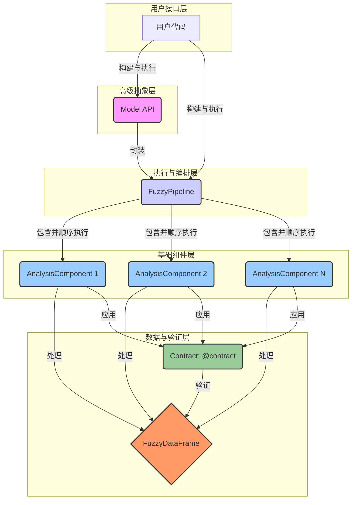

# AxisFuzzy Analysis 概览

`axisfuzzy.analysis` 是 `AxisFuzzy` 生态系统中一个强大而灵活的子模块，其设计目标是将模糊逻辑的强大能力无缝集成到现代数据科学工作流中。它提供了一套高度模块化、可扩展的工具，使用户能够构建、执行和管理复杂的数据分析管道，尤其擅长处理包含不确定性和模糊性的数据。

本模块的核心设计哲学根植于“关注点分离”和“契约式设计”两大原则。通过将复杂的分析任务分解为一系列独立的、可重用的组件，并利用严格的数据契约确保数据在这些组件之间可靠地流转，`axisfuzzy.analysis` 极大地提升了分析流程的健壮性、可维护性和可复现性。

## 核心理念

`axisfuzzy.analysis` 的设计深受现代数据处理框架（如 `scikit-learn`）和深度学习框架（如 `PyTorch`）的启发，旨在为用户提供一种既熟悉又强大的体验。其核心理念可以概括为以下几点：

- **模块化 (Modularity)**: 每一个分析步骤都被封装成一个独立的 **`AnalysisComponent`**。这种设计使得每个组件都可以被独立开发、测试和复用，从而极大地提高了代码的可维护性和开发效率。
- **管道化 (Pipelining)**: 通过 **`FuzzyPipeline`**，用户可以将多个 `AnalysisComponent` 像乐高积木一样串联起来，构建出复杂的、端到端的数据分析流程。这种方式不仅使工作流变得清晰，还便于进行流程的调整和优化。
- **契约驱动 (Contract-Driven)**: 系统引入了 **`Contract`** 机制，这是一种强大的数据验证工具。在数据进入或离开一个组件时，`Contract` 会自动检查数据的格式、类型、范围甚至更复杂的业务逻辑是否满足预设条件，从而在早期就捕捉到潜在的数据问题，保证了整个分析流程的稳定性和可靠性。
- **高级抽象 (High-Level Abstraction)**: 对于需要构建复杂分析模型的场景，`axisfuzzy.analysis` 提供了类似 `PyTorch` 的 **`Model`** API。它允许用户以一种声明式的方式定义模型结构、数据流和执行逻辑，从而能够更专注于模型本身的设计，而非底层的实现细节。

## 关键组件

`axisfuzzy.analysis` 系统的功能由以下四个核心组件协同提供：

### 1. `AnalysisComponent`：分析组件

`AnalysisComponent` 是 `axisfuzzy.analysis` 中最基本的执行单元。它是一个抽象基类，代表了分析流程中的一个具体步骤，例如：

- 从文件或数据库加载数据。
- 对数据进行预处理和清洗。
- 应用模糊化策略将清晰数据转换为模糊数据。
- 执行特定的模糊逻辑计算或推理。
- 将分析结果保存到文件或进行可视化。

每个组件都封装了特定的逻辑，并通过定义清晰的输入和输出来与其他组件交互。

### 2. `FuzzyPipeline`：模糊管道

`FuzzyPipeline` 是一个用于组织和执行 `AnalysisComponent` 序列的容器。它负责按照预定义的顺序依次调用每个组件，并将前一个组件的输出作为后一个组件的输入。

**主要职责**:
- **顺序执行**: 保证分析组件按照添加的顺序依次执行。
- **数据流转**: 自动管理数据在组件之间的传递。
- **流程控制**: 提供统一的接口来启动、监控和管理整个分析流程。

通过使用 `FuzzyPipeline`，用户可以轻松地构建出可重复、可扩展的分析工作流。

### 3. `Contract`：数据契约

`Contract` 是 `axisfuzzy.analysis` 的一大特色，它为数据驱动的工作流提供了前所未有的可靠性。`Contract` 本质上是一套附加到函数或组件上的数据验证规则。

**核心功能**:
- **输入验证**: 在组件执行前，检查输入数据是否符合预定义的规范。
- **输出保证**: 在组件执行后，确保其输出满足预期的格式和条件。
- **自动化**: 通过 `@contract` 装饰器，可以非常方便地将契约应用到任何函数或方法上，而无需侵入其内部逻辑。

内置的契约库提供了对常见数据类型（如 `pandas.DataFrame`）的丰富验证功能，同时也支持用户根据业务需求创建自定义契约。

### 4. `Model`：高级分析模型

`Model` API 是为构建复杂、可复用的分析模型而设计的高级抽象。它的设计借鉴了 `PyTorch` 的 `nn.Module`，为用户提供了一种熟悉且强大的模型构建体验。

**设计特点**:
- **声明式定义**: 用户通过继承 `Model` 类并实现其方法来声明式地定义模型的结构和计算逻辑。
- **封装与复用**: `Model` 可以将一个复杂的分析流程（可能包含多个子组件和复杂的逻辑）封装成一个单一的、可重用的单元。
- **生命周期管理**: `Model` 提供了构建 (`build`)、执行 (`forward`) 和序列化等完整的生命周期管理方法。

`Model` 特别适用于那些需要将多个分析步骤、参数和逻辑打包成一个整体进行分发和部署的场景。

## 系统架构

下图展示了 `axisfuzzy.analysis` 模块中各个核心组件之间的协同工作关系：

**架构解读**:

1.  **用户** 可以通过两种主要方式与系统交互：直接构建一个 `FuzzyPipeline` 来执行一系列分析组件，或者使用更高级的 `Model` API 来封装一个复杂的分析模型（`Model` 内部通常也会管理一个 `FuzzyPipeline`）。
2.  **`FuzzyPipeline`** 是执行的核心，它按顺序调度和运行一系列 `AnalysisComponent`。
3.  每个 **`AnalysisComponent`** 在执行前后，都会由附加在其上的 **`Contract`** 进行数据验证。
4.  **`Contract`** 确保在组件间流转的核心数据结构——**`FuzzyDataFrame`**——始终保持预期的格式和状态。
5.  整个系统层次分明，从底层的原子组件到高层的模型封装，为用户提供了不同层次的抽象，以满足从简单脚本到复杂应用开发的各种需求。

通过这套精心设计的架构，`axisfuzzy.analysis` 为在数据分析中应用模糊逻辑提供了一个健壮、灵活且易于扩展的平台。