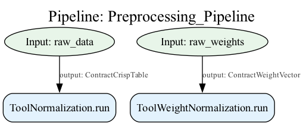
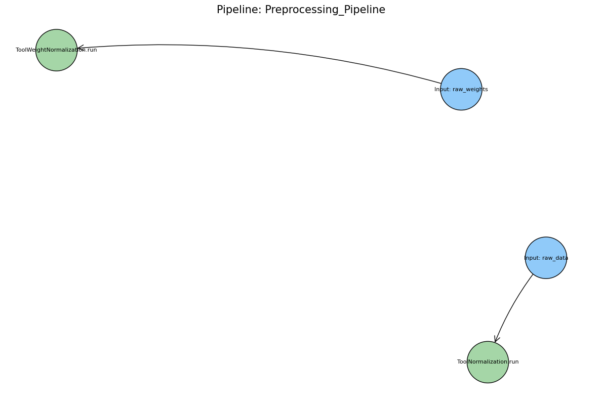
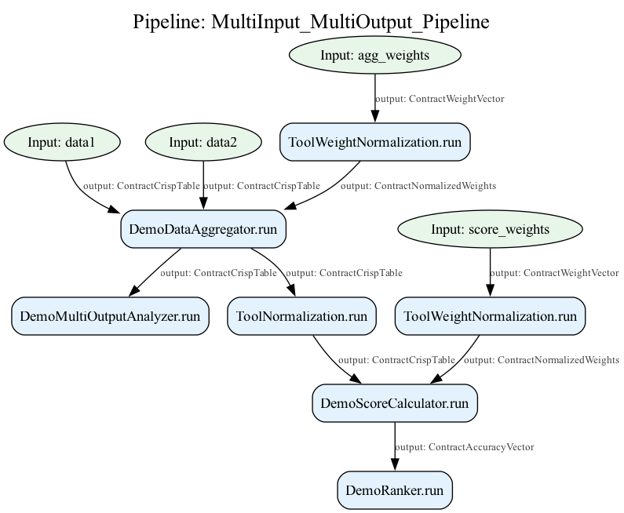

.. _components_and_pipeline:

========================
Components and Pipeline
========================

The `axisfuzzy.analysis` module provides a comprehensive framework for building modular, reusable 
data analysis workflows. At its core lies the component-pipeline architecture, which separates 
individual analysis operations (components) from their orchestration (pipelines). 

This design promotes code reusability, testability, and maintainability while enabling complex 
analytical workflows through simple composition patterns.

This document explores the foundational concepts, built-in components, and pipeline architecture 
that power the fuzzy data analysis system in `axisfuzzy`.

.. contents::
   :local:

AnalysisComponent Foundation
----------------------------

Architecture Overview
~~~~~~~~~~~~~~~~~~~~~~

The :class:`~axisfuzzy.analysis.component.base.AnalysisComponent` serves as the foundational base class 
for all analysis tools in the `axisfuzzy.analysis` ecosystem. This design follows the **marker pattern**, 
providing a clear type hierarchy and common interface while maintaining flexibility for diverse 
component implementations.

The architecture embraces object-oriented principles over functional programming approaches, promoting 
better state management, configuration serialization, and framework-level integration. 

Each component encapsulates both its operational logic and configuration state, enabling sophisticated 
pipeline construction and execution tracking.

.. code-block:: python

   from axisfuzzy.analysis import AnalysisComponent
   from axisfuzzy.analysis import contract
   
   class CustomAnalyzer(AnalysisComponent):
       def __init__(self, threshold: float = 0.5):
           self.threshold = threshold
       
       @contract
       def run(self, data):
           # Component-specific logic
           return processed_data
       
       def get_config(self) -> dict:
           return {'threshold': self.threshold}

Core Methods
~~~~~~~~~~~~

The base class defines two fundamental methods that establish the component contract:

**The run() Method Contract**

The ``run()`` method serves as the primary execution entry point for all components. While the base 
implementation raises ``NotImplementedError``, subclasses must override this method to provide their 
specific functionality. 

The method signature is intentionally flexible, accepting arbitrary positional and keyword arguments 
to accommodate diverse analysis requirements.

.. code-block:: python

   def run(self, *args, **kwargs):
       """
       Execute the component's analysis logic.
       
       This method should be overridden by all subclasses to implement
       their specific functionality.
       """
       raise NotImplementedError(
           f"{self.__class__.__name__} must implement the 'run' method."
       )

**Configuration Serialization with** ``get_config()``

The ``get_config()`` method is an abstract method that must be implemented by all subclasses. It returns 
a JSON-serializable dictionary containing the component's configuration parameters. 

This enables pipeline serialization, reproducibility, and debugging capabilities.

.. code-block:: python

   @abstractmethod
   def get_config(self) -> dict:
       """
       Returns the configuration of the component.
       
       Returns
       -------
       dict
           A JSON-serializable dictionary of configuration parameters.
       """

Design Philosophy
~~~~~~~~~~~~~~~~~

The component architecture embodies several key design principles:

**Object-Oriented Approach vs. Functional Programming**

Unlike purely functional approaches, the component system emphasizes stateful objects that encapsulate 
both behavior and configuration. 

This design choice enables:

- **State Management**: Components can maintain internal state and configuration
- **Serialization**: Complete pipeline configurations can be saved and restored
- **Type Safety**: Clear inheritance hierarchies support static analysis and IDE assistance
- **Framework Integration**: Components integrate seamlessly with the pipeline execution engine

**Composition Over Inheritance**

While components inherit from ``AnalysisComponent``, the system favors composition patterns for 
building complex workflows. 

Individual components remain focused and single-purpose, with complexity emerging from their 
orchestration rather than deep inheritance hierarchies.

Type Safety
~~~~~~~~~~~

The component system integrates deeply with the contract system to provide type safety and runtime 
validation. 

Components use type annotations in their ``run()`` methods to declare input and output contracts, 
enabling automatic validation and clear documentation of data flow requirements.

.. code-block:: python

   from axisfuzzy.analysis.contracts import contract
   from axisfuzzy.analysis.build_in import ContractCrispTable
   
   class TypeSafeComponent(AnalysisComponent):
       @contract
       def run(self, data: ContractCrispTable) -> ContractCrispTable:
           # Type-safe implementation with automatic validation
           return processed_data

The ``@contract`` decorator automatically validates inputs and outputs against their declared types, 
providing runtime safety and clear error messages when type mismatches occur.

Inheritance Patterns
~~~~~~~~~~~~~~~~~~~~

Best practices for extending the ``AnalysisComponent`` base class include:

**1. Constructor Patterns**

Always call the parent constructor and store configuration parameters as instance attributes:

.. code-block:: python

   def __init__(self, param1: str, param2: int = 10):
       super().__init__()  # Optional but recommended
       self.param1 = param1
       self.param2 = param2

**2. Configuration Management**

Implement ``get_config()`` to return all constructor parameters:

.. code-block:: python

   def get_config(self) -> dict:
       return {
           'param1': self.param1,
           'param2': self.param2
       }

**3. Contract Integration**

Use type annotations and the ``@contract`` decorator for type safety:

.. code-block:: python

   @contract
   def run(self, input_data: InputContract) -> OutputContract:
       # Implementation with automatic type validation
       pass

This foundation enables the construction of robust, type-safe analysis pipelines while maintaining 
the flexibility needed for diverse analytical workflows.

Built-in Component Library
---------------------------

The ``axisfuzzy.analysis.component.basic`` module provides a comprehensive suite of pre-built components 
that address common data preprocessing, transformation, and aggregation requirements in fuzzy analysis 
workflows.

Component Categories
~~~~~~~~~~~~~~~~~~~~

The built-in library organizes components into three primary categories:

**Data Preprocessing Components**: Handle normalization, scaling, and data preparation tasks essential 
for consistent fuzzy analysis.

**Transformation Components**: Perform data type conversions, statistical computations, and structural 
modifications.

**Aggregation Components**: Combine multiple data sources or reduce dimensionality through mathematical 
operations.

Key Components
~~~~~~~~~~~~~~

ToolNormalization
+++++++++++++++++

The ``ToolNormalization`` component provides multiple normalization strategies for crisp data tables, 
ensuring data consistency across different scales and ranges.

.. code-block:: python

    from axisfuzzy.analysis.component.basic import ToolNormalization
    
    # Min-max normalization (default)
    normalizer = ToolNormalization(method='min_max', axis=1)
    
    # Z-score standardization
    z_normalizer = ToolNormalization(method='z_score', axis=0)
    
    # Sum normalization
    sum_normalizer = ToolNormalization(method='sum', axis=1)

**Supported Methods**: ``min_max``, ``z_score``, ``sum``, ``max``
**Axis Control**: Row-wise (``axis=1``) or column-wise (``axis=0``) operations

ToolWeightNormalization
+++++++++++++++++++++++

Specialized for weight vector processing, this component ensures weight vectors sum to unity while 
handling edge cases like negative weights and zero-sum scenarios.

.. code-block:: python

    from axisfuzzy.analysis.component.basic import ToolWeightNormalization
    
    # Standard weight normalization
    weight_norm = ToolWeightNormalization(ensure_positive=True)
    
    # Allow negative weights
    flexible_norm = ToolWeightNormalization(ensure_positive=False)

ToolStatistics
++++++++++++++

Computes comprehensive statistical summaries including central tendency, dispersion, and distribution 
characteristics for data analysis and validation.

.. code-block:: python

    from axisfuzzy.analysis.component.basic import ToolStatistics
    
    # Row-wise statistics
    stats_calculator = ToolStatistics(axis=1)

**Output Metrics**: Mean, median, standard deviation, variance, minimum, maximum, and quartile information.

ToolSimpleAggregation
+++++++++++++++++++++

Performs mathematical aggregation operations across specified dimensions, supporting common reduction 
functions for data consolidation.

.. code-block:: python

    from axisfuzzy.analysis.component.basic import ToolSimpleAggregation
    
    # Mean aggregation
    mean_agg = ToolSimpleAggregation(operation='mean', axis=1)
    
    # Sum aggregation
    sum_agg = ToolSimpleAggregation(operation='sum', axis=0)

**Supported Operations**: ``mean``, ``sum``, ``min``, ``max``, ``std``

ToolFuzzification
+++++++++++++++++

Converts crisp data tables to fuzzy representations using configurable fuzzification strategies, 
bridging crisp and fuzzy domains.

.. code-block:: python

    from axisfuzzy.analysis.component.basic import ToolFuzzification
    from axisfuzzy.fuzzifier import Fuzzifier
    from axisfuzzy.membership import TriangularMF, TrapezoidalMF
    
    # Using Fuzzifier instance with triangular membership function
    fuzzifier = Fuzzifier(
        mf=TriangularMF,
        mtype='qrofn',
        q=2,
        mf_params={'a': 0.2, 'b': 0.5, 'c': 0.8}
    )
    fuzzy_converter = ToolFuzzification(fuzzifier=fuzzifier)
    
    # Using configuration dictionary with trapezoidal membership function
    fuzzy_converter = ToolFuzzification(fuzzifier={
        'mf': 'trapmf',
        'mtype': 'qrofn', 
        'q': 2,
        'mf_params': {'a': 0.1, 'b': 0.3, 'c': 0.7, 'd': 0.9}
    })

Usage Patterns
~~~~~~~~~~~~~~

**Sequential Processing**: Components naturally chain together through contract-compatible outputs and 
inputs.

**Configuration Management**: All components expose their configuration through the ``get_config()`` method 
for reproducibility and debugging.

**Error Handling**: Components perform dependency validation and provide informative error messages for 
missing requirements.

**Type Safety**: Contract decorators ensure runtime type validation and clear interface documentation.

.. code-block:: python

    from axisfuzzy.analysis.component.basic import ToolNormalization, ToolWeightNormalization
    from axisfuzzy.analysis.pipeline import FuzzyPipeline
    from axisfuzzy.analysis.build_in import ContractCrispTable, ContractWeightVector
    import pandas as pd
    import numpy as np
    
    # Typical usage pattern
    normalizer = ToolNormalization(method='min_max')
    weight_processor = ToolWeightNormalization()
    
    # Sample data
    raw_data = pd.DataFrame(np.random.rand(3, 3))
    raw_weights = np.array([1.0, 2.0, 3.0])
    
    # Components can be used independently
    normalized_data = normalizer.run(raw_data)
    normalized_weights = weight_processor.run(raw_weights)
    
    # Or integrated into pipelines for automated workflows
    pipeline = FuzzyPipeline(name="Example Pipeline")
    input_data = pipeline.input("data", contract=ContractCrispTable)
    input_weights = pipeline.input("weights", contract=ContractWeightVector)
    pipeline.add(normalizer.run, data=input_data)
    pipeline.add(weight_processor.run, weights=input_weights)

FuzzyPipeline Architecture
--------------------------

The ``FuzzyPipeline`` class implements a sophisticated computational orchestration system that combines 
Directed Acyclic Graph (DAG) execution with a fluent API design, enabling declarative construction of 
complex analysis workflows.

DAG Execution Engine
~~~~~~~~~~~~~~~~~~~~

The pipeline architecture employs a DAG-based execution model that ensures proper dependency resolution, 
prevents circular dependencies, and optimizes execution order for computational efficiency.

**Dependency Resolution**: The engine automatically analyzes step dependencies and constructs an optimal 
execution sequence that respects data flow constraints.

**Validation Framework**: Built-in cycle detection and dependency validation prevent invalid pipeline 
configurations at construction time.

**Execution State Management**: Immutable execution states enable step-by-step debugging, rollback 
capabilities, and parallel execution strategies.

.. code-block:: python

    from axisfuzzy.analysis.pipeline import FuzzyPipeline
    from axisfuzzy.analysis.component.basic import ToolNormalization, ToolSimpleAggregation
    from axisfuzzy.analysis.build_in import ContractCrispTable
    
    # Create component instances
    normalizer = ToolNormalization(method='min_max')
    aggregator = ToolSimpleAggregation(operation='mean', axis=1)
    
    # Pipeline construction creates a DAG representation
    pipeline = FuzzyPipeline(name="Analysis Workflow")
    
    # Each step becomes a node with defined dependencies
    input_data = pipeline.input("raw_data", contract=ContractCrispTable)
    normalized = pipeline.add(normalizer.run, data=input_data)
    aggregated = pipeline.add(aggregator.run, data=normalized)

Fluent API Design
~~~~~~~~~~~~~~~~~

The fluent interface enables intuitive pipeline construction through method chaining and declarative syntax, 
reducing cognitive overhead while maintaining type safety.

**Method Chaining**: Sequential operations flow naturally through connected method calls that mirror the 
logical data transformation sequence.

**Declarative Syntax**: Pipeline structure emerges from high-level descriptions rather than imperative 
control flow statements.

**Type-Safe Composition**: Contract annotations ensure compile-time and runtime type compatibility between 
connected components.

.. code-block:: python

    from axisfuzzy.analysis.pipeline import FuzzyPipeline
    from axisfuzzy.analysis.component.basic import ToolNormalization, ToolStatistics
    from axisfuzzy.analysis.build_in import ContractCrispTable
    import pandas as pd
    import numpy as np
    
    # Create component instances
    normalizer = ToolNormalization(method='min_max')
    statistics = ToolStatistics(axis=1)
    
    # Sample data
    dataframe = pd.DataFrame(np.random.rand(3, 3))
    
    # Pipeline construction (note: FuzzyPipeline doesn't support method chaining)
    pipeline = FuzzyPipeline(name="Data Processing")
    data_input = pipeline.input("data", contract=ContractCrispTable)
    normalized = pipeline.add(normalizer.run, data=data_input)
    stats_result = pipeline.add(statistics.run, data=normalized)
    
    # Execute the pipeline
    result = pipeline.run(initial_data={"data": dataframe})

output::

    {'mean': 0.5591645318883851,
    'std': 0.43061757568307885,
    'min': 0.0,
    'max': 1.0,
    'median': 0.7351874757125739,
    'count': 9}

Core Architecture Classes
~~~~~~~~~~~~~~~~~~~~~~~~~

The pipeline system is built upon five fundamental classes that work together to provide a robust, 
type-safe computational graph framework. These classes implement a sophisticated separation of concerns, 
enabling declarative pipeline construction with runtime validation and flexible execution models.

FuzzyPipeline
+++++++++++++

The ``FuzzyPipeline`` class serves as the central orchestrator for building and executing directed acyclic 
graphs (DAGs) of analysis operations. It implements a fluent API that allows developers to construct complex 
workflows through method chaining while maintaining strict type safety through the contract system.

**Architectural Design**:

The pipeline maintains an internal graph representation using ``StepMetadata`` objects, where each node 
represents either an input source or a computational step. The graph construction phase is completely 
separated from execution, enabling pipeline reuse, serialization, and optimization before runtime.

.. code-block:: python

    from axisfuzzy.analysis.pipeline import FuzzyPipeline
    from axisfuzzy.analysis.component.basic import ToolNormalization
    from axisfuzzy.analysis.build_in import ContractCrispTable
    
    # Pipeline construction phase - no computation occurs
    pipeline = FuzzyPipeline(name="Data Processing Workflow")
    
    # Input nodes define data entry points with contracts
    raw_data = pipeline.input("dataset", contract=ContractCrispTable)
    
    # Computational nodes link operations through symbolic references
    normalizer = ToolNormalization(method='min_max')
    processed = pipeline.add(normalizer.run, data=raw_data)

The pipeline's ``_steps`` dictionary stores ``StepMetadata`` objects keyed by unique step identifiers, 
while ``_input_nodes`` maintains a mapping from user-defined input names to their corresponding step IDs. 
This dual-indexing approach enables efficient graph traversal and dependency resolution.

StepMetadata
++++++++++++

The ``StepMetadata`` class encapsulates all essential information about individual pipeline steps, 
serving as the fundamental building block of the computational graph. Each metadata object contains 
complete information needed for step execution, validation, and debugging.

**Core Attributes**:

The metadata structure includes the callable tool reference, dependency mappings, static parameters, 
and comprehensive contract specifications for both inputs and outputs. The ``dependencies`` field 
maps parameter names to ``StepOutput`` objects, enabling the pipeline engine to resolve data flow 
relationships during execution.

.. code-block:: python

    # Example of StepMetadata structure for a normalization step
    step_meta = StepMetadata(
        step_id="norm_a1b2c3d4",
        display_name="MinMax Normalization",
        callable_tool=normalizer.run,
        dependencies={"data": raw_data_output},
        static_parameters={"method": "min_max"},
        input_contracts={"data": ContractCrispTable},
        output_contracts={"output": ContractCrispTable}
    )

The ``is_input_node`` property distinguishes between input sources (where ``callable_tool`` is ``None``) and 
computational steps, enabling different handling strategies during graph analysis and execution.

StepOutput
++++++++++

``StepOutput`` objects provide symbolic representations of future computation results, implementing a 
promise-based pattern that enables lazy evaluation and dependency tracking. These objects contain no actual 
data but maintain sufficient metadata to resolve dependencies during pipeline execution.

**Symbolic Reference System**:

Each ``StepOutput`` maintains references to its originating step ID, specific output name, and parent pipeline 
instance. This design enables the pipeline engine to construct a complete dependency graph while deferring 
all computation until the ``run()`` method is invoked.

.. code-block:: python

    # StepOutput objects act as symbolic placeholders
    normalized_data = pipeline.add(normalizer.run, data=raw_data)
    # normalized_data is a StepOutput, not actual computed data
    
    # Multiple outputs can be accessed by name
    multi_output_step = pipeline.add(analyzer.analyze, data=normalized_data)
    statistics = multi_output_step["statistics"]
    summary = multi_output_step["summary"]

The symbolic nature of ``StepOutput`` objects enables complex dependency chains to be constructed 
declaratively, with the pipeline engine automatically resolving execution order through topological sorting 
of the dependency graph.

ExecutionState
++++++++++++++

The ``ExecutionState`` class implements an immutable state pattern for pipeline execution, encapsulating 
the results of completed steps and providing methods for controlled step-by-step progression. This design 
enables functional-style execution with complete state tracking.

**Immutable State Management**:

Each execution state contains a snapshot of all completed step results, the execution order, and the 
current position within that order. The ``run_next()`` method creates a new ``ExecutionState`` instance 
rather than modifying the existing one, ensuring execution history is preserved and enabling rollback 
capabilities.

.. code-block:: python

    # ExecutionState enables controlled step-by-step execution
    initial_state = pipeline.start_execution({"dataset": dataframe})
    
    # Each step creates a new immutable state
    state_after_step1 = initial_state.run_next()
    state_after_step2 = state_after_step1.run_next()
    
    # Access intermediate results
    intermediate_result = state_after_step1.latest_result

The state object maintains execution metadata including timing information, step identification, and result 
accessibility, providing comprehensive debugging and monitoring capabilities for complex analytical workflows.

FuzzyPipelineIterator
+++++++++++++++++++++

The ``FuzzyPipelineIterator`` class provides a Python iterator interface for step-by-step pipeline execution, 
enabling integration with standard iteration patterns and real-time monitoring of long-running analytical 
processes.

**Iterator Protocol Implementation**:

The iterator wraps an ``ExecutionState`` and advances it through each pipeline step, yielding detailed 
execution reports that include timing information, step metadata, and intermediate results. This design 
enables seamless integration with progress bars, logging systems, and interactive debugging tools.

.. code-block:: python

    import pandas as pd
    from axisfuzzy.analysis.build_in import ContractCrispTable

    # Sample data
    df = pd.DataFrame({'A': [1, 2, 3], 'B': [4, 5, 6]})

    # Create a simple pipeline for demonstration
    demo_pipeline = FuzzyPipeline(name="Demo Pipeline")
    dataset_input = demo_pipeline.input("dataset", contract=ContractCrispTable)
    normalizer = ToolNormalization(method='min_max')
    normalized_output = demo_pipeline.add(normalizer.run, data=dataset_input)

    # Iterator enables step-by-step observation
    for step_info in demo_pipeline.step_by_step(initial_data={"dataset": df}):
        print(f"Completed: {step_info['step_name']}")
        print(f"Execution time: {step_info['execution_time']}ms")
        if hasattr(step_info['result'], 'shape'):
            print(f"Result shape: {step_info['result'].shape}")

        # Optional: Add custom monitoring logic
        if step_info['result'] is not None and hasattr(step_info['result'], '__len__') and len(step_info['result']) > 10:
            break

    # Integration with tqdm for progress visualization
    iterator = demo_pipeline.step_by_step(initial_data={"dataset": df})
    for step_info in iterator:
        # Process each step with visual progress feedback
        pass

The iterator pattern facilitates integration with monitoring systems and enables early termination of 
long-running pipelines based on intermediate results or external conditions.

**Architectural Integration**:

These five classes work together to implement a sophisticated computational graph system that separates 
pipeline definition from execution while maintaining type safety and providing comprehensive debugging 
capabilities. The design enables complex analytical workflows to be constructed declaratively and 
executed with full observability and control.

.. code-block:: python
    
    from axisfuzzy.analysis.pipeline import FuzzyPipeline
    from axisfuzzy.analysis.component.basic import ToolNormalization
    from axisfuzzy.analysis.build_in import ContractCrispTable
    
    # Create component instances
    component = ToolNormalization(method='min_max')
    
    # Create pipeline and input
    pipeline = FuzzyPipeline(name="Example Pipeline")
    data = pipeline.input("data", contract=ContractCrispTable)
    
    # StepOutput objects represent future computation results
    step_output = pipeline.add(component.run, data=data)
    
    # For components with multiple outputs, access by name
    # (Note: ToolNormalization has single output, this is conceptual example)
    # multi_output = pipeline.add(splitter.run, data=input_data)
    # output_a = multi_output['output_a']
    # output_b = multi_output['output_b']

Pipeline Construction
~~~~~~~~~~~~~~~~~~~~~

**Input Definition**: Pipelines begin with input specification that establishes entry points and 
data contracts for external data sources.

**Step Addition**: Components integrate through the ``add()`` method that accepts callable tools and 
establishes dependency relationships through parameter mapping.

**Output Specification**: Pipeline outputs emerge naturally from the final steps, with automatic result 
collection and formatting.

**Execution Models**: Support for immediate execution, step-by-step iteration, and batch processing 
accommodates diverse analytical requirements.

.. code-block:: python

    from axisfuzzy.analysis.pipeline import FuzzyPipeline
    from axisfuzzy.analysis.component.basic import ToolNormalization, ToolWeightNormalization, ToolStatistics
    from axisfuzzy.analysis.build_in import ContractCrispTable, ContractWeightVector
    import pandas as pd
    import numpy as np
    
    # Create component instances
    normalizer = ToolNormalization(method='min_max')
    weight_norm = ToolWeightNormalization()
    stats_calc = ToolStatistics(axis=1)
    
    # Sample data
    dataframe = pd.DataFrame(np.random.rand(3, 3))
    weight_vector = np.array([1.0, 2.0, 3.0])
    
    # Complete pipeline construction example
    pipeline = FuzzyPipeline(name="Comprehensive Analysis")
    
    # Define multiple inputs with contracts
    raw_data = pipeline.input("data", contract=ContractCrispTable)
    weights = pipeline.input("weights", contract=ContractWeightVector)
    
    # Build processing chain
    normalized_data = pipeline.add(normalizer.run, data=raw_data)
    normalized_weights = pipeline.add(weight_norm.run, weights=weights)
    statistics = pipeline.add(stats_calc.run, data=normalized_data)
    
    # Execute with input data
    initial_data = {
        "data": dataframe,
        "weights": weight_vector
    }
    
    results = pipeline.run(initial_data)
    
    # Alternative: step-by-step execution for debugging
    for step_info in pipeline.step_by_step(initial_data):
        print(f"Completed: {step_info['step_name']}")
        print(f"Result: {step_info['result']}")

Pipeline Visualization
----------------------

The ``FuzzyPipeline`` class provides comprehensive visualization capabilities through the ``visualize()`` method, 
enabling developers to generate 
graphical representations of their computational DAGs. This visualization system 
supports multiple rendering engines and 
customizable styling options, making it invaluable for pipeline debugging, 
documentation, and workflow communication.

Visualization Architecture
~~~~~~~~~~~~~~~~~~~~~~~~~~

The visualization system converts the internal pipeline graph structure into a NetworkX representation, which 
is then rendered using either 
Graphviz or Matplotlib backends. The system automatically detects available 
dependencies and selects the most appropriate rendering engine, ensuring compatibility across different 
development environments.

**Dual Engine Support**: The visualization framework supports both Graphviz (via pydot) for high-quality 
vector graphics and Matplotlib for environments where Graphviz is unavailable.

**Contract Visualization**: When enabled, the system displays data contract information on graph edges, 
providing clear documentation of data flow types and validation requirements.

**Customizable Styling**: Node appearance can be customized through style dictionaries, enabling consistent 
visual themes across documentation and presentations.

Basic Visualization Usage
~~~~~~~~~~~~~~~~~~~~~~~~~

The ``visualize()`` method provides a simple interface for generating pipeline diagrams with sensible defaults:

.. code-block:: python

    from axisfuzzy.analysis.pipeline import FuzzyPipeline
    from axisfuzzy.analysis.component.basic import ToolNormalization, ToolWeightNormalization
    from axisfuzzy.analysis.build_in import ContractCrispTable, ContractWeightVector
    
    # Create a multi-input pipeline for demonstration
    normalizer = ToolNormalization(method='min_max', axis=0)
    weight_normalizer = ToolWeightNormalization()
    
    pipeline = FuzzyPipeline(name="Preprocessing_Pipeline")
    
    # Define multiple inputs with contracts
    raw_data = pipeline.input("raw_data", contract=ContractCrispTable)
    raw_weights = pipeline.input("raw_weights", contract=ContractWeightVector)
    
    # Build processing chain
    normalized_data = pipeline.add(normalizer.run, data=raw_data)
    normalized_weights = pipeline.add(weight_normalizer.run, weights=raw_weights)
    
    # Generate visualization
    pipeline.visualize()

Advanced Visualization Options
~~~~~~~~~~~~~~~~~~~~~~~~~~~~~~~

The visualization system offers extensive customization through parameter configuration:

.. code-block:: python

    # High-resolution SVG output with custom styling
    custom_styles = {
        'input': {'fillcolor': 'lightblue', 'style': 'filled'},
        'component': {'fillcolor': 'lightgreen', 'style': 'filled'},
        'pipeline': {'fillcolor': 'lightyellow', 'style': 'filled'}
    }
    
    pipeline.visualize(
        filename="detailed_pipeline.svg",
        output_format='svg',
        show_contracts=True,
        engine='graphviz',
        styles=custom_styles
    )
    
    # Interactive display in Jupyter notebooks
    # Returns IPython.display.Image object for inline display
    image = pipeline.visualize(show_contracts=False, engine='matplotlib')

**Parameter Configuration**:

- ``filename``: Output file path (None for inline display)
- ``output_format``: Image format ('png', 'svg', 'pdf')
- ``show_contracts``: Display contract information on edges
- ``engine``: Rendering backend ('auto', 'graphviz', 'matplotlib')
- ``styles``: Custom node styling dictionary

Visualization Benefits
~~~~~~~~~~~~~~~~~~~~~~

**Pipeline Documentation**: Visual diagrams serve as living documentation that automatically reflects 
pipeline structure changes, ensuring documentation accuracy.

**Debugging Support**: Complex dependency relationships become immediately apparent through visual 
inspection, facilitating rapid identification of structural issues.

**Communication Tool**: Graphical representations enable effective communication of analytical workflows 
to stakeholders with varying technical backgrounds.

**Educational Value**: Visual DAGs help developers understand the relationship between declarative 
pipeline construction and the underlying computational graph execution model.

The visualization system integrates seamlessly with Jupyter notebook environments, providing immediate 
visual feedback during interactive pipeline development and experimentation.

Data Flow and Contract Integration
----------------------------------

The `axisfuzzy.analysis` system implements a sophisticated data flow architecture that 
combines **type-safe contract validation** with **flexible 
component communication patterns**. This design ensures data integrity while enabling complex 
analytical workflows through automatic dependency resolution and runtime validation.

Contract System Integration
~~~~~~~~~~~~~~~~~~~~~~~~~~~

**Type-Safe Data Validation**: The contract system provides runtime validation that goes beyond 
Python's native type hints. Each component method decorated with ``@contract`` automatically 
validates input data against predefined contract specifications, ensuring data structure compliance 
before execution.

.. code-block:: python

    from axisfuzzy.analysis.contracts import contract
    from axisfuzzy.analysis.build_in import ContractCrispTable, ContractWeightVector
    from axisfuzzy.analysis.component.base import AnalysisComponent
    
    class CustomAnalyzer(AnalysisComponent):
        def get_config(self):
            return {'name': 'CustomAnalyzer'}
            
        @contract
        def run(self, data: ContractCrispTable, weights: ContractWeightVector) -> ContractCrispTable:
            # Contract validation occurs automatically before this method executes
            # data is guaranteed to be a valid DataFrame with numerical values
            # weights is guaranteed to be a valid numpy array with positive values
            return data * weights

**Contract Inheritance and Compatibility**: The contract system supports inheritance hierarchies 
that enable polymorphic data handling. Components can accept more general contracts while 
maintaining compatibility with specialized data types.

.. code-block:: python

    # ContractNormalizedWeights inherits from ContractWeightVector
    # Components accepting ContractWeightVector can also process ContractNormalizedWeights
    
    @contract
    def process_weights(weights: ContractWeightVector) -> float:
        return weights.sum()
    
    # Both calls are valid due to contract inheritance
    result1 = process_weights(raw_weights)      # ContractWeightVector
    result2 = process_weights(normalized_weights)  # ContractNormalizedWeights

Component Communication Patterns
~~~~~~~~~~~~~~~~~~~~~~~~~~~~~~~~

**Dependency Graph Construction**: Pipeline components communicate through a declarative dependency 
graph where data flows are established during pipeline construction rather than execution. The 
``FuzzyPipeline.add()`` method automatically resolves dependencies by mapping parameter names to 
upstream component outputs.

.. code-block:: python

    from axisfuzzy.analysis.pipeline import FuzzyPipeline
    from axisfuzzy.analysis.component.basic import ToolNormalization, ToolStatistics
    
    # Automatic dependency resolution through parameter mapping
    pipeline = FuzzyPipeline(name="Data Processing")
    
    input_data = pipeline.input("dataset", contract=ContractCrispTable)
    normalizer = ToolNormalization(method='min_max')
    analyzer = ToolStatistics(axis=1)
    normalized = pipeline.add(normalizer.run, data=input_data)
    statistics = pipeline.add(analyzer.run, data=normalized)  # Depends on normalizer output
    
    # Pipeline automatically constructs: input_data → normalizer → analyzer

**Multi-Input/Multi-Output Scenarios**: Components can consume multiple inputs and produce multiple 
outputs through dictionary-based result structures. The pipeline system automatically handles output 
unpacking and routing to downstream components.

.. code-block:: python

    from typing import Dict
    
    class DataSplitter(AnalysisComponent):
        def __init__(self, split_ratio=0.8):
            super().__init__()
            self.split_ratio = split_ratio
            
        def get_config(self):
            return {'name': 'DataSplitter', 'split_ratio': self.split_ratio}
            
        @contract
        def run(self, data: ContractCrispTable) -> Dict[str, ContractCrispTable]:
            split_point = int(len(data) * self.split_ratio)
            return {
                'training_data': data.iloc[:split_point],
                'validation_data': data.iloc[split_point:]
            }
    
    # Multiple outputs accessed by name
    splitter_output = pipeline.add(splitter.run, data=input_data)
    training_result = pipeline.add(trainer.run, data=splitter_output['training_data'])
    validation_result = pipeline.add(validator.run, data=splitter_output['validation_data'])

**Pipeline Nesting Support**: The system supports nested pipeline architectures where entire pipelines 
can be embedded as components within larger workflows. This enables modular design and reusable 
analytical building blocks.

.. code-block:: python

    from axisfuzzy.analysis.pipeline import FuzzyPipeline
    from axisfuzzy.analysis.component.basic import ToolNormalization
    
    # Create sub-pipeline for data preprocessing
    preprocessing_pipeline = FuzzyPipeline(name="Preprocessing")
    prep_input = preprocessing_pipeline.input("raw_data", contract=ContractCrispTable)
    normalizer = ToolNormalization(method='min_max')
    prep_output = preprocessing_pipeline.add(normalizer.run, data=prep_input)
    
    # Embed sub-pipeline in main workflow
    main_pipeline = FuzzyPipeline(name="Main Analysis")
    main_input = main_pipeline.input("dataset", contract=ContractCrispTable)
    preprocessed = main_pipeline.add(preprocessing_pipeline.run, raw_data=main_input)
    analyzer = CustomAnalyzer()
    final_result = main_pipeline.add(analyzer.run, data=preprocessed)

Runtime Validation and Error Detection
~~~~~~~~~~~~~~~~~~~~~~~~~~~~~~~~~~~~~~

**Contract Enforcement**: During pipeline execution, the ``parse_step_inputs()`` method performs runtime 
contract validation for each component input. This validation occurs after dependency resolution but 
before component execution, ensuring that contract violations are detected early with detailed error messages.

.. code-block:: python

    # Runtime validation example (internal pipeline mechanism)
    def parse_step_inputs(step_meta: StepMetadata, state: Dict[str, Any]) -> Dict[str, Any]:
        parsed_inputs = {}
        
        # Resolve dependencies and validate contracts
        for arg_name, data in parsed_inputs.items():
            if arg_name in step_meta.input_contracts:
                expected_contract = step_meta.input_contracts[arg_name]
                if not expected_contract.validate(data):
                    raise TypeError(
                        f"Contract validation failed for '{step_meta.display_name}' "
                        f"on input '{arg_name}'. Expected '{expected_contract.name}'"
                    )

**Dependency Resolution**: The pipeline system uses topological sorting to determine optimal execution 
order while detecting circular dependencies. This ensures that all component inputs are available before 
execution and prevents infinite loops in complex workflows.

**Data Type Coercion**: The contract system can perform automatic data type coercion when compatible 
transformations are available, reducing the need for explicit conversion steps in analytical workflows 
while maintaining type safety guarantees.

Pipeline Execution and Error Handling
--------------------------------------

The `axisfuzzy.analysis` pipeline execution system provides **immutable state management** and 
**comprehensive 
error handling** through a sophisticated execution model that separates pipeline definition from runtime 
execution while maintaining full observability and control.

Execution States
~~~~~~~~~~~~~~~~

**Immutable State Architecture**

The ``ExecutionState`` class implements a functional programming paradigm where each execution step creates 
a new state object rather than modifying existing state. This immutable design pattern ensures execution 
reproducibility, enables safe concurrent access, and provides robust error recovery mechanisms.

.. code-block:: python

    import pandas as pd
    from axisfuzzy.analysis.pipeline import FuzzyPipeline
    from axisfuzzy.analysis.component.basic import ToolNormalization
    from axisfuzzy.analysis.build_in import ContractCrispTable
    
    # Create a simple pipeline
    pipeline = FuzzyPipeline(name="StateDemo_Pipeline")
    normalizer = ToolNormalization(method='min_max')
    
    raw_data = pipeline.input("dataset", contract=ContractCrispTable)
    normalized_data = pipeline.add(normalizer.run, data=raw_data)
    
    # Initialize execution state
    test_data = pd.DataFrame({'A': [1, 2, 3], 'B': [4, 5, 6]})
    initial_state = pipeline.start_execution({"dataset": test_data})
    
    # Each run_next() creates a new immutable state
    state_after_step1 = initial_state.run_next()
    
    # Original state remains unchanged - immutability guarantee
    assert initial_state.current_index == 0
    assert state_after_step1.current_index == 1
    assert initial_state.latest_result is None
    assert state_after_step1.latest_result is not None

**State Transition and Control Flow**

The execution state tracks pipeline progress through step indices, execution order, and result accumulation. 
The ``is_complete()`` method and ``run_all()`` functionality provide both granular control and batch 
execution capabilities.

.. code-block:: python

    # Manual state progression with comprehensive monitoring
    current_state = pipeline.start_execution({"dataset": test_data})
    
    while not current_state.is_complete():
        step_id = current_state.execution_order[current_state.current_index]
        step_info = current_state.pipeline.get_step_info(step_id)
        
        print(f"Executing: {step_info.display_name}")
        current_state = current_state.run_next()
        print(f"Completed step {current_state.current_index}/{len(current_state.execution_order)}")
    
    # Alternative: batch execution for complete pipeline
    final_state = initial_state.run_all()
    final_result = final_state.latest_result

**State Introspection and Debugging**

The immutable state design enables powerful debugging capabilities by preserving execution history and 
providing access to intermediate results at any point in the pipeline execution.

.. code-block:: python

    # Access intermediate results for debugging
    execution_state = pipeline.start_execution({"dataset": test_data})
    
    # Execute first step and inspect
    state_1 = execution_state.run_next()
    intermediate_result = state_1.latest_result
    
    print(f"Step 1 result shape: {intermediate_result.shape}")
    print(f"Step 1 result type: {type(intermediate_result)}")
    
    # State provides complete execution context
    print(f"Execution progress: {state_1.current_index}/{len(state_1.execution_order)}")
    print(f"Latest step ID: {state_1.latest_step_id}")
    print(f"Available results: {list(state_1.step_results.keys())}")

Step-by-Step Iteration and Monitoring
~~~~~~~~~~~~~~~~~~~~~~~~~~~~~~~~~~~~~

**Iterator-Based Execution Control**: The ``FuzzyPipelineIterator`` provides a Python-native interface 
for pipeline execution monitoring with detailed step information, timing data, and result access. This 
enables integration with logging systems and interactive debugging tools.

.. code-block:: python

    import pandas as pd
    import time
    from axisfuzzy.analysis.pipeline import FuzzyPipeline
    from axisfuzzy.analysis.component.basic import ToolNormalization
    from axisfuzzy.analysis.build_in import ContractCrispTable
    
    # Create simple pipeline for demonstration
    pipeline = FuzzyPipeline(name="Iterator_Demo")
    normalizer = ToolNormalization(method='min_max')
    
    raw_data = pipeline.input("dataset", contract=ContractCrispTable)
    normalized = pipeline.add(normalizer.run, data=raw_data)
    
    # Test data
    test_data = pd.DataFrame({'A': [1, 2, 3], 'B': [4, 5, 6]})
    
    # Step-by-step execution with iterator
    print("Executing pipeline step by step...")
    for step in pipeline.step_by_step({"dataset": test_data}):
        print(f"Step {step['step_index'] + 1}/{step['total_steps']}: {step['step_name']}")
        print(f"Execution time: {step['execution_time']:.4f}s")
        print(f"Result type: {type(step['result']).__name__}")
        if hasattr(step['result'], 'shape'):
            print(f"Result shape: {step['result'].shape}")

**Real-Time Execution Monitoring**: The iterator pattern enables real-time observation of analytical 
processes with access to intermediate results, execution timing, and step metadata.

.. code-block:: python

    # Progress tracking with execution monitoring
    import time
    
    # Create pipeline with multiple steps
    df = pd.DataFrame({'A': [1, 2, 3, 4], 'B': [10, 20, 30, 40]})
    pipeline = FuzzyPipeline(name="Progress_Pipeline")
    dataset_input = pipeline.input("dataset", contract=ContractCrispTable)
    normalizer = ToolNormalization(method='min_max')
    normalized_output = pipeline.add(normalizer.run, data=dataset_input)
    
    # Execute with detailed monitoring
    start_time = time.time()
    for step_info in pipeline.step_by_step({"dataset": df}):
        current = step_info['step_index'] + 1
        total = step_info['total_steps']
        progress = current / total * 100
        elapsed = time.time() - start_time
        
        print(f"[{current}/{total}] {progress:.1f}% - {step_info['step_name']}")
        print(f"Step time: {step_info['execution_time']:.4f}s")
        print(f"Total elapsed: {elapsed:.4f}s")
        
        # Inspect intermediate results
        if hasattr(step_info['result'], 'shape'):
            print(f"Output shape: {step_info['result'].shape}")
        print("-" * 40)

Error Handling and Recovery Mechanisms
~~~~~~~~~~~~~~~~~~~~~~~~~~~~~~~~~~~~~~

**Contract Validation Errors**: The system provides detailed error messages for contract validation 
failures, including the specific component, input parameter, expected contract, and received data 
type. This enables rapid debugging of data flow issues.

.. code-block:: python

    try:
        result = pipeline.run(invalid_data)
    except TypeError as e:
        # Detailed contract validation error
        # "Runtime contract validation failed for 'DataNormalizer' on input 'data'. 
        #  Expected 'ContractCrispTable', but received object of type str."
        print(f"Contract validation error: {e}")

**Dependency Resolution Errors**: Circular dependency detection occurs during pipeline construction 
using topological sorting algorithms. The system raises ``ValueError`` exceptions with clear 
descriptions of the problematic dependency cycles.

.. code-block:: python

    try:
        # This would create a circular dependency
        step_a = pipeline.add(component_a.run, data=step_b)
        step_b = pipeline.add(component_b.run, data=step_a)  # Circular reference
        pipeline.run(input_data)
    except ValueError as e:
        # "A cycle was detected in the pipeline graph."
        print(f"Dependency error: {e}")

**Execution State Recovery**: The immutable state design enables safe error recovery by maintaining 
valid execution states even when individual steps fail. Applications can implement retry logic or 
alternative execution paths based on intermediate state information.

.. code-block:: python

    # Robust execution with error recovery
    def execute_with_retry(pipeline, input_data, max_retries=3):
        for attempt in range(max_retries):
            try:
                return pipeline.run(input_data)
            except Exception as e:
                if attempt == max_retries - 1:
                    raise e
                print(f"Attempt {attempt + 1} failed: {e}. Retrying...")
                time.sleep(1)  # Brief delay before retry

**Iterator State Management**: The iterator maintains execution state internally and provides 
seamless integration with Python's iteration protocol while preserving immutable state guarantees.

.. code-block:: python

    # Iterator provides access to execution state
    iterator = pipeline.step_by_step({"dataset": test_data})
    
    # Manual step execution with state inspection
    step_info = next(iterator)
    print(f"Completed: {step_info['step_name']}")
    print(f"Progress: {step_info['step_index'] + 1}/{step_info['total_steps']}")
    
    # Early termination based on conditions
    for step_info in pipeline.step_by_step({"dataset": test_data}):
        if step_info['execution_time'] > 1.0:  # Stop if step takes too long
            print("Terminating due to long execution time")
            break
        print(f"Step {step_info['step_index'] + 1} completed successfully")

**Component-Level Error Isolation**: Individual component failures are isolated within the execution 
framework, preventing cascade failures and enabling partial pipeline execution with graceful degradation.

The execution and error handling architecture balances computational efficiency with developer 
experience, providing powerful abstractions that simplify complex workflow construction while 
maintaining the flexibility and robustness required for advanced analytical scenarios.

Custom Component Development Guide
----------------------------------

This section provides comprehensive 
guidelines for developing custom analysis components that integrate 
seamlessly with the AxisFuzzy pipeline framework.

Development Best Practices
~~~~~~~~~~~~~~~~~~~~~~~~~~~

**Component Design Principles**: Custom components should inherit from :class:`AnalysisComponent` and 
follow the single-responsibility principle. Each component should perform one well-defined analytical 
operation with clear input-output contracts.

.. code-block:: python

    from axisfuzzy.analysis.component.base import AnalysisComponent
    from axisfuzzy.analysis.contracts import contract
    from axisfuzzy.analysis.build_in import ContractCrispTable, ContractWeightVector
    
    class CustomAnalyzer(AnalysisComponent):
        """Custom component for specialized analysis."""
        
        def __init__(self, threshold: float = 0.5, method: str = 'default'):
            self.threshold = threshold
            self.method = method
        
        def get_config(self) -> dict:
            """Return serializable configuration."""
            return {'threshold': self.threshold, 'method': self.method}

**Immutable State Management**: Components should maintain immutable state after initialization. 
All configuration parameters should be set during construction and exposed through :meth:`get_config` 
for serialization support.

Contract Integration
~~~~~~~~~~~~~~~~~~~~

**Type-Safe Component Implementation**: Use the :func:`@contract` decorator to enforce input-output 
type safety. This provides automatic validation and clear API documentation.

.. code-block:: python

    @contract
    def run(self, data: ContractCrispTable, weights: ContractWeightVector) -> ContractWeightVector:
        """
        Execute analysis with contract-enforced type safety.
        
        Parameters
        ----------
        data : ContractCrispTable
            Input numerical DataFrame for analysis.
        weights : ContractWeightVector
            Weight vector for computation.
            
        Returns
        -------
        ContractWeightVector
            Computed result vector.
        """
        # Implementation with automatic contract validation
        result = self._compute_analysis(data, weights)
        return result

**Custom Contract Definition**: For specialized data types, define custom contracts using 
the :class:`Contract` framework with appropriate validation functions.

.. code-block:: python

    from axisfuzzy.analysis.contracts import Contract
    
    # Define custom contract for specialized data structure
    ContractCustomData = Contract(
        'ContractCustomData',
        lambda obj: hasattr(obj, 'special_attribute') and len(obj) > 0
    )

Configuration Management
~~~~~~~~~~~~~~~~~~~~~~~~

**Proper get_config() Implementation**: The :meth:`get_config` method must return a JSON-serializable 
dictionary containing all parameters necessary to reconstruct the component state.

.. code-block:: python

    def get_config(self) -> dict:
        """Return complete component configuration."""
        config = {
            'threshold': self.threshold,
            'method': self.method,
            'advanced_params': self.advanced_params.copy()  # Deep copy for safety
        }
        # Handle complex objects that need special serialization
        if hasattr(self, 'model'):
            config['model_state'] = self.model.serialize()
        return config

**Parameter Validation**: Implement robust parameter validation in the constructor to ensure 
component reliability and provide clear error messages for invalid configurations.

Testing Strategies
~~~~~~~~~~~~~~~~~~

**Unit Testing Approach**: Test components in isolation using mock data that satisfies the required 
contracts. Focus on edge cases and parameter boundary conditions.

.. code-block:: python

    import pytest
    import pandas as pd
    
    def test_custom_analyzer():
        # Create test data satisfying contracts
        test_data = pd.DataFrame({'A': [1, 2, 3], 'B': [4, 5, 6]})
        test_weights = pd.Series([0.3, 0.7])
        
        analyzer = CustomAnalyzer(threshold=0.6)
        result = analyzer.run(test_data, test_weights)
        
        # Verify output contract compliance
        assert isinstance(result, pd.Series)
        assert len(result) == len(test_data)

**Integration Testing**: Test components within pipeline contexts to verify contract compatibility 
and execution flow integrity.

Performance Considerations
~~~~~~~~~~~~~~~~~~~~~~~~~~

**Optimization Guidelines**: Implement efficient algorithms with consideration for large datasets. 
Use vectorized operations when working with numerical data and avoid unnecessary data copying.

.. code-block:: python

    def _compute_analysis(self, data, weights):
        """Optimized computation using vectorized operations."""
        # Use in-place operations where possible
        normalized_data = data.copy()  # Explicit copy for safety
        
        # Vectorized computation for performance
        result = (normalized_data * weights).sum(axis=1)
        
        # Memory-efficient processing for large datasets
        if len(data) > 10000:
            result = self._chunked_processing(data, weights)
        
        return result

**Memory Management**: For large-scale analysis, implement chunked processing and consider memory 
usage patterns. Use generators for streaming data processing when appropriate.

The component development framework provides a robust foundation for creating reusable, type-safe 
analytical tools that integrate seamlessly with the AxisFuzzy pipeline ecosystem while maintaining 
high performance and reliability standards.

Fully customize pipelines and visualization
~~~~~~~~~~~~~~~~~~~~~~~~~~~~~~~~~~~~~~~~~~~~

This subsection contains a complete example of a custom component and pipeline construction, 
and demonstrates a complex visual DAG flow chart of the built pipeline.

**1. Custom contracts and components**

.. code-block:: python

    from typing import Dict

    import pandas as pd
    import numpy as np

    from axisfuzzy.analysis.build_in import ContractWeightVector, ContractCrispTable, ContractStatisticsDict, \
        ContractNormalizedWeights
    from axisfuzzy.analysis import contract, Contract, AnalysisComponent

    # Additional demo contracts
    ContractAccuracyVector = Contract(
        'ContractAccuracyVector',
        lambda obj: isinstance(obj, (pd.Series, np.ndarray)) and len(obj) > 0,
        parent=ContractWeightVector
    )

    ContractOrderResult = Contract(
        'ContractOrderResult',
        lambda obj: isinstance(obj, pd.Series) and obj.dtype in ['int64', 'float64']
    )

    ContractMultiMetrics = Contract(
        'ContractMultiMetrics',
        lambda obj: isinstance(obj, dict) and all(isinstance(v, (int, float)) for v in obj.values())
    )

    class DemoScoreCalculator(AnalysisComponent):
        """
        Calculates composite scores from data and weights.

        Parameters
        ----------
        score_method : str, default 'weighted_sum'
            Method for score calculation.
        """

        def __init__(self, score_method: str = 'weighted_sum'):
            valid_methods = ['weighted_sum', 'geometric_mean']
            if score_method not in valid_methods:
                raise ValueError(f"Method must be one of {valid_methods}")
            self.score_method = score_method

        def get_config(self) -> dict:
            """Returns the component's configuration."""
            return {'score_method': self.score_method}

        @contract
        def run(self, data: ContractCrispTable, weights: ContractNormalizedWeights) -> ContractAccuracyVector:
            """
            Calculates composite scores.

            Parameters
            ----------
            data : ContractCrispTable
                Input data matrix.
            weights : ContractNormalizedWeights
                Normalized weights for criteria.

            Returns
            -------
            ContractScoreVector
                Composite scores for each alternative.
            """
            if self.score_method == 'weighted_sum':
                scores = (data * weights).sum(axis=1)
            else:  # geometric_mean
                scores = np.power(np.prod(data ** weights, axis=1), 1 / len(weights))

            return pd.Series(scores, name='composite_score', index=data.index)

    class DemoMultiOutputAnalyzer(AnalysisComponent):
        """
        Performs multiple analyses simultaneously (multi-output demo).
        """

        def __init__(self):
            pass

        def get_config(self) -> dict:
            """Returns the component's configuration."""
            return {}

        @contract
        def run(self, data: ContractCrispTable) -> Dict[str, ContractStatisticsDict]:
            """
            Performs multiple statistical analyses.

            Parameters
            ----------
            data : ContractCrispTable
                Input data for analysis.

            Returns
            -------
            Dict[str, ContractStatisticsDict]
                Multiple statistical summaries.
            """
            # Row-wise statistics
            row_stats = {
                'mean': float(data.mean(axis=1).mean()),
                'std': float(data.mean(axis=1).std()),
                'min': float(data.mean(axis=1).min()),
                'max': float(data.mean(axis=1).max())
            }

            # Column-wise statistics
            col_stats = {
                'mean': float(data.mean(axis=0).mean()),
                'std': float(data.mean(axis=0).std()),
                'min': float(data.mean(axis=0).min()),
                'max': float(data.mean(axis=0).max())
            }

            return {
                'row_statistics': row_stats,
                'column_statistics': col_stats
            }

    class DemoRanker(AnalysisComponent):
        """
        Ranks alternatives based on scores.

        Parameters
        ----------
        ascending : bool, default False
            Whether to rank in ascending order.
        """

        def __init__(self, ascending: bool = False):
            self.ascending = ascending

        def get_config(self) -> dict:
            """Returns the component's configuration."""
            return {'ascending': self.ascending}

        @contract
        def run(self, scores: ContractAccuracyVector) -> ContractOrderResult:
            """
            Ranks alternatives based on scores.

            Parameters
            ----------
            scores : ContractScoreVector
                Input scores to rank.

            Returns
            -------
            ContractRankingResult
                Ranking results (1 = best).
            """
            return scores.rank(ascending=self.ascending, method='min').astype(int)

    class DemoDataAggregator(AnalysisComponent):
        """
        Aggregates multiple data sources (multi-input demo).

        Parameters
        ----------
        aggregation_method : str, default 'average'
            Method for aggregating multiple inputs.
        """

        def __init__(self, aggregation_method: str = 'average'):
            valid_methods = ['average', 'weighted_average']
            if aggregation_method not in valid_methods:
                raise ValueError(f"Method must be one of {valid_methods}")
            self.aggregation_method = aggregation_method

        def get_config(self) -> dict:
            """Returns the component's configuration."""
            return {'aggregation_method': self.aggregation_method}

        @contract
        def run(self,
                data1: ContractCrispTable,
                data2: ContractCrispTable,
                weights: ContractNormalizedWeights = None) -> ContractCrispTable:
            """
            Aggregates multiple data sources.

            Parameters
            ----------
            data1 : ContractCrispTable
                First data source.
            data2 : ContractCrispTable
                Second data source.
            weights : ContractNormalizedWeights, optional
                Weights for weighted aggregation.

            Returns
            -------
            ContractCrispTable
                Aggregated data.
            """
            if self.aggregation_method == 'average':
                return (data1 + data2) / 2
            else:  # weighted_average
                if weights is None or len(weights) != 2:
                    weights = np.array([0.5, 0.5])
                return data1 * weights[0] + data2 * weights[1]

**2. Pipeline construction and execution, as well as visualization**

.. code-block:: python

    from axisfuzzy.analysis.component.basic import ToolNormalization, ToolWeightNormalization
    from axisfuzzy.analysis import FuzzyPipeline

    print("\n" + "=" * 60)
    print("Demo: Multiple Inputs -> Multiple Outputs")
    print("=" * 60)

    # Create components
    aggregator = DemoDataAggregator(aggregation_method='weighted_average')
    multi_analyzer = DemoMultiOutputAnalyzer()
    normalizer = ToolNormalization(method='min_max', axis=0)
    score_calculator = DemoScoreCalculator()
    ranker = DemoRanker(ascending=False)
    weight_normalizer = ToolWeightNormalization()

    # Build pipeline
    pipeline = FuzzyPipeline(name="MultiInput_MultiOutput_Pipeline")

    # Define multiple inputs
    data1 = pipeline.input("data1", contract=ContractCrispTable)
    data2 = pipeline.input("data2", contract=ContractCrispTable)
    agg_weights = pipeline.input("agg_weights", contract=ContractWeightVector)
    score_weights = pipeline.input("score_weights", contract=ContractWeightVector)

    # Process and aggregate data
    normalized_agg_weights = pipeline.add(weight_normalizer.run, weights=agg_weights)
    aggregated_data = pipeline.add(
        aggregator.run,
        data1=data1,
        data2=data2,
        weights=normalized_agg_weights
    )

    # Multiple analysis paths for multiple outputs
    # Path 1: Statistical analysis
    stats_results = pipeline.add(multi_analyzer.run, data=aggregated_data)

    # Path 2: Scoring and ranking
    normalized_data = pipeline.add(normalizer.run, data=aggregated_data)
    normalized_score_weights = pipeline.add(weight_normalizer.run, weights=score_weights)
    scores = pipeline.add(
        score_calculator.run,
        data=normalized_data,
        weights=normalized_score_weights
    )
    rankings = pipeline.add(ranker.run, scores=scores)

    # Test data
    test_data1 = pd.DataFrame({
        'A': [1, 2, 3, 4],
        'B': [10, 20, 30, 40],
        'C': [100, 200, 300, 400]
    })
    test_data2 = pd.DataFrame({
        'A': [2, 3, 4, 5],
        'B': [15, 25, 35, 45],
        'C': [150, 250, 350, 450]
    })
    test_agg_weights = np.array([0.6, 0.4])
    test_score_weights = np.array([0.5, 0.3, 0.2])

    # Run pipeline
    result = pipeline.run({
        "data1": test_data1,
        "data2": test_data2,
        "agg_weights": test_agg_weights,
        "score_weights": test_score_weights
    })

    print(f"Input data1 shape: {test_data1.shape}")
    print(f"Input data2 shape: {test_data2.shape}")
    print(f"Output type: {type(result)}")
    print(f"Output components: {list(result.keys()) if isinstance(result, dict) else 'Single output'}")
    print("\nMultiple Outputs:")
    if isinstance(result, dict):
        for key, value in result.items():
            print(f"\n{key}:")
            print(f"  Type: {type(value)}")
            if hasattr(value, 'shape'):
                print(f"  Shape: {value.shape}")
            print(f"  Value: {value}")

output::

    ============================================================
    Demo: Multiple Inputs -> Multiple Outputs
    ============================================================
    Input data1 shape: (4, 3)
    Input data2 shape: (4, 3)
    Output type: <class 'dict'>
    Output components: ['DemoRanker.run', 'DemoMultiOutputAnalyzer.run']

    Multiple Outputs:

    DemoRanker.run:
    Type: <class 'pandas.core.series.Series'>
    Shape: (4,)
    Value: 0    4
    1    3
    2    2
    3    1
    Name: composite_score, dtype: int64

    DemoMultiOutputAnalyzer.run:
    Type: <class 'dict'>
    Value: {'row_statistics': 
               {'mean': 99.96666666666667, 
                'std': 47.76679460322481, 
                'min': 44.46666666666667, 
                'max': 155.46666666666667}, 
            'column_statistics': 
               {'mean': 99.96666666666665, 
                'std': 147.74540037961702, 
                'min': 2.9000000000000004, 
                'max': 270.0}}

**3. Visualization**

.. code-block:: python

    pipeline.visualize()

.. Note::
    The visualization is generated using **graphviz** (If not, by using `matplotlip`). 
    If you encounter any issues 
    with the visualization, please ensure that graphviz is installed and 
    available in your system PATH.

Conclusion
----------

The AxisFuzzy component-pipeline architecture represents a 
sophisticated framework 
for constructing modular, type-safe analytical workflows. Through the combination of 
the :class:`AnalysisComponent` foundation, comprehensive built-in component library, 
and the :class:`FuzzyPipeline` orchestration engine, developers can build complex data 
analysis systems with minimal complexity.

**Key Architectural Strengths**:

- **Type Safety**: Contract-driven validation ensures runtime correctness and clear API documentation
- **Modularity**: Component-based design promotes code reuse and maintainable analytical workflows  
- **Execution Control**: Immutable state management and step-by-step iteration enable debugging and monitoring
- **Extensibility**: Well-defined interfaces support custom component development and framework extension

**Practical Benefits**:

The framework balances developer productivity with computational efficiency, providing 
declarative pipeline construction while maintaining the performance characteristics required 
for large-scale fuzzy analysis. The separation of component logic from orchestration concerns 
enables teams to develop specialized analytical tools independently while ensuring seamless 
integration within the broader ecosystem.

**Future Considerations**:

This architecture establishes a foundation for advanced features including parallel execution, 
distributed computing, and automated optimization strategies, positioning AxisFuzzy as a 
scalable platform for sophisticated fuzzy logic applications in research and production environments.

The component-pipeline system transforms complex analytical requirements into manageable, 
composable units that collectively enable powerful fuzzy data analysis capabilities while 
maintaining the clarity and reliability essential for scientific computing applications.