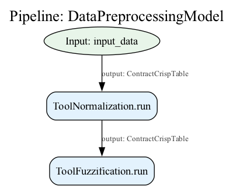

.. _model_api:

=========
Model API
=========

The Model API provides a high-level abstraction layer over the FuzzyPipeline system, 
enabling developers to build complex fuzzy data analysis workflows using an intuitive, 
PyTorch-inspired programming model. This API transforms the declarative pipeline 
construction into an object-oriented, composable framework that emphasizes code 
readability and maintainability.

This document guides you through the Model API, from basic concepts to advanced 
patterns, demonstrating how to leverage this powerful abstraction for building 
sophisticated analysis workflows.

.. contents::
   :local:

What is Model API
-----------------

Understanding the Model Concept
~~~~~~~~~~~~~~~~~~~~~~~~~~~~~~~

The Model API represents the highest level of abstraction in AxisFuzzy's analysis 
framework, transforming how we construct and execute fuzzy data analysis workflows. 
Rather than manually orchestrating components through explicit pipeline construction, 
the Model API enables you to define analysis logic using intuitive, object-oriented 
patterns that feel natural to Python developers.

Think of a Model as a **blueprint for your analysis workflow**. Just as an architect 
creates blueprints that describe how a building should be constructed without 
specifying the exact construction sequence, a Model describes what your analysis 
should accomplish without dictating the precise execution order.

At its core, a Model serves as:

- **A High-Level Abstraction Layer**: Sits above the Pipeline and Component systems, 
  providing a user-friendly interface for complex analysis workflows
- **An Automatic Pipeline Generator**: Converts your intuitive ``forward()`` method 
  into optimized ``FuzzyPipeline`` execution graphs through symbolic tracing
- **A Composable Building Block**: Enables hierarchical composition where models 
  can contain other models, creating sophisticated nested analysis structures
- **A Contract-Aware System**: Seamlessly integrates with AxisFuzzy's type safety 
  system to ensure data compatibility across workflow stages

Why Model Over Direct Pipeline Usage
~~~~~~~~~~~~~~~~~~~~~~~~~~~~~~~~~~~~

To understand the Model API's value, consider the difference between manual pipeline 
construction and model-based approaches. Traditional pipeline construction requires 
explicit dependency management and careful orchestration:

.. code-block:: python

   # Traditional Pipeline Approach - Manual and Verbose
   pipeline = FuzzyPipeline("data_analysis")
   
   # Explicit input definition with contracts
   input_data = pipeline.input("raw_data", contract=ContractCrispTable)
   input_weights = pipeline.input("weights", contract=ContractWeightVector)
   
   # Manual step orchestration with dependency tracking
   step1 = pipeline.add(normalizer.run, data=input_data)
   step2 = pipeline.add(weight_normalizer.run, weights=input_weights)
   step3 = pipeline.add(fuzzifier.run, data=step1)
   final_result = pipeline.add(aggregator.run, data=step3, weights=step2)

This approach, while powerful, requires you to:

- Manually track data dependencies between steps
- Explicitly manage intermediate variable names
- Handle contract validation at each step
- Maintain complex orchestration logic

The Model API transforms this complexity into elegant, readable code:

.. code-block:: python

   # Model API Approach - Intuitive and Clean
   class DataAnalysisModel(Model):
       def __init__(self):
           super().__init__()
           self.normalizer = ToolNormalization()
           self.weight_normalizer = ToolWeightNormalization()
           self.fuzzifier = ToolFuzzification(fuzzifier=my_fuzzifier)
           self.aggregator = ToolSimpleAggregation()
       
       def forward(self, raw_data: ContractCrispTable, weights: ContractWeightVector):
           # Natural data flow description
           normalized_data = self.normalizer(raw_data)
           normalized_weights = self.weight_normalizer(weights)
           fuzzy_data = self.fuzzifier(normalized_data)
           return self.aggregator(fuzzy_data, normalized_weights)

The Model API automatically handles:

- **Dependency Resolution**: Infers data flow from your ``forward()`` method
- **Pipeline Generation**: Creates optimized execution graphs behind the scenes
- **Contract Validation**: Ensures type safety through symbolic tracing
- **Resource Management**: Optimizes memory usage and execution order

Design Philosophy and Inspiration
~~~~~~~~~~~~~~~~~~~~~~~~~~~~~~~~~

The Model API draws inspiration from PyTorch's ``nn.Module`` architecture while 
adapting its principles specifically for fuzzy data analysis workflows. This design 
philosophy centers on several key principles:

**Declarative Over Imperative**: Your ``forward()`` method describes *what* the 
analysis should accomplish, not *how* it should be executed. The framework handles 
the complex orchestration details automatically.

**Composability by Design**: Models naturally compose with other models, enabling 
you to build complex analysis workflows from simpler, reusable components. A model 
can contain other models, creating hierarchical structures that mirror real-world 
analysis patterns.

**Symbolic Execution**: The framework traces your ``forward()`` method symbolically 
during the ``build()`` phase, capturing the computational graph without executing 
the actual analysis. This enables powerful optimizations and introspection capabilities.

**Developer Experience First**: Familiar object-oriented patterns reduce cognitive 
load, making complex fuzzy analysis workflows as intuitive as writing regular Python 
classes. The API feels natural to developers with experience in modern machine 
learning frameworks.

**Integration with AxisFuzzy Ecosystem**: Models seamlessly integrate with the 
broader AxisFuzzy ecosystem, including the Component system for reusable analysis 
building blocks, the Contract system for type safety, and the Pipeline system for 
execution optimization.

Building Your First Model
--------------------------

Essential Model Components
~~~~~~~~~~~~~~~~~~~~~~~~~~

Creating a Model in AxisFuzzy follows a structured pattern that ensures consistency, 
maintainability, and integration with the broader framework. Every Model implementation 
requires four essential components that work together to define your analysis workflow.

**1. Class Inheritance and Structure**

All models must inherit from the base ``Model`` class, which provides the core 
infrastructure for symbolic tracing, pipeline generation, and execution management:

.. code-block:: python

   from axisfuzzy.analysis.app.model import Model
   
   class MyAnalysisModel(Model):
       """A custom analysis model for specific workflow needs."""
       pass

The ``Model`` base class inherits from both ``AnalysisComponent`` and ``ABC`` (Abstract 
Base Class), ensuring your model integrates seamlessly with the component system while 
enforcing implementation of required abstract methods.

**2. Component Initialization**

The ``__init__`` method is where you define and configure the analysis components 
(building blocks) that your model will orchestrate. This is where you compose your 
workflow from reusable components:

.. code-block:: python

   def __init__(self, normalization_method='min_max'):
       super().__init__()  # Essential: Initialize the base Model
       
       # Define analysis components with their configurations
       self.normalizer = ToolNormalization(method=normalization_method, axis=0)
       self.fuzzifier = ToolFuzzification(fuzzifier=my_fuzzifier)
       self.aggregator = ToolSimpleAggregation(operation='mean')

**3. Configuration Serialization**

The ``get_config()`` method enables model persistence, reproducibility, and sharing. 
This method must return a dictionary containing all necessary information to recreate 
your model:

.. code-block:: python

   def get_config(self) -> dict:
       """Return serializable configuration for model persistence."""
       return {
           'model_type': 'DataPreprocessingModel',
           'normalizer_config': self.normalizer.get_config(),
           'fuzzifier_config': self.fuzzifier.get_config(),
           'aggregator_config': self.aggregator.get_config()
       }

**4. Forward Logic Definition**

The ``forward()`` method is the heart of your model - it describes how data flows 
through your components using natural Python syntax. This method is symbolically 
traced during the build phase to generate the execution pipeline:

.. code-block:: python

   def forward(self, data: ContractCrispTable) -> ContractFuzzyTable:
       """Define the data flow logic using natural Python syntax."""
       # Data flows naturally through components
       normalized_data = self.normalizer(data)
       fuzzy_data = self.fuzzifier(normalized_data)
       aggregated_result = self.aggregator(fuzzy_data)
       return aggregated_result

Complete First Model Example
~~~~~~~~~~~~~~~~~~~~~~~~~~~~~

Let's build a complete, practical model that demonstrates real-world usage patterns. 
This example creates a data preprocessing model that normalizes input data and prepares 
it for fuzzy analysis:

.. code-block:: python

   from axisfuzzy.analysis.app.model import Model
   from axisfuzzy.analysis.component.basic import ToolNormalization, ToolFuzzification
   from axisfuzzy.analysis.build_in import ContractCrispTable, ContractFuzzyTable
   from axisfuzzy.analysis.accessor import FuzzyAccessor
   from axisfuzzy.fuzzifier import Fuzzifier
   
   class DataPreprocessingModel(Model):
       """
       A comprehensive data preprocessing model that normalizes crisp data
       and converts it to fuzzy format for downstream analysis.
       
       This model demonstrates the essential patterns for building
       reusable, configurable analysis workflows.
       """
       
       def __init__(self, normalization_method='min_max', fuzzifier_config=None):
           super().__init__()
           
           # Configure normalization component
           self.normalizer = ToolNormalization(
               method=normalization_method, 
               axis=0  # Normalize along columns
           )
           
           # Configure fuzzification component
           if fuzzifier_config is None:
               # Default fuzzifier configuration
               fuzzifier_config = {
                   'mf': 'gaussmf',
                   'mtype': 'qrofn',
                   'pi': 0.2,
                   'mf_params': [{'sigma': 0.15, 'c': 0.5}]
               }
           
           fuzzifier = Fuzzifier(**fuzzifier_config)
           self.fuzzifier = ToolFuzzification(fuzzifier=fuzzifier)
           
           # Store configuration for serialization
           self._normalization_method = normalization_method
           self._fuzzifier_config = fuzzifier_config
       
       def get_config(self) -> dict:
           """Return complete model configuration for persistence."""
           return {
               'normalization_method': self._normalization_method,
               'fuzzifier_config': self._fuzzifier_config
           }
       
       def forward(self, input_data: ContractCrispTable) -> ContractFuzzyTable:
           """
           Process input data through normalization and fuzzification.
           
           The symbolic tracer captures this data flow to generate
           an optimized execution pipeline automatically.
           """
           # Step 1: Normalize the input data
           normalized_data = self.normalizer(input_data)
           
           # Step 2: Convert to fuzzy representation
           fuzzy_data = self.fuzzifier(normalized_data)
           
           return fuzzy_data

Model Execution Workflow
~~~~~~~~~~~~~~~~~~~~~~~~~

Using your model follows a clear, three-phase workflow that separates definition, 
compilation, and execution. This separation enables powerful optimizations and 
introspection capabilities:

.. code-block:: python

   import pandas as pd
   import numpy as np
   
   # Prepare sample data
   input_data = pd.DataFrame(
       np.random.rand(5, 3), 
       columns=['Feature_1', 'Feature_2', 'Feature_3']
   )
   
   # Phase 1: Model Instantiation
   # Create your model with desired configuration
   model = DataPreprocessingModel(
       normalization_method='z_score',
       fuzzifier_config={'mf': 'gaussmf', 'mtype': 'qrofn', 'pi': 0.2, 
                        'mf_params': [{'sigma': 0.15, 'c': 0.5}]}
   )
   
   # Phase 2 & 3: Automatic Build and Execution
   # The model automatically builds the pipeline during first execution
   # Using the FuzzyAccessor (recommended approach)
   result = input_data.fuzzy.run(model)
   
   # Alternative: Direct model execution (also triggers automatic build)
   model.build()  # Optional: explicit build
   result = model.run(input_data)
   
   # Access intermediate results for debugging
   result, intermediates = input_data.fuzzy.run(model, return_intermediate=True)

output::

    --- Building FuzzyPipeline for 'DataPreprocessingModel'... ---
    --- Starting symbolic trace of 'forward' method... ---
    > Tracing call to 'ToolNormalization'...
    > Tracing call to 'ToolFuzzification'...
    --- Symbolic trace complete. ---
    --- FuzzyPipeline for 'DataPreprocessingModel' built successfully. ---

    Warning: Model 'DataPreprocessingModel' has already been built. Re-building...
    --- Building FuzzyPipeline for 'DataPreprocessingModel'... ---
    --- Starting symbolic trace of 'forward' method... ---
    > Tracing call to 'ToolNormalization'...
    > Tracing call to 'ToolFuzzification'...
    --- Symbolic trace complete. ---
    --- FuzzyPipeline for 'DataPreprocessingModel' built successfully. ---

**Understanding the Build Phase**

The ``build()`` step is crucial and performs several important operations:

1. **Symbolic Tracing**: Executes your ``forward()`` method with symbolic inputs to 
   capture the computational graph without processing actual data

2. **Pipeline Generation**: Converts the traced graph into an optimized ``FuzzyPipeline`` 
   with proper dependency resolution and execution ordering

3. **Contract Validation**: Ensures all component inputs and outputs are compatible 
   through the contract system, catching type mismatches early

4. **Optimization**: Applies various optimizations such as operation fusion and 
   memory management strategies

**Execution Flexibility**

Once built, your model provides multiple execution options:

.. code-block:: python

   # Standard execution using FuzzyAccessor
   result = input_data.fuzzy.run(model)
   
   # Step-by-step execution for debugging
   # First ensure the model is built
   model.build()
   iterator = model.step_by_step(input_data)
   
   # Iterate through each step
   for step_result in iterator:
       print(f"Step {step_result['step_index']}/{step_result['total_steps']}: "
             f"{step_result['step_name']} completed")
       print(f"Execution time: {step_result['execution_time']:.3f}ms")
   
   # Get final result from iterator
   final_result = iterator.result
   
   # Execution with intermediate results
   final_result, all_intermediates = input_data.fuzzy.run(model, return_intermediate=True)

output::

    Warning: Model 'DataPreprocessingModel' has already been built. Re-building...
    --- Building FuzzyPipeline for 'DataPreprocessingModel'... ---
    --- Starting symbolic trace of 'forward' method... ---
    > Tracing call to 'ToolNormalization'...
    > Tracing call to 'ToolFuzzification'...
    --- Symbolic trace complete. ---
    --- FuzzyPipeline for 'DataPreprocessingModel' built successfully. ---

    Step 1/2: ToolNormalization.run completed
    Execution time: 0.468ms
    Step 2/2: ToolFuzzification.run completed
    Execution time: 0.192ms

**Print Summary**

The ``.summary()`` method provides a clear and comprehensive overview of your 
model's architecture. It displays essential information like the types of layers and 
their input/output contracts in an easy-to-read format. This is particularly useful 
during model development as it helps you verify the model structure and data flow 
before actually running any computations.

.. code-block:: python

   model.summary()

output::

    Model: "DataPreprocessingModel"
    =========================================================================
    Layer (type)               Input Contracts             Output Contracts  
    -------------------------------------------------------------------------
    Input: input_data          -                           ContractCrispTable
    ToolNormalization          ContractCrispTable          ContractCrispTable
    ToolFuzzification          ContractCrispTable          ContractFuzzyTable
    -------------------------------------------------------------------------
    Total layers: 2
    =========================================================================

**Visualization**

The computational graph can be visualized as a directed acyclic graph (DAG) 
showing component connections and data flow. By using ``.visualize()``, the graphical 
representation facilitates model can be used to debug and architecture verification.

.. code-block:: python

   model.visualize()

Understanding Model Architecture
--------------------------------

The Model API represents a sophisticated abstraction layer that transforms intuitive 
object-oriented code into optimized execution graphs. Understanding its internal 
architecture is crucial for building complex analysis workflows and debugging 
performance issues.

Model-Component Relationship
~~~~~~~~~~~~~~~~~~~~~~~~~~~~

The Model API builds upon the existing AnalysisComponent foundation, creating a 
hierarchical architecture where Models serve as high-level orchestrators of 
component interactions. This relationship enables powerful composition patterns 
while maintaining clear separation of concerns.

**Inheritance and Composition Architecture**:

.. code-block:: text

   # Base hierarchy
   AnalysisComponent (Abstract Base)
   ├── Individual Components (ToolNormalization, ToolFuzzification, etc.)
   └── Model (High-level Orchestrator)
       ├── Custom Models (Your implementations)
       └── Nested Models (Models containing other Models)

The Model class inherits from ``AnalysisComponent``, making it compatible with the 
broader component ecosystem while adding specialized capabilities for workflow 
orchestration and symbolic execution.

**Automatic Component Registration**:

When you assign an AnalysisComponent to a Model attribute, it's automatically 
registered as a submodule through the overridden ``__setattr__`` method:

.. code-block:: python

   class DataAnalysisModel(Model):
       def __init__(self):
           super().__init__()
           # Automatic registration via __setattr__ override
           self.normalizer = ToolNormalization()    # Registered as submodule
           self.fuzzifier = ToolFuzzification()     # Also registered
           self.aggregator = ToolSimpleAggregation() # Also registered

This registration enables the Model to:

- Track all constituent components for serialization and introspection
- Apply symbolic tracing to component calls during the build phase
- Manage component lifecycle and state consistency
- Enable recursive building for nested model architectures

Symbolic Tracing Mechanism
~~~~~~~~~~~~~~~~~~~~~~~~~~

The heart of the Model API is its symbolic tracing system, which captures the 
execution pattern of your ``forward()`` method without actually running the 
computations. This process transforms imperative Python code into declarative 
pipeline specifications.

**Tracing Process Overview**:

1. **Input Symbolization**: Method parameters become symbolic placeholders with 
   associated contracts
2. **Call Interception**: Component calls are intercepted via monkey patching 
   and recorded as pipeline steps
3. **Dependency Tracking**: Data flow dependencies are automatically captured 
   through parameter passing
4. **Graph Construction**: The recorded pattern builds an optimized FuzzyPipeline DAG

**Implementation Details**:

.. code-block:: python

   def forward(self, data: ContractCrispTable, weights: ContractWeightVector):
       # During build(), these calls are intercepted:
       normalized = self.normalizer(data)        # Creates: normalizer_step -> data_input
       norm_weights = self.weight_norm(weights)  # Creates: weight_norm_step -> weights_input
       fuzzy_data = self.fuzzifier(normalized)   # Creates: fuzzifier_step -> normalizer_step
       
       # Multiple inputs to single component
       result = self.aggregator(fuzzy_data, norm_weights)  # Creates: aggregator_step -> [fuzzifier_step, weight_norm_step]
       return result

**Tracing Output Visualization**:

.. code-block:: text

   --- Building FuzzyPipeline for 'DataAnalysisModel'... ---
   --- Starting symbolic trace of 'forward' method... ---
     > Tracing call to 'ToolNormalization'...
     > Tracing call to 'ToolWeightNormalization'...
     > Tracing call to 'ToolFuzzification'...
     > Tracing call to 'ToolSimpleAggregation'...
   --- Symbolic trace complete. ---
   --- FuzzyPipeline for 'DataAnalysisModel' built successfully. ---

Pipeline Generation Process
~~~~~~~~~~~~~~~~~~~~~~~~~~~

The symbolic tracing process automatically generates an optimized FuzzyPipeline 
that preserves the logical structure of your ``forward()`` method while enabling 
advanced execution features like step-by-step debugging and intermediate result 
access.

**Transformation Example**:

.. code-block:: python

   # Your intuitive forward() method:
   def forward(self, data: ContractCrispTable):
       normalized = self.normalizer(data)
       return self.fuzzifier(normalized)
   
   # Equivalent generated pipeline structure:
   pipeline = FuzzyPipeline("MyModel")
   data_input = pipeline.input("data", contract=ContractCrispTable)
   norm_step = pipeline.add(self.normalizer.run, data=data_input)
   fuzz_step = pipeline.add(self.fuzzifier.run, data=norm_step)

**Advanced Pipeline Features**:

The generated pipeline inherits all FuzzyPipeline capabilities:

- **Parallel Execution**: Independent branches execute concurrently
- **Lazy Evaluation**: Steps execute only when their outputs are needed
- **Intermediate Access**: Any step's output can be retrieved for debugging
- **Step-by-Step Execution**: Iterate through execution for detailed analysis

Contract System Integration
~~~~~~~~~~~~~~~~~~~~~~~~~~~

The Model API seamlessly integrates with AxisFuzzy's contract system, providing 
compile-time type checking and runtime validation throughout the analysis workflow.

**Type Annotation Processing**:

.. code-block:: python

   def forward(self, 
               data: ContractCrispTable,        # Input contract validation
               weights: ContractWeightVector    # Input contract validation
               ) -> ContractFuzzyTable:         # Output contract specification
       # Contracts are automatically validated during build()
       # and enforced during execution
       pass

**Contract Validation Flow**:

1. **Build-Time Validation**: Input contracts are extracted from type annotations 
   and validated against component requirements
2. **Runtime Enforcement**: Data flowing through the pipeline is validated at 
   each step to ensure contract compliance
3. **Error Propagation**: Contract violations provide clear error messages with 
   step-level granularity

This integration ensures that complex multi-step workflows maintain data integrity 
and type safety without requiring manual validation code.

Advanced Model Patterns
-----------------------

The Model API's flexibility enables sophisticated analysis patterns that go beyond 
simple linear workflows. These advanced patterns leverage the framework's symbolic 
tracing and pipeline generation capabilities to create complex, reusable analysis 
architectures.

Multi-Input Multi-Output Models
~~~~~~~~~~~~~~~~~~~~~~~~~~~~~~~

Real-world analysis workflows often require processing multiple data sources and 
producing multiple outputs. The Model API naturally supports these patterns through 
its flexible parameter handling and return value processing.

**Parallel Processing Architecture**:

.. code-block:: python

   from axisfuzzy.fuzzifier import Fuzzifier
   from axisfuzzy.analysis.app.model import Model
   from axisfuzzy.analysis.component.basic import (
       ToolNormalization, ToolWeightNormalization, 
       ToolFuzzification, ToolSimpleAggregation, ToolStatistics
   )
   from axisfuzzy.analysis.build_in import (
       ContractCrispTable, ContractWeightVector, ContractStatisticsDict, ContractAny
   )
   
   # Define fuzzifier for the model
   my_fuzzifier = Fuzzifier(
       mf='gaussmf',
       mtype='qrofn',
       pi=0.2,
       mf_params=[{'sigma': 0.15, 'c': 0.5}]
   )

   class MultiStreamAnalysisModel(Model):
       def __init__(self):
           super().__init__()
           self.data_normalizer = ToolNormalization(method='min_max')
           self.weight_normalizer = ToolWeightNormalization()
           self.fuzzifier = ToolFuzzification(fuzzifier=my_fuzzifier)
           self.aggregator = ToolSimpleAggregation(operation='mean')
           self.statistical_analyzer = ToolStatistics()
       
       def get_config(self) -> dict:
           return {
               'data_normalizer': self.data_normalizer.get_config(),
               'weight_normalizer': self.weight_normalizer.get_config(),
               'fuzzifier': self.fuzzifier.get_config(),
               'aggregator': self.aggregator.get_config(),
               'statistical_analyzer': self.statistical_analyzer.get_config()
           }
       
       def forward(self, 
                   data: ContractCrispTable, 
                   weights: ContractWeightVector):
           # Parallel processing branches - execute concurrently
           normalized_data = self.data_normalizer(data)
           normalized_weights = self.weight_normalizer(weights)
           
           # Sequential processing on normalized data
           fuzzy_data = self.fuzzifier(normalized_data)
           statistical_summary = self.statistical_analyzer(normalized_data)
           
           # Multi-input aggregation using normalized data and weights
           final_scores = self.aggregator(normalized_data)
           
           # Multiple outputs as dictionary
           return {
               'scores': final_scores,
               'fuzzy_representation': fuzzy_data,
               'statistical_summary': statistical_summary,
               'normalized_weights': normalized_weights
           }

**Benefits of Multi-I/O Patterns**:

- **Parallel Execution**: Independent input processing branches execute concurrently
- **Flexible Output Access**: Consumers can access specific outputs without 
  recomputing the entire workflow
- **Intermediate Result Inspection**: All processing stages remain accessible 
  for debugging and analysis

Non-Linear Data Flow Patterns
~~~~~~~~~~~~~~~~~~~~~~~~~~~~~

The Model API excels at handling complex, non-linear data flows that mirror 
real-world analysis requirements. These patterns include branching, merging, 
conditional processing, and iterative refinement.

**Branching and Merging Workflows**:

.. code-block:: python

   class BranchingAnalysisModel(Model):
       def __init__(self):
           super().__init__()
           self.preprocessor = ToolNormalization(method='min_max')
           self.statistical_branch = ToolStatistics()
           self.fuzzy_branch = ToolFuzzification(fuzzifier=my_fuzzifier)
           self.aggregator_branch = ToolSimpleAggregation(operation='mean')
       
       def get_config(self) -> dict:
           return {
               'preprocessor': self.preprocessor.get_config(),
               'statistical_branch': self.statistical_branch.get_config(),
               'fuzzy_branch': self.fuzzy_branch.get_config(),
               'aggregator_branch': self.aggregator_branch.get_config()
           }
       
       def forward(self, data: ContractCrispTable):
           # Common preprocessing
           preprocessed = self.preprocessor(data)
           
           # Multiple analysis branches from single input
           statistical_features = self.statistical_branch(preprocessed)
           fuzzy_features = self.fuzzy_branch(preprocessed)
           aggregated_scores = self.aggregator_branch(preprocessed)
           
           # Return multiple analysis results
           return {
               'statistical_summary': statistical_features,
               'fuzzy_representation': fuzzy_features,
               'aggregated_scores': aggregated_scores,
               'preprocessed_data': preprocessed
           }

**Conditional Processing Patterns**:

.. code-block:: python

   class ConditionalAnalysisModel(Model):
       def __init__(self):
           super().__init__()
           self.preprocessor = ToolNormalization()
           self.detailed_analyzer = ToolStatistics()
           self.fast_analyzer = ToolSimpleAggregation(operation='mean')
           self.default_analyzer = ToolSimpleAggregation(operation='sum')
       
       def get_config(self) -> dict:
           return {
               'preprocessor': self.preprocessor.get_config(),
               'detailed_analyzer': self.detailed_analyzer.get_config(),
               'fast_analyzer': self.fast_analyzer.get_config(),
               'default_analyzer': self.default_analyzer.get_config()
           }
       
       def forward(self, data: ContractCrispTable, analysis_mode: ContractAny):
           preprocessed = self.preprocessor(data)
           
           # Note: Conditional logic is captured during symbolic tracing
           # The pipeline will contain all possible paths
           if analysis_mode == "comprehensive":
               detailed_features = self.detailed_analyzer(preprocessed)
               return detailed_features
           elif analysis_mode == "fast":
               return self.fast_analyzer(preprocessed)
           else:
               return self.default_analyzer(preprocessed)

**Important Note**: Conditional logic in ``forward()`` methods is captured during 
symbolic tracing. The generated pipeline includes all possible execution paths, 
with runtime decisions determining which path to execute.

Nested Model Composition
~~~~~~~~~~~~~~~~~~~~~~~~

One of the Model API's most powerful features is its support for hierarchical 
composition, where models can contain other models as components. This enables 
building complex analysis workflows from simpler, reusable building blocks.

**Hierarchical Model Architecture**:

.. code-block:: python

   from axisfuzzy.fuzzifier import Fuzzifier
   from axisfuzzy.analysis.app.model import Model
   from axisfuzzy.analysis.component.basic import (
       ToolNormalization,
       ToolFuzzification,
       ToolSimpleAggregation,
       ToolWeightNormalization
   )
   from axisfuzzy.analysis.build_in import (
       ContractCrispTable,
       ContractWeightVector,
       ContractFuzzyTable
   )

   # Create a simple fuzzifier for demonstration
   # Using Gaussian membership function with q-rung orthopair fuzzy numbers
   my_fuzzifier = Fuzzifier(
       mf='gaussmf',                    # Gaussian membership function
       mtype='qrofn',                   # q-rung orthopair fuzzy number
       q=3,                             # q parameter for qrofn
       mf_params={'sigma': 0.15, 'c': 0.5}  # Gaussian parameters
   )

   class DataPreprocessingModel(Model):
       def __init__(self):
           super().__init__()
           self.normalizer = ToolNormalization(method='z_score')
           self.statistics = ToolStatistics()  # For data quality assessment
       
       def get_config(self) -> dict:
           return {
               'preprocessing_type': 'standard',
               'normalizer': self.normalizer.get_config(),
               'statistics': self.statistics.get_config()
           }
       
       def forward(self, data: ContractCrispTable):
           # Simple preprocessing pipeline
           normalized_data = self.normalizer(data)
           return normalized_data
   
   class FuzzyAnalysisModel(Model):
       def __init__(self, fuzzifier=None):
           super().__init__()
           # Use the predefined fuzzifier if none provided
           if fuzzifier is None:
               fuzzifier = my_fuzzifier
           self.fuzzifier = ToolFuzzification(fuzzifier=fuzzifier)
           self.aggregator = ToolSimpleAggregation(operation='mean')
       
       def get_config(self) -> dict:
           return {
               'analysis_type': 'fuzzy',
               'fuzzifier': self.fuzzifier.get_config(),
               'aggregator': self.aggregator.get_config()
           }
       
       def forward(self, data: ContractCrispTable, weights: ContractWeightVector):
           # Convert to fuzzy representation
           fuzzy_data = self.fuzzifier(data)
           # Aggregate the crisp data using weights information
           aggregated_scores = self.aggregator(data)
           return {
               'fuzzy_data': fuzzy_data,
               'aggregated_scores': aggregated_scores
           }
   
   class CompleteAnalysisWorkflow(Model):
       def __init__(self, fuzzifier=None):
           super().__init__()
           # Use the predefined fuzzifier if none provided
           if fuzzifier is None:
               fuzzifier = my_fuzzifier
           # Nested models as components - automatic registration
           self.preprocessing = DataPreprocessingModel()
           self.analysis = FuzzyAnalysisModel(fuzzifier)
           self.weight_normalizer = ToolWeightNormalization()
       
       def get_config(self) -> dict:
           return {
               'workflow_type': 'complete_analysis',
               'preprocessing_config': self.preprocessing.get_config(),
               'analysis_config': self.analysis.get_config(),
               'weight_normalizer': self.weight_normalizer.get_config()
           }
       
       def forward(self, raw_data: ContractCrispTable, weights: ContractWeightVector):
           # Models calling other models - creates nested pipeline structure
           preprocessed_data = self.preprocessing(raw_data)
           normalized_weights = self.weight_normalizer(weights)
           analysis_results = self.analysis(preprocessed_data, normalized_weights)
           return analysis_results

**Example Usage**:

.. code-block:: python

   # Example usage
   data = pd.DataFrame({'A': [1, 2, 3], 'B': [4, 5, 6]})
   weights = np.array([0.6, 0.4])
   
   # Create model instances (fuzzifier is automatically used)
   fuzzy_model = FuzzyAnalysisModel()
   complete_workflow = CompleteAnalysisWorkflow()

After executing ``complete_workflow.summary()``, we can see the model architecture containing 
the nested pipeline.

.. code-block:: python

   complete_workflow.summary()

output::

    Model: "CompleteAnalysisWorkflow"
    ==============================================================================================================================
    Layer (type)                        Input Contracts                                   Output Contracts                        
    ------------------------------------------------------------------------------------------------------------------------------
    Input: raw_data                     -                                                 ContractCrispTable                      
    Input: weights                      -                                                 ContractWeightVector                    
    DataPreprocessingModel              ContractCrispTable                                ContractCrispTable                      
    └─ ToolNormalization              ContractCrispTable                                ContractCrispTable                      
    ToolWeightNormalization             ContractWeightVector                              ContractNormalizedWeights               
    FuzzyAnalysisModel                  ContractCrispTable, ContractWeightVector          ContractFuzzyTable, ContractWeightVector
    └─ ToolFuzzification              ContractCrispTable                                ContractFuzzyTable                      
    └─ ToolSimpleAggregation          ContractCrispTable                                ContractWeightVector                    
    ------------------------------------------------------------------------------------------------------------------------------
    Total layers: 3 (including 2 nested model(s) with 3 sub-layers)
    ==============================================================================================================================

**Nested Model Benefits**:

- **Modularity**: Each model can be developed, tested, and reused independently
- **Hierarchical Debugging**: Issues can be isolated to specific model levels
- **Flexible Composition**: Models can be recombined in different configurations
- **Recursive Building**: The framework automatically handles nested model building

**Pipeline Generation for Nested Models**:

When building nested models, the framework:

1. Recursively builds all nested models first
2. Integrates nested pipelines into the parent model's execution graph
3. Optimizes the combined pipeline for efficient execution
4. Maintains clear boundaries for debugging and introspection

This architecture enables building sophisticated analysis systems from simple, 
composable components while maintaining the intuitive programming model that 
makes the Model API accessible to developers.

Model Lifecycle and Management
------------------------------

Model Serialization and Persistence
~~~~~~~~~~~~~~~~~~~~~~~~~~~~~~~~~~~

Models support complete serialization for reproducibility and deployment.
The serialization system captures model architecture, configuration,
and all nested components, enabling exact reconstruction.

**Saving and Loading Models**:

.. code-block:: python

   # Save model configuration and state
   model.save("my_analysis_model.json")
   
   # Restore model from saved configuration
   loaded_model = ComplexAnalysisModel.load("my_analysis_model.json")
   loaded_model.build()  # Must rebuild after loading
   
   # Now ready for use
   results = loaded_model.run(data, weights)

**Custom Serialization**:

Every model must implement ``get_config()`` for proper serialization:

.. code-block:: python

   class CustomModel(Model):
       def __init__(self, layers=3, activation='relu'):
           super().__init__()
           self.layers = layers
           self.activation = activation
       
       def get_config(self):
           return {
               'layers': self.layers,
               'activation': self.activation
           }

Model Visualization and Debugging
~~~~~~~~~~~~~~~~~~~~~~~~~~~~~~~~~

Models provide comprehensive visualization capabilities through the
underlying FuzzyPipeline system, enabling inspection of data flow
and computational graphs.

**Visualization and Summary**:

.. code-block:: python

   # Visualize the complete computational graph
   model.visualize(save_path="model_graph.png")
   
   # Print detailed model structure
   model.summary()
   
   # Step-by-step debugging
   for step_result in model.step_by_step(data, weights):
       print(f"Step: {step_result.step_name}")
       print(f"Output: {step_result.output}")

Performance Optimization
~~~~~~~~~~~~~~~~~~~~~~~~

Model performance can be optimized through several strategies,
focusing on computational efficiency and memory management.

**Optimization Strategies**:

.. code-block:: python

   # Build-once, run-many pattern
   model = MyModel()
   model.build()  # One-time compilation cost
   
   # Efficient repeated execution
   for data_batch in data_batches:
       result = model(data_batch)
   
   # Memory-efficient execution
   results = model.run(data, return_intermediate=False)

**Component-Level Optimization**:

.. code-block:: python

   # Use efficient components for large datasets
   class OptimizedModel(Model):
       def __init__(self):
           super().__init__()
           self.normalizer = ToolNormalization(
               method='min_max', 
               axis=0,  # Vectorized operations
               inplace=True  # Reduce memory usage
           )

Error Handling and Troubleshooting
~~~~~~~~~~~~~~~~~~~~~~~~~~~~~~~~~~

The Model system provides comprehensive error handling and debugging
capabilities to help identify and resolve issues quickly.

**Common Error Patterns**:

.. code-block:: python

   # Model not built before execution
   try:
       result = model(data)
   except RuntimeError as e:
       print("Remember to call model.build() first!")
   
   # Contract validation errors
   try:
       model.run(invalid_data)
   except ContractValidationError as e:
       print(f"Contract validation failed: {e}")
       print(f"Expected: {e.expected_contract}")

**Debugging Strategies**:

.. code-block:: python

   # Enable detailed logging for troubleshooting
   import logging
   logging.getLogger('axisfuzzy.analysis').setLevel(logging.DEBUG)
   
   # Validate model state
   if not model.built:
       raise RuntimeError("Model must be built before use")
   
   # Use step-by-step execution to isolate issues
   iterator = model.step_by_step(data)
   for step in iterator:
       print(f"Successfully executed: {step.step_name}")

**Best Practices**:

1. Always call ``model.build()`` before execution
2. Use ``model.summary()`` to inspect model structure
3. Validate contracts independently before model integration
4. Enable debug logging for complex troubleshooting scenarios

Integration with Analysis Ecosystem
-----------------------------------

Component System Integration
~~~~~~~~~~~~~~~~~~~~~~~~~~~~

The Model API seamlessly integrates with AxisFuzzy's comprehensive
analysis ecosystem, providing unified access to all framework components
and enabling sophisticated analytical workflows.

**Built-in Component Support**:

.. code-block:: python

   from axisfuzzy.analysis.component.basic import (
       ToolNormalization, ToolFuzzification, ToolSimpleAggregation
   )
   
   class IntegratedModel(Model):
       def __init__(self):
           super().__init__()
           self.normalizer = ToolNormalization(method='min_max')
           self.fuzzifier = ToolFuzzification(fuzzifier=my_fuzzifier)
           self.aggregator = ToolSimpleAggregation(operation='mean')

**Custom Component Integration**:

.. code-block:: python

   class CustomProcessor(AnalysisComponent):
       def __init__(self, threshold=0.5):
           self.threshold = threshold
       
       def get_config(self):
           return {'threshold': self.threshold}
       
       def run(self, data):
           return self.process_with_threshold(data)
   
   class ModelWithCustomComponent(Model):
       def __init__(self):
           super().__init__()
           self.custom = CustomProcessor(threshold=0.7)

**Pandas Integration**:

.. code-block:: python

   import pandas as pd
   
   # DataFrames automatically gain fuzzy analysis capabilities
   df = pd.DataFrame(data)
   results = df.fuzzy.apply_model(model, weights=weights)

Contract-Driven Type Safety
~~~~~~~~~~~~~~~~~~~~~~~~~~~

The Model API leverages AxisFuzzy's contract system to provide
compile-time and runtime type safety, ensuring robust and reliable
analytical pipelines.

**Type Validation**:

.. code-block:: python

   def forward(self, data: ContractCrispTable, 
               weights: ContractWeightVector) -> ContractFuzzyTable:
       # Contract compatibility verified during build()
       normalized = self.normalizer(data)
       return self.fuzzifier(normalized)
   
   # Runtime validation with contract decorators
   @contract
   def custom_component(input_data: ContractCrispTable) -> ContractFuzzyTable:
       return fuzzify_data(input_data)

**Custom Contracts**:

.. code-block:: python

   class CustomDataContract(ContractCrispTable):
       def validate(self, data):
           super().validate(data)
           if data.shape[1] < 3:
               raise ValueError("Data must have at least 3 columns")

FuzzyPipeline Interoperability
~~~~~~~~~~~~~~~~~~~~~~~~~~~~~~

Models and FuzzyPipelines are fully interoperable, enabling flexible
composition and reuse of analytical components.

**Pipeline Access and Composition**:

.. code-block:: python

   model = ComplexAnalysisModel()
   model.build()
   
   # Access the generated pipeline directly
   pipeline = model.pipeline
   pipeline.visualize(layout='hierarchical')
   
   # Embed models within larger pipelines
   meta_pipeline = FuzzyPipeline("meta_analysis")
   input_data = meta_pipeline.input("raw_data", contract=ContractCrispTable)
   
   model_output = meta_pipeline.add(
       model.run, 
       data=input_data,
       display_name="ComplexAnalysis"
   )

**Nested Model Architecture**:

.. code-block:: python

   class HierarchicalModel(Model):
       def __init__(self):
           super().__init__()
           self.preprocessing_model = DataPreprocessingModel()
           self.analysis_model = FuzzyAnalysisModel()
       
       def forward(self, data):
           preprocessed = self.preprocessing_model(data)
           return self.analysis_model(preprocessed)

Extension and Customization
~~~~~~~~~~~~~~~~~~~~~~~~~~~

The Model API provides extensive extension points for customization
and domain-specific adaptations.

**Custom Model Base Classes**:

.. code-block:: python

   class TimeSeriesModel(Model):
       """Base class for time series fuzzy analysis."""
       
       def __init__(self, window_size=10):
           super().__init__()
           self.window_size = window_size
           self.temporal_processor = TemporalProcessor(window_size)
       
       def get_config(self):
           return {'window_size': self.window_size}

**Contract Extensions**:

.. code-block:: python

   class FinancialDataContract(ContractCrispTable):
       """Contract for financial data validation."""
       
       required_columns = ['price', 'volume', 'timestamp']
       
       def validate(self, data):
           super().validate(data)
           for col in self.required_columns:
               if col not in data.columns:
                   raise ValueError(f"Missing required column: {col}")

**Plugin Architecture**:

.. code-block:: python

   # Register custom components for automatic discovery
   from axisfuzzy.analysis.registry import ComponentRegistry
   
   @ComponentRegistry.register('custom_domain')
   class DomainSpecificComponent(AnalysisComponent):
       pass

**Advanced Customization**:

.. code-block:: python

   class OptimizedModel(Model):
       def build(self):
           super().build()
           self._apply_domain_optimizations()
       
       def _apply_domain_optimizations(self):
           # Domain-specific pipeline optimizations
           pass

Conclusion
----------

The Model API represents a significant advancement in fuzzy data analysis workflow 
construction, transforming complex pipeline orchestration into intuitive, 
object-oriented programming patterns. By abstracting away the intricacies of 
dependency management and execution optimization, it enables developers to focus 
on the analytical logic rather than infrastructure concerns.

Key advantages of the Model API include:

**Intuitive Development Experience**: The PyTorch-inspired design makes complex 
fuzzy analysis workflows as natural as writing regular Python classes, 
significantly reducing the learning curve for new developers.

**Automatic Optimization**: Symbolic tracing and pipeline generation ensure 
optimal execution performance without requiring manual optimization efforts 
from developers.

**Seamless Integration**: Deep integration with AxisFuzzy's component system, 
contract validation, and pipeline infrastructure provides a cohesive development 
experience across the entire framework.

**Production-Ready Scalability**: Built-in serialization, debugging capabilities, 
and performance monitoring make models suitable for both research prototyping 
and production deployment.

The Model API bridges the gap between research flexibility and production 
reliability, enabling teams to build sophisticated fuzzy data analysis systems 
that are both maintainable and performant. As you continue exploring AxisFuzzy's 
capabilities, the Model API will serve as your primary interface for constructing 
complex analytical workflows with confidence and clarity.