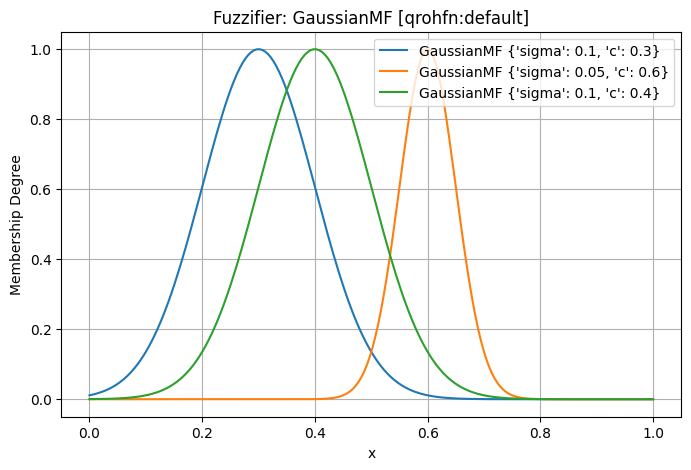

.. _fuzzifier:

##############################
Fuzzifier: From Crisp to Fuzzy
##############################

In `axisfuzzy`, the fuzzification system is a cornerstone of the library, designed for flexibility and 
extensibility. It is orchestrated by the main :class:`~axisfuzzy.fuzzifier.Fuzzifier` class, which acts 
as a high-level interface for converting crisp inputs (like numbers, lists, or NumPy arrays) into fuzzy 
representations such as :class:`~axisfuzzy.core.Fuzznum` and :class:`~axisfuzzy.core.Fuzzarray`.

This system is built on a modular architecture that leverages the **Strategy Pattern**. It allows users 
to dynamically select from various fuzzification algorithms, each encapsulated within a 
:class:`~axisfuzzy.fuzzifier.strategy.FuzzificationStrategy`. These strategies are discovered 
and managed by a singleton :class:`~axisfuzzy.fuzzifier.registry.FuzzificationStrategyRegistry`, 
ensuring a consistent and extensible framework.

This document provides a comprehensive guide to the `axisfuzzy` fuzzifier, from its architectural 
principles to practical, hands-on examples.

.. contents::
   :local:

Introduction to Fuzzification
=============================

What is Fuzzification?
----------------------

Fuzzification is the process of transforming a crisp (i.e., precise, non-fuzzy) numerical value into a fuzzy set. 
It is the first and one of the most critical steps in any fuzzy logic system. While a crisp value represents 
a single point, a fuzzy set represents that value with a degree of membership over a range of possibilities, 
capturing the inherent ambiguity and imprecision of real-world concepts.

For example, instead of defining a "hot" temperature as a single value like 30°C, fuzzification 
allows us to represent it as a fuzzy set where different temperatures have varying degrees of "hotness." 
A temperature of 28°C might have a membership degree of 0.8 to the "hot" set, while 25°C might have a degree of 0.4.

The Role of the Fuzzifier in `axisfuzzy`
----------------------------------------

In the `axisfuzzy` library, the :class:`~axisfuzzy.fuzzifier.Fuzzifier` class serves as the central 
engine for this transformation. It encapsulates the logic, algorithms, and configurations required to 
convert crisp inputs—be it a single number, a list, or a NumPy array—into fuzzy numbers (``Fuzznum``) 
or fuzzy arrays (``Fuzzarray``).

The design of the `Fuzzifier` is guided by two core principles: **flexibility** and **extensibility**. 
It allows users to easily select different fuzzification strategies and membership functions, while also 
providing a clear path for developers to extend the system with custom logic.

Architectural Deep Dive
=======================

The fuzzification subsystem in `axisfuzzy` is built upon a robust and modular architecture composed of 
three key components. This design promotes separation of concerns and leverages powerful design patterns 
to create a system that is both easy to use and easy to extend.

The Core Components
-------------------

1.  ``FuzzificationStrategy``: This is an abstract base class (ABC) that defines the contract for 
    all fuzzification algorithms. Any class that performs the actual conversion of a crisp value 
    to a fuzzy number must inherit from this class and implement the abstract ``fuzzify`` method. 
    This ensures a consistent interface across all strategies.

2.  ``FuzzificationStrategyRegistry``: This is a singleton registry that discovers, stores, and 
    manages all available ``FuzzificationStrategy`` implementations. It acts as a central lookup service, 
    allowing the ``Fuzzifier`` to find the appropriate strategy based on the fuzzy number type (``mtype``) 
    and a chosen ``method``. The registry is populated automatically using the ``@register_fuzzifier`` 
    decorator, making new strategies instantly available to the system upon definition.

3.  ``Fuzzifier``: This is the primary user-facing class. It acts as a high-level orchestrator or a 
    "facade" that coordinates the other components. When a user wants to perform fuzzification, 
    they instantiate a ``Fuzzifier``, providing it with a membership function and specifying the 
    desired strategy. The ``Fuzzifier`` then consults the registry to find the correct strategy and 
    delegates the actual fuzzification task to it.

To better visualize how these components interact, the following diagram illustrates the architectural flow:

.. code-block:: text

   Input: Crisp Value/Array
           |
           v
   ┌─────────────────────────────────────────────────────────────┐
   │                    Fuzzifier                                │
   │  ┌─────────────────┐    ┌─────────────────────────────────┐ │
   │  │  Membership     │    │     Fuzzification Strategy      │ │
   │  │  Function       │───▶│                                 │ │
   │  │                 │    │                                 │ │
   │  └─────────────────┘    └─────────────────────────────────┘ │
   │                                    │                        │
   └────────────────────────────────────┼────────────────────────┘
                                         v
                           Output: Fuzznum/Fuzzarray

Design Patterns in Action
-------------------------

The architecture elegantly employs two classic design patterns:

*   **The Strategy Pattern**: The relationship between the ``Fuzzifier`` and the various ``FuzzificationStrategy`` 
    implementations is a textbook example of the Strategy Pattern. The ``Fuzzifier`` (the context) is configured 
    with a concrete strategy object. When its ``fuzzify`` method is called, it delegates the call to the strategy object. 
    This allows the algorithm used for fuzzification to be selected and swapped at runtime, completely decoupling 
    the client (``Fuzzifier``) from the implementation of the algorithm (``FuzzificationStrategy``).

*   **The Singleton Pattern (for the Registry)**: The ``FuzzificationStrategyRegistry`` is implemented as a singleton. 
    This ensures that there is only one instance of the registry throughout the application's lifecycle. 
    A single, centralized registry guarantees that all parts of the system have a consistent view of the 
    available strategies, preventing fragmentation and simplifying management. The global ``get_registry_fuzzify()`` 
    function provides access to this single instance.

This combination of components and design patterns results in a highly cohesive and loosely coupled system, 
which is fundamental to the maintainability and scalability of `axisfuzzy`.

FuzzificationStrategy: The Blueprint for Fuzzification
=======================================================

At the heart of the fuzzification engine is the :class:`~axisfuzzy.fuzzifier.strategy.FuzzificationStrategy` 
abstract base class (ABC). This class serves as a formal contract, or blueprint, for all fuzzification 
algorithms within `axisfuzzy`. It ensures that every strategy, regardless of its internal complexity, 
presents a consistent interface to the rest of the system, particularly to the :class:`~axisfuzzy.fuzzifier.Fuzzifier`.

Core Responsibilities
---------------------

The primary responsibilities of a ``FuzzificationStrategy`` are:

1.  **Defining the Algorithm**: It must implement the logic for converting a crisp numerical input 
    (a single number or an array) into a fuzzy number (:class:`~axisfuzzy.core.fuzznums.Fuzznum`) 
    or a fuzzy array (:class:`~axisfuzzy.core.fuzzarray.Fuzzarray`).
2.  **Interfacing with Membership Functions**: It orchestrates the use of a :class:`~axisfuzzy.membership.MembershipFunction` 
    to calculate the membership degree(s) that form the basis of the resulting fuzzy number.
3.  **Handling Fuzzy Number Specifics**: It must correctly construct the target fuzzy number, 
    respecting its mathematical constraints (e.g., for a QROFN, ensuring that :math:`\mu^q + \nu^q \le 1`).

The `fuzzify` Method Contract
-----------------------------

The central piece of the strategy is the abstract method ``fuzzify``:

.. code-block:: python

   @abstractmethod
   def fuzzify(self,
               x: Union[float, int, list, np.ndarray],
               mf_cls: type,
               mf_params_list: List[Dict]) -> Union[Fuzznum, Fuzzarray]:
       """
       Fuzzifies the input data.
       """
       pass

This method signature is the core contract:

*   ``x``: The crisp input value(s). It can be a single scalar, a list, or a NumPy array, 
    allowing for both single-value and vectorized operations.
*   ``mf_cls``: The **class** of the membership function to be used (e.g., ``GaussianMF``). 
    The strategy is responsible for instantiating it.
*   ``mf_params_list``: A list of parameter dictionaries. This allows a single fuzzification 
    call to use multiple variations of the same membership function, which is essential for 
    creating hesitant fuzzy numbers or handling complex scenarios.
*   **Return Value**: The method must return either a single :class:`~axisfuzzy.core.fuzznums.Fuzznum` 
    instance (for scalar input) or a :class:`~axisfuzzy.core.fuzzarray.Fuzzarray` (for array-like input).

Strategy Identification
-----------------------

Each concrete strategy class is uniquely identified by two class attributes:

*   ``mtype``: A string indicating the type of fuzzy number it produces (e.g., ``'qrofn'``, ``'qrohfn'``).
*   ``method``: A string naming the specific algorithm (e.g., ``'linear'``, ``'entropy'``, ``'custom'``).

These attributes are not just labels; they are the keys used by the registry to store and retrieve 
the strategy, forming the foundation of the system's automatic discovery mechanism.

FuzzificationStrategyRegistry: The Central Directory
====================================================

The :class:`~axisfuzzy.fuzzifier.registry.FuzzificationStrategyRegistry` is the central nervous 
system of the fuzzification module. It acts as a comprehensive directory or catalog of all available 
:class:`~axisfuzzy.fuzzifier.strategy.FuzzificationStrategy` implementations. Implemented as a singleton, 
it ensures that there is one, and only one, source of truth for strategy discovery throughout the application.

Core Responsibilities
---------------------

1.  **Strategy Registration**: It provides a mechanism to register new strategy classes.
2.  **Strategy Discovery and Retrieval**: It allows the :class:`~axisfuzzy.fuzzifier.Fuzzifier` 
    to look up and retrieve the appropriate strategy class based on the desired fuzzy number type (``mtype``) 
    and algorithm name (``method``).
3.  **Default Management**: It manages a default method for each fuzzy number type, simplifying 
    the user experience.

The Automatic Registration and Discovery Mechanism
--------------------------------------------------

The most powerful feature of the registry is its seamless integration with the 
:func:`~axisfuzzy.fuzzifier.registry.register_fuzzifier` decorator. This decorator automates 
the entire registration process.

.. code-block:: python

   from .registry import register_fuzzifier

   @register_fuzzifier
   class MyCustomStrategy(FuzzificationStrategy):
       # ... implementation ...

When Python loads this code, the decorator immediately calls the registry's ``register`` method:

Key Methods of the Registry
---------------------------

The registry exposes several key methods for managing strategies:

*   ``register(mtype, method, strategy_cls, is_default=False)``:
    This is the core registration function, called automatically by the decorator. It maps the ``(mtype, method)`` 
    tuple to the ``strategy_cls``. If ``is_default`` is ``True``, it sets this method as the default for the given ``mtype``.

*   ``get_strategy(mtype, method=None)``:
    This is the primary lookup method used by the ``Fuzzifier``. It retrieves the strategy **class** associated 
    with the given ``mtype`` and ``method``. If ``method`` is omitted, it intelligently falls back to the 
    registered default method for that ``mtype``. This allows users to simply specify a fuzzy number type 
    (like ``'qrofn'``) and get the most common or recommended fuzzification algorithm for it without needing 
    to know the specific method name.

*   ``list_strategies(mtype=None)``:
    Provides a list of all registered ``(mtype, method)`` tuples, allowing for introspection and discovery 
    of available capabilities.

*   ``get_available_mtypes()`` and ``get_available_methods(mtype)``:
    These helper methods make it easy to query which fuzzy number types are supported and what 
    methods are available for each type.

Decoupling in Action
--------------------

The registry, in combination with the strategy pattern, creates a beautifully decoupled architecture. 
The ``Fuzzifier`` does not need to know about any concrete strategy classes. It only communicates with 
the registry, asking for a strategy that matches the user's request.

This design means that developers can add entirely new fuzzification algorithms to `axisfuzzy` without 
ever touching the core ``Fuzzifier`` code. As long as a new strategy adheres to the 
:class:`~axisfuzzy.fuzzifier.strategy.FuzzificationStrategy` contract and is registered with the decorator, 
it instantly becomes available throughout the system.

Using the Fuzzifier
====================

This section provides a practical, step-by-step guide to using the :class:`~axisfuzzy.fuzzifier.Fuzzifier`. 
We will cover everything from the initial setup to creating a ``Fuzzifier`` instance, performing the actual 
fuzzification, and interpreting the results. The design of the ``Fuzzifier`` emphasizes flexibility, allowing 
you to configure it in several ways to best suit your application's needs.

Creating a Fuzzifier Instance: Three Core Approaches
-----------------------------------------------------

Instantiating a :class:`~axisfuzzy.fuzzifier.Fuzzifier` is a declarative process. You specify *what* you want to achieve, 
and the ``Fuzzifier`` handles the *how*. The constructor's flexibility shines in how you define the membership 
function (``mf``), which can be done in three distinct ways.

The general constructor signature is:

.. code-block:: python

   Fuzzifier(mf, mtype=None, method=None, **kwargs)

Key Parameters:

*   ``mf``: The membership function definition. This can be an **instance**, a **class**, or a **string name**.
*   ``mtype``: A string specifying the target fuzzy number type (e.g., ``'qrofn'``, ``'qrohfn'``).
*   ``method``: A string specifying the fuzzification strategy. If omitted, the registered default for the ``mtype`` is used.
*   ``**kwargs``: A flexible set of keyword arguments, including:
    
    - ``mf_params``: **Crucially**, this dictionary (or list of dictionaries) provides the parameters 
      for the membership function when ``mf`` is a class or a name.
    
    - Other parameters required by the chosen strategy (e.g., ``q`` for q-rung orthopair fuzzy numbers).

Let's explore the three approaches to providing ``mf``.

Approach 1: By Membership Function Instance (The Direct Approach)
~~~~~~~~~~~~~~~~~~~~~~~~~~~~~~~~~~~~~~~~~~~~~~~~~~~~~~~~~~~~~~~~~~

This is the most direct method. You create and configure an instance of a :class:`~axisfuzzy.membership.MembershipFunction` 
subclass first, and then pass it to the ``Fuzzifier``. The ``Fuzzifier`` will automatically infer the parameters from the instance.

.. code-block:: python

   from axisfuzzy.fuzzifier import Fuzzifier
   from axisfuzzy.membership import GaussianMF

   # Step 1: Create a pre-configured membership function instance
   mf_instance = GaussianMF(sigma=4.0, c=20.0)

   # Step 2: Pass the instance to the Fuzzifier.
   # Parameters are automatically inferred. No `mf_params` needed.
   fuzz_engine = Fuzzifier(
       mf=mf_instance,
       mtype='qrofn',
       q=3
   )

   print(f"Engine created with instance: {fuzz_engine}")

Approach 2: By Membership Function Class (The Declarative Approach)
~~~~~~~~~~~~~~~~~~~~~~~~~~~~~~~~~~~~~~~~~~~~~~~~~~~~~~~~~~~~~~~~~~~

This approach is more declarative. You provide the membership function **class** itself (e.g., ``GaussianMF``) and 
supply its parameters separately through the ``mf_params`` keyword argument. This keeps the configuration 
centralized in the ``Fuzzifier`` constructor.

.. code-block:: python

   from axisfuzzy.fuzzifier import Fuzzifier
   from axisfuzzy.membership import GaussianMF

   # Pass the class and its parameters separately
   fuzz_engine = Fuzzifier(
       mf=GaussianMF,
       mtype='qrofn',
       q=3,
       mf_params={'sigma': 4.0, 'c': 20.0}  # Parameters for GaussianMF
   )

   print(f"Engine created with class: {fuzz_engine}")

Approach 3: By Membership Function Name (The Dynamic Approach)
~~~~~~~~~~~~~~~~~~~~~~~~~~~~~~~~~~~~~~~~~~~~~~~~~~~~~~~~~~~~~~

This is the most flexible method, ideal for dynamic configurations (e.g., loading from a JSON or YAML file). 
You provide the registered **string name** or alias of the membership function (e.g., ``'gaussmf'``) and 
its parameters via ``mf_params``.

.. code-block:: python

   from axisfuzzy.fuzzifier import Fuzzifier

   # Use the registered name 'gaussmf'
   fuzz_engine = Fuzzifier(
       mf='gaussmf',
       mtype='qrofn',
       q=3,
       mf_params={'sigma': 4.0, 'c': 20.0}
   )

   print(f"Engine created with name: {fuzz_engine}")

This approach decouples your code from specific class imports, making it highly adaptable.

Performing Fuzzification
------------------------

Once instantiated, the ``Fuzzifier`` object is callable, meaning you can use it like a function. 
It seamlessly handles single values, lists, or NumPy arrays, always returning the appropriate fuzzy representation.

.. code-block:: python

   import numpy as np

   # Assuming `fuzz_engine` is one of the Fuzzifiers created above.

   # a. Fuzzify a single crisp value
   crisp_value = 18.0
   fuzzy_number = fuzz_engine(crisp_value)

   print(f"Crisp input: {crisp_value}")
   print(f"Fuzzy output: {fuzzy_number}")
   print(f"Type of output: {type(fuzzy_number)}")

   # b. Fuzzify a NumPy array
   crisp_array = np.array([15.0, 20.0, 25.0])
   fuzzy_array = fuzz_engine(crisp_array)

   print(f"\nCrisp array input: {crisp_array}")
   print(f"Fuzzy array output: {fuzzy_array}")
   print(f"Type of output: {type(fuzzy_array)}")

Interpreting the Result
-----------------------

The output of a fuzzification operation is either a :class:`~axisfuzzy.core.Fuzznum` (for a single input) or 
a :class:`~axisfuzzy.core.Fuzzarray` (for an array input).

A :class:`~axisfuzzy.core.Fuzznum` is a structured object that holds the membership degree (``md``), 
non-membership degree (``nmd``)(example for ``qrofn``).

For our ``qrofn`` example, the ``fuzz_engine`` would perform the following internal steps when called with :math:`x = 18.0`:

1.  **Calculate Membership Degree**: It computes ``md = GaussianMF(sigma=4.0, c=20.0).compute(18.0)``.
2.  **Apply Fuzzification Strategy**: The chosen ``qrofn`` strategy then uses this ``md`` and the ``q=3`` 
    parameter to calculate the ``nmd``. For a standard ``qrofn``, this is typically ``nmd = (1 - md**q)**(1/q)``.
3.  **Construct Fuzznum**: It returns a ``Fuzznum`` object containing the calculated ``md`` and ``nmd``.

The resulting fuzzy number encapsulates the input's belongingness to the fuzzy set defined by the Gaussian curve, 
providing a rich, nuanced representation compared to the original crisp value.

Handling Complex Scenarios: Multiple Membership Functions
---------------------------------------------------------

A powerful feature of the ``Fuzzifier`` is its ability to handle multiple membership function definitions for a 
single fuzzification task. This is particularly important for creating Hesitant Fuzzy Numbers (like ``qrohfn``), 
where a single crisp value is mapped to multiple membership degrees, reflecting uncertainty or expert disagreement.

This is achieved by passing a **list of dictionaries** to the ``mf_params`` argument.

**Use Case: Creating a Q-Rung Orthopair Hesitant Fuzzy Number (qrohfn)**

Let's configure a ``Fuzzifier`` to evaluate a score based on three different perspectives: pessimistic, neutral, 
and optimistic. Each perspective is represented by a different Gaussian membership function.

.. code-block:: python

   from axisfuzzy.fuzzifier import Fuzzifier

   # Configure a Fuzzifier for a hesitant fuzzy scenario
   hesitant_fuzzifier = Fuzzifier(
       mf='gaussmf',
       mtype='qrohfn',  # Target: q-rung Orthopair Hesitant Fuzzy Number
       q=2,
       mf_params=[
           {'sigma': 0.1, 'c': 0.3},  # Pessimistic view
           {'sigma': 0.1, 'c': 0.5},  # Neutral view
           {'sigma': 0.1, 'c': 0.7}   # Optimistic view
       ]
   )

   # Fuzzify a single score
   score = 0.45
   hesitant_fuzzy_number = hesitant_fuzzifier(score)

   print(f"Crisp score: {score}")
   print(f"Hesitant Fuzzy Number: {hesitant_fuzzy_number}")

Output

.. code-block:: text

    Crisp score: 0.45
    Hesitant Fuzzy Number: <[0.0439, 0.3247, 0.8825],[0.1]>

When ``hesitant_fuzzifier`` is called, it computes the membership degree for the input score ``0.45`` against 
*each* of the three Gaussian functions, resulting in a ``Fuzznum`` that contains a set of membership degrees, 
capturing the full spectrum of the hesitant evaluation.

.. note::
   **Critical Difference: QROFN vs QROHFN Multi-Parameter Fuzzification**
   
   When using multiple membership function parameters (``mf_params`` as a list), there is a fundamental 
   difference between ``qrofn`` and ``qrohfn`` fuzzification strategies:
   
   * **QROFN (Q-Rung Orthopair Fuzzy Numbers)**: Multiple parameters create **separate** fuzzy numbers 
     that are stacked together, resulting in a ``Fuzzarray`` with an **additional dimension**. For example, 
     if you fuzzify a 2D NumPy array with 3 parameter sets, the result will be a 3D ``Fuzzarray``.
   
   * **QROHFN (Q-Rung Orthopair Hesitant Fuzzy Numbers)**: Multiple parameters are **fused** into a 
     single hesitant fuzzy number, maintaining the **same dimensionality** as the input. The same 2D 
     array with 3 parameter sets results in a 2D ``Fuzzarray`` where each element contains multiple 
     membership degrees.
   
   This distinction is crucial for high-dimensional data processing and affects the shape of your 
   output arrays. Choose the appropriate fuzzy number type based on whether you need separate 
   evaluations (QROFN) or hesitant/uncertain evaluations (QROHFN).

Batch Processing of Array-Like Data
-----------------------------------

The ``Fuzzifier`` is optimized for performance and can seamlessly process not just single values, but 
also **NumPy arrays** and **lists of numbers**. When an array-like input is provided, the fuzzifier 
applies the same membership function(s) to every element in the array, returning a list of ``Fuzznum`` objects.

This vectorization-like capability is highly efficient for batch processing tasks, such as fuzzifying an entire dataset column.

.. code-block:: python

   import numpy as np
   from axisfuzzy.fuzzifier import Fuzzifier

   # Fuzzifier for 'medium' values
   fuzzifier = Fuzzifier(mf='gaussmf', mf_params={'sigma': 0.1, 'c': 0.5})

   # A dataset of crisp values
   crisp_data = np.array([0.1, 0.48, 0.52, 0.9, 0.3])

   # Fuzzify the entire array in one go
   fuzzy_results = fuzzifier(crisp_data)

   # The output is a list of Fuzznum objects
   for crisp, fuzzy in zip(crisp_data, fuzzy_results):
       print(f"Crisp: {crisp:.2f} -> Fuzzy: {fuzzy}")

This demonstrates how easily the ``Fuzzifier`` scales from single data points to large datasets, 
making it a powerful tool for data analysis and feature engineering pipelines.

Advanced Features
=================

This section delves into the advanced capabilities of the :class:`~axisfuzzy.fuzzifier.Fuzzifier`, 
specifically its support for serialization and visualization. These features are designed to enhance 
portability, reproducibility, and analytical insight.

Serialization for Portability
-----------------------------

A key feature of the ``Fuzzifier`` is its ability to be serialized. This means you can save the complete 
configuration of a ``Fuzzifier`` instance—including its membership function, strategy, and all associated 
parameters—and then perfectly reconstruct it later. This is invaluable for model persistence, sharing 
configurations, and ensuring reproducibility in experiments.

This functionality is provided by two paired methods: :meth:`~axisfuzzy.fuzzifier.Fuzzifier.get_config` 
and :meth:`~axisfuzzy.fuzzifier.Fuzzifier.from_config`.

*   :meth:`~axisfuzzy.fuzzifier.Fuzzifier.get_config`: This instance method returns a serializable 
    dictionary containing all the information required to recreate the ``Fuzzifier``.
*   :meth:`~axisfuzzy.fuzzifier.Fuzzifier.from_config`: This class method takes a configuration dictionary 
    (generated by `get_config`) and returns a new `Fuzzifier` instance with the exact same configuration.

**Practical Use Case: Model Persistence and Sharing**

Imagine you have configured a complex ``Fuzzifier`` for a specific data analysis task. 
You can save its configuration to a file (e.g., in JSON format) and load it back whenever needed, 
without having to manually redefine it in your code.

.. code-block:: python

   import json
   from axisfuzzy.fuzzifier import Fuzzifier

   # 1. Create and configure a Fuzzifier
   original_fuzzifier = Fuzzifier(
       mf='gaussmf',
       mtype='qrofn',
       q=2,
       mf_params={'sigma': 0.5, 'c': 0.5}
   )

   # 2. Get its configuration and save it to a file
   config = original_fuzzifier.get_config()

   with open('fuzzifier_config.json', 'w') as f:
       json.dump(config, f)

   # ... later, in a different script or session ...

   # 3. Load the configuration from the file
   with open('fuzzifier_config.json', 'r') as f:
       loaded_config = json.load(f)

   # 4. Reconstruct the Fuzzifier from the configuration
   reconstructed_fuzzifier = Fuzzifier.from_config(loaded_config)

   # The reconstructed Fuzzifier is identical to the original
   print(f"Original: {original_fuzzifier}")
   print(f"Reconstructed: {reconstructed_fuzzifier}")

   # Verify that they produce the same output
   crisp_value = 0.7
   assert original_fuzzifier(crisp_value) == reconstructed_fuzzifier(crisp_value)

Visualization for Fuzzifier
---------------------------

Understanding the shape and position of the membership function(s) is crucial for interpreting the behavior of 
your fuzzy system. The ``Fuzzifier`` provides a built-in :meth:`~axisfuzzy.fuzzifier.Fuzzifier.plot` 
method for this exact purpose.

This method visualizes the membership function(s) associated with the ``Fuzzifier`` instance over a specified range.

**Using the** ``plot()`` **Method**

The ``plot()`` method is straightforward to use. You can control the x-axis range and the number of points used for plotting.

.. code-block:: python

   from axisfuzzy.fuzzifier import Fuzzifier

   # Create a Fuzzifier with multiple membership functions
   # for a hesitant fuzzy scenario
   hesitant_fuzzifier = Fuzzifier(
       mf='gaussmf',
       mtype='qrohfn',
       q=2,
       mf_params=[
           {'sigma': 0.1, 'c': 0.3},
           {'sigma': 0.05, 'c': 0.6},
           {'sigma': 0.1, 'c': 0.4}
       ]
   )

   # Visualize the underlying membership functions
   hesitant_fuzzifier.plot(
       x_range=(0, 1),
       num_points=200,
       show=True  # Set to False if you want to customize the plot further
   )

This will generate a plot showing the three Gaussian curves, allowing you to instantly see how 
they overlap and cover the input space.

**Customizing Plots**

The ``plot()`` method is built on top of `matplotlib`. While it provides a quick way to generate a 
standard plot, you can easily create more advanced and customized visualizations. By setting 
``show=False``, the plot is not immediately displayed, which allows you to access the current 
`matplotlib` figure and axes to add custom titles, labels, annotations, or other elements before 
finally showing it yourself.

Extending the System: Custom Fuzzification Strategies
=====================================================

The `axisfuzzy` fuzzification engine is designed for extensibility. While it comes with a set of standard, 
built-in strategies, its true power lies in allowing users to define and integrate their own custom 
fuzzification logic. This section guides you through the process of creating and registering your 
own ``FuzzificationStrategy``.

When to Build Your Own Strategy?
--------------------------------

You should consider creating a custom strategy in any of the following scenarios:

*   **Novel Fuzzy Number Types**: If you are implementing a new type of fuzzy number that is not 
    already supported by `axisfuzzy`, you will need to create a strategy to handle its specific 
    membership and non-membership calculations.
*   **Alternative Fuzzification Logic**: You may have a theoretical model or a specific application 
    requirement that defines the relationship between membership (``md``) and non-membership (``nmd``) 
    differently from the standard strategies. For example, you might want ``nmd`` to be a 
    function of both ``md`` and some external parameter.
*   **Domain-Specific Adjustments**: In certain expert systems, the fuzzification process might 
    need to incorporate domain-specific rules or heuristics that go beyond a simple mathematical 
    transformation.
*   **Performance Optimization**: For performance-critical applications, you might design a highly 
    optimized strategy that is tailored to a specific hardware architecture or numerical library.

A Step-by-Step Implementation Guide
-----------------------------------

Creating and integrating a new strategy is a straightforward process involving three key steps, 
as illustrated by the built-in strategies for ``qrofn`` and ``qrohfn``.

**1. Define the Strategy Class**

First, create a new Python class that inherits from the abstract base class 
:class:`~axisfuzzy.fuzzifier.strategy.FuzzificationStrategy`. Inside the class, you **must** define two class attributes:

*   ``mtype``: A string that specifies the fuzzy number type this strategy is for (e.g., `'qrofn'`, `'qrohfn'`).
*   ``method``: A string that provides a unique name for this strategy within its ``mtype`` (e.g., `'default'`, `'pessimistic'`).

.. code-block:: python

   from axisfuzzy.fuzzifier.strategy import FuzzificationStrategy

   class MyCustomStrategy(FuzzificationStrategy):
       mtype = 'qrofn'  # Target fuzzy number type
       method = 'my_special_method' # Unique name for the strategy

       # ... implementation will go here ...

**2. Implement the `fuzzify` Abstract Method**

Next, you must implement the ``fuzzify`` method. This is the core of your strategy, containing the 
logic to convert a crisp input into a fuzzy number or an array of fuzzy numbers.

The correct signature is:

.. code-block:: python

   from typing import Union, List, Dict
   import numpy as np
   from axisfuzzy.core import Fuzznum, Fuzzarray

   def fuzzify(self,
               x: Union[float, int, list, np.ndarray],
               mf_cls: type,
               mf_params_list: List[Dict]) -> Union[Fuzznum, Fuzzarray]:
       # Your custom logic here
       # This method should process the crisp input `x` using the provided
       # membership function class (`mf_cls`) and its parameters (`mf_params_list`)
       # and return a Fuzznum or Fuzzarray.
       pass

Key parameters:

- ``x``: The crisp input value(s), which can be a single number, a list, or a NumPy array.
- ``mf_cls``: The membership function class (e.g., ``Gaussmf``) to be used for calculating membership degrees.
- ``mf_params_list``: A list of dictionaries, where each dictionary contains the parameters for 
  one membership function instance (e.g., ``[{'c': 0.5, 'sigma': 0.1}]``).

**3. Register the New Strategy**

Finally, to make your strategy discoverable by the ``Fuzzifier``, you must register it using the 
:func:`~axisfuzzy.fuzzifier.registry.register_fuzzifier` decorator. This decorator reads the ``mtype`` 
and ``method`` attributes from your class to add it to the central registry.

The decorator can take one optional argument:

*   ``is_default`` (optional, ``bool``): If ``True``, this strategy will become the default method for 
    the specified ``mtype``. This means it will be used when a user requests that ``mtype`` without specifying a ``method``.

.. code-block:: python

   from axisfuzzy.fuzzifier import register_fuzzifier

   @register_fuzzifier(is_default=False)
   class MyCustomStrategy(FuzzificationStrategy):
       mtype = 'qrofn'
       method = 'my_special_method'

       def fuzzify(self, x, mf_cls, mf_params_list):
           # ... implementation ...
           pass

A Complete Example: The "Pessimistic" QROFN Strategy
----------------------------------------------------

Let's create a complete, practical example. We will implement a "pessimistic" strategy for q-rung 
Orthopair Fuzzy Numbers (``qrofn``). In this strategy, we'll define the non-membership degree (``nmd``) 
to be slightly higher than in the standard approach, reflecting a more cautious or "pessimistic" evaluation.

Let's say our pessimistic ``nmd`` is defined as :math:`(1 - md^q)^{1/q} + 0.1 * (1 - md)`, but capped at :math:`(1 - md^q)^(1/q)`.

.. code-block:: python

   import numpy as np
   from typing import Union, List, Dict

   from axisfuzzy.core import Fuzznum, Fuzzarray, get_registry_fuzztype
   from axisfuzzy.fuzzifier import FuzzificationStrategy, register_fuzzifier, Fuzzifier

   # Step 1 & 3: Define and Register the Strategy
   @register_fuzzifier
   class PessimisticQROFNStrategy(FuzzificationStrategy):
       """
       A pessimistic fuzzification strategy for Q-Rung Orthopair Fuzzy Numbers (QROFNs).

       This strategy calculates a non-membership degree that is intentionally
       higher than the standard, reflecting a more cautious or "pessimistic"
       evaluation. It demonstrates how to inject custom logic into the
       fuzzification process.
       """
       mtype = 'qrofn'
       method = 'pessimistic'

       # The __init__ method is inherited from FuzzificationStrategy,
       # which already handles the 'q' parameter.

       def fuzzify(self,
                   x: Union[float, int, list, np.ndarray],
                   mf_cls: type,
                   mf_params_list: List[Dict]) -> Union[Fuzznum, Fuzzarray]:
           """
           Implements the pessimistic fuzzification logic.
           """
           # For a simple QROFN, we usually work with a single membership function.
           # We'll extract the parameters for the first one.
           params = mf_params_list[0]
           mf = mf_cls(**params)
           x = np.asarray(x, dtype=float)

           # 1. Calculate the membership degree (md) from the crisp input.
           md = np.clip(mf.compute(x), 0, 1)

           # 2. Implement the custom "pessimistic" logic for non-membership (nmd).
           # The standard nmd is the maximum possible value given md.
           standard_nmd = (1 - md**self.q)**(1/self.q)

           # Our pessimistic adjustment slightly increases the non-membership degree.
           pessimistic_nmd = standard_nmd + 0.1 * (1 - md)

           # We must still respect the QROFN constraint: md^q + nmd^q <= 1.
           # So, we take the minimum of our adjusted value and the maximum allowed value.
           nmd = np.minimum(pessimistic_nmd, (1 - md**self.q)**(1/self.q))

           # 3. Create the final fuzzy number(s) using the backend system.
           backend_cls = get_registry_fuzztype().get_backend(self.mtype)
           backend = backend_cls.from_arrays(mds=md, nmds=nmd, q=self.q)
           arr = Fuzzarray(backend=backend, mtype=self.mtype, q=self.q)

           # Return a single Fuzznum if the input was a scalar.
           if x.ndim == 0:
               return arr[()]
           return arr

Now, let's use our new strategy

.. code-block:: python

   # Create a Fuzzifier and specify our custom method
   pessimistic_fuzzifier = Fuzzifier(
       mf='gaussmf',
       mtype='qrofn',
       method='pessimistic',  # <-- Here we select our new strategy
       q=3,
       mf_params={'sigma': 4.0, 'c': 20.0}
   )

   # For comparison, create a Fuzzifier using the default strategy
   default_fuzzifier = Fuzzifier(
       mf='gaussmf',
       mtype='qrofn',
       method='default',      # <-- The standard, built-in strategy
       q=3,
       mf_params={'sigma': 4.0, 'c': 20.0}
   )

   crisp_value = 18.0
   pessimistic_result = pessimistic_fuzzifier(crisp_value)
   default_result = default_fuzzifier(crisp_value)

   print(f"Crisp Input: {crisp_value}\n")
   print(f"Default Strategy Output:     {default_result}")
   print(f"Pessimistic Strategy Output: {pessimistic_result}")
   print(f"\nNote how the 'pessimistic' result has a slightly higher non-membership degree (nmd).")

output::

   Crisp Input: 18.0

   Default Strategy Output:     <0.8825,0.678>
   Pessimistic Strategy Output: <0.8825,0.6788>

   Note how the 'pessimistic' result has a slightly higher non-membership degree (nmd).

By following this pattern, you can seamlessly extend `axisfuzzy` with powerful, domain-specific 
fuzzification logic, making the system adaptable to virtually any research or application need.

Conclusion
==========

The `axisfuzzy` fuzzification system stands as a powerful and flexible engine for transforming 
crisp data into rich, nuanced fuzzy representations. Its design, rooted in the Strategy Pattern, 
provides a robust framework that is both easy to use for standard applications and highly extensible 
for advanced, domain-specific research.

Through this guide, we have explored the system from multiple perspectives:

*   **Architectural Soundness**: The clear separation of concerns between the ``Fuzzifier``, 
    ``FuzzificationStrategy``, and the ``FuzzificationStrategyRegistry`` creates a maintainable and scalable system.
*   **Practical Application**: We have demonstrated how to instantiate and use the ``Fuzzifier`` for converting 
    single values and arrays into ``Fuzznum`` and ``Fuzzarray`` objects.
*   **Advanced Capabilities**: Features like serialization (``get_config``/ ``from_config``) and visualization 
    (``plot``) enhance model persistence, reproducibility, and analytical insight.
*   **Unlimited Extensibility**: The ability to create and register custom fuzzification strategies ensures 
    that `axisfuzzy` can evolve to meet the unique demands of any fuzzy logic application or theoretical model.
