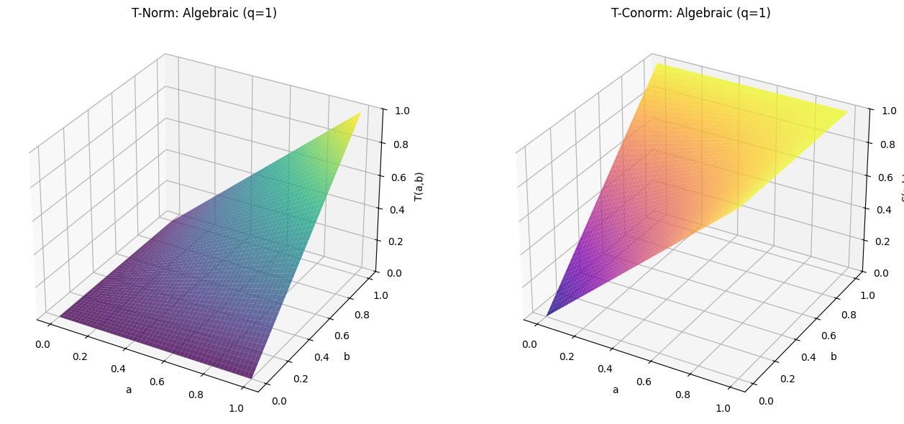

.. _fuzzy-operations:

Fuzzy Operations: High-Performance Mathematical Computations
=============================================================

This document explores the sophisticated architecture that powers high-performance mathematical and 
logical operations on fuzzy numbers and arrays. A deep understanding of this framework is essential 
for harnessing the full capabilities of the library, from basic arithmetic to advanced fuzzy inference.

`AxisFuzzy` is engineered for both power and simplicity. It abstracts the complexities of fuzzy 
mathematics through a robust, multi-layered system, allowing you to manipulate ``Fuzznum`` and ``Fuzzarray`` 
objects with the same ease as standard Python numbers or NumPy arrays. This seamless experience is achieved through:

- **A Solid Mathematical Foundation**: A comprehensive and extensible framework for triangular norms 
  (t-norms) and t-conorms, providing the building blocks for all logical operations.
- **A Unified Operation Framework**: A systematic approach to defining and registering operations for 
  diverse fuzzy number types, ensuring consistency and extensibility.
- **A Centralized Dispatch System**: An intelligent dispatcher that routes operations to the most 
  efficient execution path, seamlessly handling interactions between fuzzy objects, scalars, and NumPy arrays.
- **High-Performance Backends**: An architecture that delegates vectorized computations to specialized, 
  mtype-specific backends, leveraging the power of NumPy for C-level performance.

This guide provides a deep dive into each of these components, illuminating the design principles that 
make `AxisFuzzy` a premier tool for fuzzy set theory research and application development.

.. contents::
    :local:

Core Concepts: The `triangular.py` Module
-----------------------------------------

.. _fuzzy-operations-triangular:

At the core of fuzzy logic are the generalizations of Boolean operations (AND, OR) to the continuous domain of `[0, 1]`. 
These are known as **triangular norms (t-norms)** and **triangular conorms (t-conorms)**. The `axisfuzzy.core.triangular` 
module provides a comprehensive, high-performance, and extensible framework for these fundamental building blocks.

What are T-Norms and T-Conorms?
~~~~~~~~~~~~~~~~~~~~~~~~~~~~~~~~

- **T-Norms (Fuzzy AND)**: A t-norm, :math:`T(a, b)`, generalizes set intersection. 
  It is a commutative, associative, and monotonic function with the boundary condition :math:`T(a, 1) = a`.
- **T-Conorms (Fuzzy OR)**: A t-conorm, :math:`S(a, b)`, generalizes set union. 
  It shares the same properties but has the boundary condition :math:`S(a, 0) = a`.

They are duals under standard negation :math:`N(x) = 1 - x`, following De Morgan's laws.

The `OperationTNorm` Factory
~~~~~~~~~~~~~~~~~~~~~~~~~~~~

The primary entry point into this framework is the ``OperationTNorm`` class. It serves as a powerful factory and a
unified interface for creating, configuring, and executing all t-norm and t-conorm operations. 
It is designed to be both powerful for researchers and easy to use for practitioners.

.. code-block:: python

    from axisfuzzy.core.triangular import OperationTNorm
    import numpy as np

    # 1. Create an operator for the 'einstein' t-norm family with q=2
    einstein_op = OperationTNorm(norm_type='einstein', q=2)

Core Functionality
------------------

The operator provides methods for pairwise calculations and array-wide reductions.

**Pairwise Operations**

The ``t_norm`` and ``t_conorm`` methods perform element-wise operations on scalars or NumPy arrays.

.. code-block:: python

    # Perform scalar calculations
    t_norm_result = einstein_op.t_norm(0.6, 0.7)
    print(f"Einstein T-Norm (q=2): {t_norm_result:.3f}")

    t_conorm_result = einstein_op.t_conorm(0.6, 0.7)
    print(f"Einstein T-Conorm (q=2): {t_conorm_result:.3f}")

    # Perform vectorized calculations with NumPy arrays
    arr1 = np.array([0.1, 0.5, 0.9])
    arr2 = np.array([0.2, 0.4, 0.8])
    vectorized_result = einstein_op.t_norm(arr1, arr2)
    print(f"Vectorized T-Norm (q=2): {np.round(vectorized_result, 3)}")

**Reduction Operations**

For aggregating an array of membership values, the framework provides highly efficient reduction methods: 
``t_norm_reduce`` and ``t_conorm_reduce``. These use a tree-like reduction pattern (``_pairwise_reduce``) 
to minimize computation steps, which is significantly faster than a sequential `np.reduce`.

.. code-block:: python

    data = np.array([0.2, 0.5, 0.8, 0.9])

    # Reduce the array using the t-norm
    reduced_t_norm = einstein_op.t_norm_reduce(data)
    print(f"T-Norm Reduction: {reduced_t_norm:.3f}")

    # Reduce the array using the t-conorm
    reduced_t_conorm = einstein_op.t_conorm_reduce(data)
    print(f"T-Conorm Reduction: {reduced_t_conorm:.3f}")

Introspection and Verification
------------------------------

The framework includes tools for inspecting the operator's configuration and verifying its mathematical properties.

**Getting Operator Information**

The ``get_info`` method returns a dictionary with the current configuration of the operator.

.. code-block:: python

    info = einstein_op.get_info()
    # Returns: {'norm_type': 'einstein', 'is_archimedean': True, ... 'q': 2, ...}
    print(info)

**Verifying De Morgan's Laws**

A crucial aspect of fuzzy logic is the duality between t-norms and t-conorms. 
The ``verify_de_morgan_laws`` method allows you to check if this property holds for the current operator and its q-complement.

.. code-block:: python

    # Verify the laws for specific values
    verification_results = einstein_op.verify_de_morgan_laws(a=0.6, b=0.7)
    # Returns: {'de_morgan_1': True, 'de_morgan_2': True}
    print(f"De Morgan's Laws hold: {verification_results}")

Visualization
-------------

To build an intuitive understanding of a t-norm family's behavior, the ``plot_t_norm_surface`` method 
generates 3D surface plots for both the t-norm and its dual t-conorm.

.. code-block:: python

    # Visualize the Einstein t-norm and t-conorm surfaces (for q=2)
    einstein_op.plot_t_norm_surface()

This is an invaluable tool for teaching, research, and selecting the right norm for a specific application.

Extensibility
-------------

The framework is designed to be easily extended with custom t-norm definitions.

**Listing and Registering Norms**

You can list all available norms or register your own custom implementation.

.. code-block:: python

    from axisfuzzy.core.triangular import BaseNormOperation

    # List all available t-norm types
    print(f"Available norms: {OperationTNorm.list_available_norms()}")

    # Define a new, custom t-norm (e.g., a simplified "product" norm)
    class MySimpleNorm(BaseNormOperation):
        def t_norm_impl(self, a, b):
            return a * b
        def t_conorm_impl(self, a, b):
            return a + b - a * b

    # Register the new norm with a unique name
    OperationTNorm.register_norm('my_simple_norm', MySimpleNorm)

    # Now you can use it like any other built-in norm
    my_op = OperationTNorm(norm_type='my_simple_norm')
    print(f"Custom T-Norm: {my_op.t_norm(0.5, 0.6):.3f}")

Framework Architecture
~~~~~~~~~~~~~~~~~~~~~~

The `triangular.py` module is designed for extensibility and performance, built on several key components:

- ``BaseNormOperation``: An abstract base class that defines the contract for all t-norm implementations. 
  Each specific family (e.g., `EinsteinNorm`, `LukasiewiczNorm`) is a subclass that provides concrete 
  implementations for ``t_norm_impl`` and ``t_conorm_impl``.

- Registration Mechanism: The framework uses a registry pattern. New t-norm classes decorated 
  with ``@register_norm`` are automatically discovered and made available through the 
  ``OperationTNorm`` factory, making the system easily extensible.

- ``TypeNormalizer``: A utility class that ensures type safety and consistency. 
  It automatically handles conversions between scalars and NumPy arrays, ensuring that all 
  internal computations are performed on `np.ndarray` for maximum performance and broadcasting capabilities.

- **q-Rung Support**: The framework natively supports q-rung fuzzy sets. By specifying the `q` parameter, 
  ``OperationTNorm`` automatically creates q-extended versions of the t-norm and t-conorm, 
  :math:`T_q(a,b) = (T(a^q, b^q))^{\frac{1}{q}}`, enabling advanced fuzzy modeling without extra effort.

.. code-block:: python

    # Create an operator for a q-rung fuzzy set with q=3
    qrofn_op = OperationTNorm(norm_type='algebraic', q=3)

    # This now computes the q-extended algebraic t-norm
    q_result = qrofn_op.t_norm(0.6, 0.7)
    # Expected: (0.6^3 * 0.7^3)^(1/3) = (0.216 * 0.343)^(1/3) = 0.074088^(1/3) = 0.42
    print(f"q-Extended Algebraic T-Norm (q=3): {q_result:.3f}")

Supported T-Norm Families
~~~~~~~~~~~~~~~~~~~~~~~~~

`AxisFuzzy` provides a rich library of 12 t-norm families, each with distinct characteristics 
suitable for different modeling scenarios. They are broadly classified into Archimedean and non-Archimedean types.

**Archimedean T-Norms**

These are characterized by the property :math:`T(x, x) < x` for :math:`x` 
in (0, 1) and can be constructed from a generator function.

1.  **algebraic**: :math:`T(a, b) = a \times b`
2.  **lukasiewicz**: :math:`T(a, b) = \max(0, a + b - 1)`
3.  **einstein**: :math:`T(a, b) = (a \times b) / (1 + (1 - a) \times (1 - b))`
4.  **hamacher**: A parameterized family.
5.  **yager**: A parameterized family.
6.  **schweizer_sklar**: A parameterized family.
7.  **dombi**: A parameterized family.
8.  **aczel_alsina**: A parameterized family.
9.  **frank**: A parameterized family.

**Non-Archimedean T-Norms**

10. **minimum**: :math:`T(a, b) = \min(a, b)`. The standard and most widely used t-norm.
11. **drastic**: :math:`T(a, b)` is :math:`b` if :math:`a=1`, :math:`a` if :math:`b=1`, and :math:`0` otherwise.
12. **nilpotent**: A non-Archimedean t-norm where :math:`T(a,b) = \min(a,b)` if :math:`a+b > 1` and :math:`0` otherwise.

Visualization and Analysis
~~~~~~~~~~~~~~~~~~~~~~~~~~

A key feature of the `triangular` module is the ability to visualize the behavior of 
t-norms and t-conorms. The `plot_t_norm_surface` method generates 3D surface plots, 
providing invaluable intuition for how different families shape the fuzzy intersection and union.

.. code-block:: python

    # Visualize the algebraic t-norm with parameter lambda = 3
    algebraic_op = OperationTNorm(norm_type='algebraic', lamb=3)
    algebraic_op.plot_t_norm_surface()

This tool is crucial for research and education, allowing for direct comparison and deeper 
understanding of the mathematical properties of each t-norm family.

The ``OperationTNorm`` Class
~~~~~~~~~~~~~~~~~~~~~~~~~~~~

The main entry point to the t-norm framework is the ``OperationTNorm`` class. 
It acts as a factory that provides a unified interface for all supported t-norm and t-conorm operations.

.. code-block:: python

    from axisfuzzy.core.triangular import OperationTNorm

    # Create an instance for the algebraic t-norm
    algebraic_op = OperationTNorm(norm_type='algebraic')

    # Calculate the t-norm (fuzzy AND)
    result_t = algebraic_op.t_norm(0.6, 0.7)  # Output: 0.42

    # Calculate the t-conorm (fuzzy OR)
    result_s = algebraic_op.t_conorm(0.6, 0.7)  # Output: 0.88

The ``OperationTNorm`` class also supports vectorized operations on NumPy arrays, 
which is crucial for the high-performance computation in ``Fuzzarray``.

Generator Functions for Archimedean T-Norms
~~~~~~~~~~~~~~~~~~~~~~~~~~~~~~~~~~~~~~~~~~~~

A key feature of Archimedean t-norms is that they can be constructed from 
a **generator function** :math:`g: [0, 1] -> [0, \infty]`, which is a strictly decreasing and 
continuous function with :math:`g(1) = 0`. The t-norm is then given by:

:math:`T(a, b) = g_{inv}(g(a) + g(b))`

where :math:`g_{inv}` is the pseudo-inverse of :math:`g`.

The ``OperationTNorm`` instance provides access to these functions:

.. code-block:: python

    # Get the generator function and its inverse
    g = algebraic_op.g_func
    g_inv = algebraic_op.g_inv_func

    # Verify the t-norm calculation
    # g(0.6) + g(0.7) = -ln(0.6) + -ln(0.7) = 0.5108 + 0.3567 = 0.8675
    # g_inv(0.8675) = exp(-0.8675) = 0.42
    
Support for q-Rung Fuzzy Sets
~~~~~~~~~~~~~~~~~~~~~~~~~~~~~

The framework also supports q-rung orthopair fuzzy sets (q-ROFNs) and q-rung orthopair hesitant fuzzy sets (q-ROHFNs). 
This is achieved through an isomorphic mapping that transforms the q-rung membership and 
non-membership degrees into a representation that is compatible with the standard t-norm 
and t-conorm operations. This allows the same powerful fuzzy logic operators to be applied to 
these more complex fuzzy set types. You can specify the ``q`` parameter during the initialization of ``OperationTNorm``:

.. code-block:: python

    # Create an operator for a q-rung fuzzy set with q=3
    qrofn_op = OperationTNorm(norm_type='einstein', q=3)

The Core Computational Engine
------------------------------

.. _fuzzy-operations-framework:

The computational power of ``Fuzznum`` and ``Fuzzarray`` is driven by a sophisticated, extensible framework 
defined in the ``axisfuzzy.core.operation`` module. This engine is architected around two pivotal classes, 
``OperationMixin`` and ``OperationScheduler``, which together provide a systematic and maintainable approach 
to defining, registering, and dispatching fuzzy number operations.

This decoupled architecture separates the *definition* of an operation from its *invocation*, 
making the system highly modular and extensible.

``OperationMixin``: The Blueprint for Fuzzy Operations
~~~~~~~~~~~~~~~~~~~~~~~~~~~~~~~~~~~~~~~~~~~~~~~~~~~~~~~

The ``OperationMixin`` class is the cornerstone for defining all fuzzy arithmetic. 
Think of it as a standardized "blueprint" or "template" that every operation must follow. 
If you want to add a specific operational rule for a new fuzzy number type, you need to implement 
a new ``OperationMixin`` subclass for that computation. For example, if you want to add addition 
operations for the ``qrofn`` type, you need to implement an ``AddOperationQROFN`` class that inherits from ``OperationMixin``.
This approach ensures that all operations, whether built-in or custom, behave consistently and 
integrate seamlessly into the ``AxisFuzzy`` ecosystem.

Key responsibilities of an ``OperationMixin`` subclass include:

- **Operation Identification**: Each subclass must define the operation's name 
  (e.g., ``'add'``, ``'mul'``, ``'gt'``) and the membership types (``mtypes``) it supports 
  (e.g., ``['qrofn']``).
- **Core Logic Implementation**: Subclasses must override specific methods to provide 
  the concrete implementation for binary (``_execute_binary_op_impl``), 
  unary (``_execute_unary_op_operand_impl``, ``_execute_unary_op_pure_impl``), 
  and comparison (``_execute_comparison_op_impl``) operations.
- **Preprocessing and Validation**: The mixin includes utility methods for preprocessing and validating operands, 
  such as ``_validate_operands`` and ``_preprocess_operands``. 
  These methods ensure that operands are of the correct type, ``mtype``, and ``q``-rung, 
  and handle any necessary conversions or coercions.
- **Type-Safety Enforcement**: The mixin includes type-checking mechanisms to ensure that 
  operations are only performed on compatible fuzzy numbers (e.g., matching ``mtype`` and ``q``-rung).

.. Note::

    The unary operations for ``_execute_unary_op_operand_impl`` and ``_execute_unary_op_pure_impl`` are different. 
    The former is for operations that require an operand and the latter is for operations that do not require an operand.

By adhering to this interface, the framework guarantees that all operations are consistent, predictable, and type-safe.

**How It Works: The Blueprint Explained**

At its core, ``OperationMixin`` is an abstract class that defines a contract. 
Any class that inherits from it must provide implementations for a few key methods. 
Here is a simplified view of its structure:

.. code-block:: python

    # Simplified from axisfuzzy/core/operation.py

    from abc import ABC, abstractmethod

    class OperationMixin(ABC):
        """A blueprint for all fuzzy operations."""

        @abstractmethod
        def get_operation_name(self) -> str:
            """Returns the unique name of the operation (e.g., 'add', 'multiply')."""
            pass

        @abstractmethod
        def get_supported_mtypes(self) -> list[str]:
            """Returns a list of fuzzy types this operation supports (e.g., ['qrofn'])."""
            pass

        def _execute_binary_op_impl(self, strategy_1, strategy_2, tnorm):
            """Implements the logic for Fuzznum (single number) operations."""
            raise NotImplementedError

        def _execute_fuzzarray_op_impl(self, fuzzarray_1, other, tnorm):
            """Implements the logic for Fuzzarray (vectorized) operations."""
            raise NotImplementedError

        # ... other methods for unary, comparison operations, etc. ...

The magic happens when you combine this blueprint with the ``@register_operation`` decorator. 
This decorator automatically tells ``AxisFuzzy``'s central "dispatcher" about your 
new operation, making it available for use.

**How to Implement a New Operation**

Let's see how this works in practice. Suppose we want to implement the addition operation 
for q-Rung Orthopair Fuzzy Numbers (``qrofn``). The implementation would look something 
like this:

.. code-block:: python

    # In axisfuzzy/fuzztype/qrofs/op.py
    from axisfuzzy.core import OperationMixin, register_operation, OperationTNorm
    from axisfuzzy import Fuzzarray

    @register_operation
    class QROFNAddition(OperationMixin):
        """Implements addition for q-Rung Orthopair Fuzzy Numbers."""

        def get_operation_name(self) -> str:
            # This name corresponds to the '+' operator.
            return 'add'

        def get_supported_mtypes(self) -> list[str]:
            # This operation is specifically for 'qrofn' types.
            return ['qrofn']

        def _execute_binary_op_impl(self, strategy_1, strategy_2, tnorm: OperationTNorm):
            """
            Defines the core logic for adding two Fuzznum objects.
            The 'strategy' objects contain the membership (md) and non-membership (nmd) degrees.
            """
            # The addition formula for QROFNs uses a T-conorm and a T-norm.
            md = tnorm.t_conorm(strategy_1.md, strategy_2.md)
            nmd = tnorm.t_norm(strategy_1.nmd, strategy_2.nmd)

            # The result is a dictionary of the new fuzzy number's components.
            return {'md': md, 'nmd': nmd, 'q': strategy_1.q}

        def _execute_fuzzarray_op_impl(self, fuzzarray_1, other, tnorm: OperationTNorm):
            """
            Defines the high-performance logic for adding Fuzzarray objects.
            This method works directly with the underlying NumPy arrays for speed.
            """
            mds1, nmds1 = fuzzarray_1.backend.get_component_arrays()
            mds2, nmds2 = other.backend.get_component_arrays() # Assumes 'other' is compatible

            md_res = tnorm.t_conorm(mds1, mds2)
            nmd_res = tnorm.t_norm(nmds1, nmds2)

            # Create a new Fuzzarray from the resulting arrays.
            backend_cls = fuzzarray_1.backend.__class__
            new_backend = backend_cls.from_arrays(md_res, nmd_res, q=fuzzarray_1.q)
            return Fuzzarray(backend=new_backend)

By following this pattern, you can extend ``AxisFuzzy`` with new operations for existing fuzzy types 
or add complete support for entirely new types of fuzzy numbers. The framework ensures that once your 
``OperationMixin`` subclass is defined and registered, it will be automatically dispatched whenever 
a user performs the corresponding operation (e.g., ``qrofn_1 + qrofn_2``).

``OperationScheduler``: The Central Dispatcher
~~~~~~~~~~~~~~~~~~~~~~~~~~~~~~~~~~~~~~~~~~~~~~~

The ``OperationScheduler`` is the central "manager" of all fuzzy computations. It doesn't perform 
calculations itself. Instead, it directs traffic, dispatching tasks to the correct "worker"—a 
specialized :class:`~.operation.OperationMixin` subclass.

Scheduler Principles
++++++++++++++++++++

1.  **Operation Registration via Decorators**

    Through the ``@register_operation`` decorator, the manager (scheduler) know about its workers 
    (mixin subclasses). This is the crucial link. When you define a new operation 
    class ``op_name`` and decorate it, you are essentially telling the scheduler at import time: "Here is a 
    new worker. It handles the operation named by ``get_operation(self, op_name: str, mtype: str)`` 
    for the fuzzy types ``mtype``.

    This automated registration process means you can add new functionality without ever 
    touching the scheduler's code. The system discovers and integrates new operations seamlessly.

2.  **Dynamic Operation Dispatch**

    When you write ``fuzznum1 + fuzznum2``, the ``__add__`` method of the fuzzy number internally 
    calls the scheduler, asking it to find a suitable worker for the ``'add'`` operation and the 
    ``mtype`` of ``fuzznum1``. The scheduler looks up its registry, finds the correct 
    :class:`~.operation.OperationMixin` subclass, and delegates the task to it. This is the essence 
    of the framework's polymorphic behavior.

3.  **T-Norm Management: Switching the Mathematical Engine**

    This is perhaps the most powerful and conceptually important feature of the scheduler. 
    The T-norm and its dual, the T-conorm, are the fundamental building blocks for fuzzy set 
    intersection and union. The choice of T-norm defines the mathematical properties of your 
    fuzzy logic system.

    The scheduler holds a globally configurable :class:`~.triangular.OperationTNorm` instance. 
    When you call ``scheduler.set_t_norm('yager', yager_param=2)``, you are doing something profound:

    -   You are instructing the scheduler to create a new T-norm object, specifically an instance 
        of the ``YagerNorm`` class from the :mod:`~.triangular` module.
    -   From that moment on, every operation dispatched by the scheduler (unless explicitly overridden) 
        will be supplied with this new ``YagerNorm`` object.
    -   The "worker" classes (e.g., ``QROFNAddition``) use the ``t_norm()`` and ``t_conorm()`` methods 
        of the provided object to perform their calculations. For example, addition is typically 
        defined using the T-conorm for membership degrees and the T-norm for non-membership degrees.

    Therefore, changing the T-norm is **not just a parameter tweak; it is a fundamental switch 
    of the underlying mathematical framework**. It allows you to instantly pivot from, for example, 
    the probabilistic logic of the ``'algebraic'`` T-norm to the bounded-difference logic of the 
    ``'lukasiewicz'`` T-norm, and observe the impact on your model's behavior—all without changing 
    any of the operation logic itself.

    .. code-block:: python

        # 1. Access the global scheduler instance
        from axisfuzzy.core.operation import get_registry_operation
        scheduler = get_registry_operation()

        # 2. Set a new T-norm
        scheduler.set_t_norm('yager', yager_param=2)

        # 3. Now, any operation performed after this will use the Yager T-norm
        result = fuzznum1 + fuzznum2  # This addition will use the Yager T-norm

4.  **Performance Monitoring**

    As a central dispatcher, the scheduler is perfectly positioned to monitor performance. 
    It wraps every operation call with a timer, providing a simple yet effective way to benchmark 
    different implementations or T-norms.

    .. code-block:: python

        # 1. Access the global scheduler instance
        from axisfuzzy.core.operation import get_registry_operation
        scheduler = get_registry_operation()

        # 2. Now, any operation performed after this will be timed
        result = fuzznum1 + fuzznum2  # This addition will be timed

        # 3. Check the performance metrics
        print(scheduler.get_performance_metrics())

How to Expend
+++++++++++++

This manager/worker design makes the framework clean and easy to extend. Let's look at its main jobs.

1.  **Registering and Finding Operations**

    The scheduler discovers its workers using the ``@register_operation`` decorator. 
    When you create a new operation class and decorate it, you're telling the scheduler: 
    "I've built a new worker. Here's what it does and what fuzzy types it supports."

    .. code-block:: python

        # Conceptual: How a new operation is registered automatically
        from axisfuzzy.core import OperationMixin, register_operation

        @register_operation
        class NewSubtraction(OperationMixin):
            def get_operation_name(self): return 'sub'
            def get_supported_mtypes(self): return ['new_fuzzy_type']
            # ... implementation ...

    Once registered, you can ask the scheduler what operations are available for any fuzzy type.

    .. code-block:: python

        # 1. Access the global scheduler instance
        from axisfuzzy.core.operation import get_registry_operation
        scheduler = get_registry_operation()

        # 2. Check which operations are available for 'qrofn'
        available_ops = scheduler.get_available_ops('qrofn')
        print(f"QROFN supports: {available_ops}")

2.  **Switching the Mathematical Engine (T-Norms)**

    This is the scheduler's most powerful feature. It lets you switch the entire mathematical 
    foundation of your fuzzy logic with a single command. The T-norm defines how fuzzy intersection 
    (AND) and union (OR) behave.

    By default, the framework uses the ``'algebraic'`` T-norm. But you can change it globally. 
    When you do, the scheduler provides this new mathematical "engine" to all subsequent operations.

    .. code-block:: python

        # 3. Get the current global T-norm configuration
        print(f"Default T-Norm before: {scheduler.get_default_t_norm_config()}")

        # 4. Change the global T-norm to the Yager T-norm with parameter 2
        # This instantly changes the math for all future default operations.
        scheduler.set_t_norm('yager', yager_param=2)
        print(f"Default T-Norm after: {scheduler.get_default_t_norm_config()}")

3.  **Performance Monitoring**

    As the central dispatcher, the scheduler can easily time every operation. This is useful for 
    benchmarking and finding performance bottlenecks.

    .. code-block:: python

        # 5. Get performance statistics
        # (Note: Operations must be run first to generate stats)
        # stats = scheduler.get_performance_stats()
        # print(stats)

        # To reset the timer cache:
        # scheduler.clear_performance_stats()

Intelligent Dispatch: The ``operate`` Function
-----------------------------------------------

.. _fuzzy-operations-dispatcher:

The ``operate`` function, located in ``axisfuzzy.core.dispatcher``, is the internal engine that powers all 
operator-based computations in AxisFuzzy. While you may never call it directly, it's what makes 
expressions like ``my_fuzzarray + 2`` or ``fuzznum1 * fuzznum2`` work seamlessly. Its sole purpose 
is to act as an intelligent "traffic cop," inspecting the types of the operands and routing the 
calculation to the most efficient backend implementation.

This dispatch mechanism achieves two primary goals:
1.  **Unified User Experience**: It allows you to use standard Python operators on all fuzzy types 
and scalars, abstracting away the complex internal logic.
2.  **Maximized Performance**: It aggressively prioritizes vectorized operations, 
ensuring that calculations involving ``Fuzzarray`` are always as fast as possible.

Here is a breakdown of its core dispatch rules:

- **`Fuzznum` vs. `Fuzznum`**:
  The simplest case. The operation is delegated directly to the underlying strategy 
  object of the ``Fuzznum`` for a straightforward, element-wise calculation.

- **`Fuzzarray` vs. `Fuzzarray`**:
  This is the high-performance path. The operation is dispatched to the 
  ``Fuzzarray``'s ``execute_vectorized_op`` method, which leverages the optimized, compiled 
  backend to perform the calculation across the entire array simultaneously.

- **`Fuzzarray` vs. `Fuzznum` (Broadcasting)**:
  To maintain performance, the ``Fuzznum`` is automatically "broadcast" into a new 
  ``Fuzzarray`` with a shape compatible with the other array operand. The operation then 
  proceeds as an efficient `Fuzzarray` vs. `Fuzzarray` calculation.

- **Fuzzy Type vs. Scalar/`ndarray` (Broadcasting)**:
  When a fuzzy object interacts with a scalar (like an ``int`` or ``float``) or a ``numpy.ndarray``, 
  the non-fuzzy operand is broadcast to work with the fuzzy object's backend. This ensures that 
  even mixed-type operations benefit from vectorized computation where possible. For example, 
  in ``my_fuzzarray * 2``, the scalar `2` is efficiently applied to every element in the array's backend.

- **Reverse Operations**:
  The dispatcher correctly handles commutative operations where the fuzzy object is on the 
  right-hand side (e.g., ``2 * my_fuzznum``). It does this by simply swapping the operands and 
  re-running the dispatch logic, avoiding redundant code.

- **Unary Operations**:
  Operations that take a single operand, like the ``complement``, are also handled, dispatching 
  to the appropriate implementation on either ``Fuzznum`` or ``Fuzzarray``.

- **Operation Aliasing**:
  For convenience and internal consistency, some operations are mapped to internal names. 
  For instance, multiplication (``mul``) or division (``div``) with a scalar is internally routed 
  to the ``tim`` (times) operation, which is optimized for scalar multiplication.

By understanding this dispatch logic, you can better predict the performance characteristics of 
your fuzzy calculations and appreciate the design that makes AxisFuzzy both powerful and easy to use.

High-Performance Vectorization with ``OperationMixin``
------------------------------------------------------

.. _fuzzy-operations-backend:

While the ``FuzzarrayBackend`` provides the optimized **Struct-of-Arrays (SoA)** data layout, 
the true engine for high-performance computation on ``Fuzzarray`` objects is the synergy between 
``OperationMixin`` and the backend. Instead of iterating over individual fuzzy numbers, `AxisFuzzy` 
leverages specialized, vectorized methods to execute operations on entire arrays at once.

The Gateway to Vectorization: ``execute_fuzzarray_op``
~~~~~~~~~~~~~~~~~~~~~~~~~~~~~~~~~~~~~~~~~~~~~~~~~~~~~~~~

The key to this process is the ``OperationMixin.execute_fuzzarray_op`` method. It serves as the 
designated entry point for operations involving at least one ``Fuzzarray``. When the dispatcher 
encounters an operation like ``fuzzarray1 + fuzzarray2``, it bypasses the scalar execution path 
and directly calls the ``execute_fuzzarray_op`` method on the appropriate ``OperationMixin`` subclass.

This method, in turn, calls the abstract ``_execute_fuzzarray_op_impl``, which concrete operation 
classes **must** override to provide a high-performance implementation.

Implementing Vectorized Logic
~~~~~~~~~~~~~~~~~~~~~~~~~~~~~

Inside an ``_execute_fuzzarray_op_impl`` override, the developer has direct access to the operands' 
underlying data structures. The logic typically follows these steps:

1.  **Access the Backend**: Retrieve the ``FuzzarrayBackend`` instance from the ``Fuzzarray`` operand(s).
2.  **Extract Component Arrays**: Get the raw NumPy arrays for each fuzzy component (e.g., ``md``, ``nmd``) from the backend.
3.  **Perform Vectorized Computation**: Apply the operation's logic directly to these NumPy arrays 
    using the provided ``OperationTNorm`` instance. This is where the significant performance gain 
    occurs, as NumPy executes these operations in optimized, compiled C or Fortran code.
4.  **Construct a New Backend**: Create a new ``FuzzarrayBackend`` instance from the resulting component arrays.
5.  **Return a New Fuzzarray**: Wrap the new backend in a new ``Fuzzarray`` object to be returned to the user.

High-Performance Vectorized Computations
~~~~~~~~~~~~~~~~~~~~~~~~~~~~~~~~~~~~~~~~

The core of ``axisfuzzy``'s performance lies in its ability to execute operations on entire 
``Fuzzarray`` objects at once, leveraging the power of NumPy for vectorized calculations. 
When implementing custom operations by subclassing ``OperationMixin``, it is crucial to provide an 
efficient, vectorized implementation in the ``_execute_fuzzarray_op_impl`` method.

Vectorized Binary Operations
++++++++++++++++++++++++++++

This method is the engine for binary operators like ``+``, ``*``, etc., on ``Fuzzarray`` objects. 
A correct implementation avoids Python loops and operates directly on the underlying NumPy arrays stored in the backend.

The key steps are:

1.  **Prepare Operands**: Extract the component NumPy arrays (e.g., membership, non-membership) from 
    the ``Fuzzarray`` operands. This step must also handle broadcasting rules between a ``Fuzzarray`` 
    and another ``Fuzzarray`` or a scalar ``Fuzznum``.
2.  **Execute Vectorized Calculation**: Use the provided ``OperationTNorm`` instance to perform the 
    core fuzzy logic (e.g., ``tnorm.t_conorm(md1, md2)``). Since ``OperationTNorm`` methods are designed 
    to work on NumPy arrays, this step is highly efficient.
3.  **Construct Result**: Create a new backend instance from the resulting component arrays and wrap it in a new ``Fuzzarray``.

Here is a practical example showing the implementation of vectorized addition for ``qrofn`` types. 
Note how the logic for preparing operands and broadcasting is handled explicitly, as would be done 
inside a helper function like ``_prepare_operands``.

.. code-block:: python

    # Example: Core algorithm for vectorized binary addition in QROFNAddition
    def _execute_fuzzarray_op_impl(self, fuzzarray_1, other, tnorm):
        # Step 1: Extract component arrays from operands
        mds1, nmds1 = fuzzarray_1.backend.get_component_arrays()
        mds2, nmds2 = self._prepare_operands(other)  # Handle Fuzzarray/Fuzznum cases
        
        # Step 2: Execute vectorized T-norm/T-conorm operations
        md_result = tnorm.t_conorm(mds1, mds2)
        nmd_result = tnorm.t_norm(nmds1, nmds2)
        
        # Step 3: Construct and return new Fuzzarray
        backend_cls = get_registry_fuzztype().get_backend(fuzzarray_1.mtype)
        new_backend = backend_cls.from_arrays(md_result, nmd_result, q=fuzzarray_1.q)
        return Fuzzarray(backend=new_backend)

Optimized Reductions: ``t_norm_reduce`` and ``t_conorm_reduce``
++++++++++++++++++++++++++++++++++++++++++++++++++++++++++++++++

For aggregation operations that rely on T-norms (e.g., calculating a fuzzy-valued sum or product across an axis), 
a critical performance feature must be used: the ``t_norm_reduce()`` and ``t_conorm_reduce()`` methods of 
the ``OperationTNorm`` object.

- **Why are they important?** A naive implementation might loop over the array, applying the T-norm pairwise. 
  This is extremely inefficient.
- **How do they work?** These ``reduce`` methods employ highly optimized algorithms, such as tree-based reduction, 
  which dramatically reduce the number of Python function calls and structure the computation for better performance. 
  Using them is not just a suggestion; it is essential for achieving high performance in custom reduction operations.

This architecture ensures that operations on large ``Fuzzarray`` objects are not just convenient but also 
exceptionally fast, fully leveraging the power of NumPy's vectorized engine within the fuzzy logic framework.

Supported Operations: Complete Reference
----------------------------------------

``AxisFuzzy`` provides comprehensive support for mathematical and logical operations on both 
``Fuzznum`` and ``Fuzzarray`` objects through intuitive Python operator overloading. This section 
provides a complete reference of all supported operations, organized by category.

Arithmetic Operations
~~~~~~~~~~~~~~~~~~~~~

The framework supports all standard arithmetic operations with seamless integration:

**Basic Arithmetic**

.. code-block:: python

    from axisfuzzy import Fuzznum, Fuzzarray
    import numpy as np

    # Create fuzzy numbers
    a = Fuzznum(mtype='qrofn').create(md=0.8, nmd=0.3, q=2)
    b = Fuzznum(mtype='qrofn').create(md=0.6, nmd=0.4, q=2)

    # Arithmetic operations
    result_add = a + b          # Addition using t-conorm
    result_sub = a - b          # Subtraction
    result_mul = a * b          # Multiplication using t-norm
    result_div = a / b          # Division
    result_pow = a ** 2         # Power operation

    # Reverse operations are also supported
    result_radd = 0.5 + a       # Reverse addition with scalar
    result_rmul = 2.0 * a       # Reverse multiplication with scalar

**Vectorized Arithmetic with Fuzzarray**

.. code-block:: python

    # Create fuzzy arrays
    arr1 = Fuzzarray(mtype='qrofn', q=2)
    arr1.backend.from_arrays(
        md=np.array([0.8, 0.7, 0.9]),
        nmd=np.array([0.2, 0.3, 0.1])
    )
    
    arr2 = Fuzzarray(mtype='qrofn', q=2)
    arr2.backend.from_arrays(
        md=np.array([0.6, 0.5, 0.8]),
        nmd=np.array([0.3, 0.4, 0.2])
    )

    # Vectorized operations
    vec_add = arr1 + arr2       # Element-wise addition
    vec_mul = arr1 * arr2       # Element-wise multiplication
    vec_pow = arr1 ** 2         # Element-wise power

Comparison Operations
~~~~~~~~~~~~~~~~~~~~~

All standard comparison operators are supported, returning boolean arrays for ``Fuzzarray`` objects:

.. code-block:: python

    # Comparison operations
    gt_result = a > b           # Greater than
    lt_result = a < b           # Less than
    ge_result = a >= b          # Greater than or equal
    le_result = a <= b          # Less than or equal
    eq_result = a == b          # Equality
    ne_result = a != b          # Inequality

    # For Fuzzarray, returns boolean NumPy arrays
    arr_gt = arr1 > arr2        # Returns: np.ndarray of bool
    arr_eq = arr1 == arr2       # Element-wise equality comparison

Logical Operations
~~~~~~~~~~~~~~~~~~

Fuzzy set operations are implemented through operator overloading, providing intuitive syntax:

**Set Operations**

.. code-block:: python

    # Fuzzy set operations
    intersection = a & b        # Intersection (fuzzy AND)
    union = a | b              # Union (fuzzy OR)
    complement = ~a            # Complement (fuzzy NOT)
    symdiff = a ^ b           # Symmetric difference (fuzzy XOR)

**Implication Operations**

.. code-block:: python

    # Fuzzy implication operations
    right_impl = a >> b        # Right implication: a → b
    left_impl = a << b         # Left implication: a ← b (equivalent to b → a)

**Equivalence Operation**

.. code-block:: python

    # Fuzzy equivalence (biconditional)
    equiv = a.equivalent(b)    # Equivalence: a ↔ b

Matrix Operations
~~~~~~~~~~~~~~~~~

For ``Fuzzarray`` objects, matrix multiplication is supported:

.. code-block:: python

    # Matrix multiplication for compatible Fuzzarray shapes
    matrix_a = Fuzzarray(mtype='qrofn', q=2, shape=(3, 4))
    matrix_b = Fuzzarray(mtype='qrofn', q=2, shape=(4, 2))
    
    # Matrix multiplication using @ operator
    result_matmul = matrix_a @ matrix_b  # Shape: (3, 2)

Operation Categories Summary
~~~~~~~~~~~~~~~~~~~~~~~~~~~~

The following table summarizes all supported operations:

.. list-table:: Supported Operations Reference
   :header-rows: 1
   :widths: 20 15 15 50

   * - Category
     - Operator
     - Method
     - Description
   * - **Arithmetic**
     - ``+``
     - ``__add__``
     - Addition using t-conorm
   * - 
     - ``-``
     - ``__sub__``
     - Subtraction
   * - 
     - ``*``
     - ``__mul__``
     - Multiplication using t-norm
   * - 
     - ``/``
     - ``__truediv__``
     - Division
   * - 
     - ``**``
     - ``__pow__``
     - Power operation
   * - **Comparison**
     - ``>``
     - ``__gt__``
     - Greater than
   * - 
     - ``<``
     - ``__lt__``
     - Less than
   * - 
     - ``>=``
     - ``__ge__``
     - Greater than or equal
   * - 
     - ``<=``
     - ``__le__``
     - Less than or equal
   * - 
     - ``==``
     - ``__eq__``
     - Equality
   * - 
     - ``!=``
     - ``__ne__``
     - Inequality
   * - **Logical**
     - ``&``
     - ``__and__``
     - Intersection (fuzzy AND)
   * - 
     - ``|``
     - ``__or__``
     - Union (fuzzy OR)
   * - 
     - ``~``
     - ``__invert__``
     - Complement (fuzzy NOT)
   * - 
     - ``^``
     - ``__xor__``
     - Symmetric difference (fuzzy XOR)
   * - **Implication**
     - ``>>``
     - ``__rshift__``
     - Right implication (a → b)
   * - 
     - ``<<``
     - ``__lshift__``
     - Left implication (a ← b)
   * - 
     - N/A
     - ``equivalent()``
     - Equivalence (a ↔ b)
   * - **Matrix**
     - ``@``
     - ``__matmul__``
     - Matrix multiplication

Type Compatibility and Broadcasting
~~~~~~~~~~~~~~~~~~~~~~~~~~~~~~~~~~~

All operations support intelligent type compatibility and broadcasting:

- **Fuzzy-Fuzzy Operations**: Between compatible fuzzy types with matching ``mtype`` and ``q`` parameters
- **Fuzzy-Scalar Operations**: Between fuzzy objects and Python scalars or NumPy scalars
- **Fuzzy-Array Operations**: Between ``Fuzzarray`` and NumPy arrays with compatible shapes
- **Broadcasting**: Automatic shape broadcasting following NumPy conventions for ``Fuzzarray`` operations

.. note::
   All operations respect the configured T-norm and T-conorm settings. You can control the 
   fuzzy logic behavior by setting the global T-norm using the operation scheduler:
   
   .. code-block:: python
   
       from axisfuzzy.core.registry import get_registry_operation
       
       scheduler = get_registry_operation()
       scheduler.set_t_norm('einstein')  # Set global T-norm to Einstein

Practical Operations
--------------------

This guide provides a comprehensive walkthrough of the operational capabilities within AxisFuzzy. 
We will explore how to perform arithmetic, logical, and other operations on ``Fuzznum`` and 
``Fuzzarray`` objects, and delve into the underlying mechanisms that make these operations both 
intuitive and highly performant.

The Operation Engine: ``dispatcher.py`` and ``OperationMixin``
~~~~~~~~~~~~~~~~~~~~~~~~~~~~~~~~~~~~~~~~~~~~~~~~~~~~~~~~~~~~~~

At the core of all fuzzy computations is a sophisticated dispatch system. When you write ``a + b``, 
where ``a`` and ``b`` are fuzzy objects, you are not just invoking a simple method. Instead, 
you are triggering a chain of events orchestrated by the central ``operate`` function 
in :py:mod:`axisfuzzy.core.dispatcher`.

This dispatcher is the "brain" that:

- Inspects the types of the operands (``Fuzznum``, ``Fuzzarray``, scalar, etc.).
- Determines the most efficient execution path based on a set of dispatch rules.
- Delegates the actual computation to a specialized :py:class:`~.operation.OperationMixin` subclass 
  registered for that specific operation (e.g., 'add', 'mul') and fuzzy type (``mtype``).

This architecture ensures that the same high-level syntax (``+``, ``*``, ``>``) is consistently applied, 
while the framework intelligently selects the best implementation, whether it's a simple scalar operation 
or a complex, vectorized computation on a large array.

Operations on ``Fuzznum`` Objects
~~~~~~~~~~~~~~~~~~~~~~~~~~~~~~~~~

A ``Fuzznum`` represents a single, atomic fuzzy number. Operations between ``Fuzznum`` objects are the most fundamental use case.

Creating ``Fuzznum`` Objects
++++++++++++++++++++++++++++

As detailed in the :ref:`user_guide_core_data_structures` guide, the recommended way to 
create ``Fuzznum`` objects is via the :py:func:`axisfuzzy.core.fuzznum` factory.

Performing Basic Arithmetic
+++++++++++++++++++++++++++

Let's see an example of adding two q-Rung Orthopair Fuzzy Numbers (q-ROFNs).

.. code-block:: python

    from axisfuzzy.core import fuzznum
    from axisfuzzy.core.operation import get_registry_operation

    # Get the global operation scheduler and set the T-Norm. 'algebraic' is the default.
    # The T-Conorm (for addition) is derived from the T-Norm.
    scheduler = get_registry_operation()
    scheduler.set_t_norm('algebraic')

    # Create two q-ROFNs using the fuzzynum factory
    a = fuzznum(md=0.8, nmd=0.1, q=3)
    b = fuzznum(md=0.7, nmd=0.2, q=3)

    # Perform addition
    c = a + b

    print(f"a: {a}")
    print(f"b: {b}")
    print(f"a + b: {c}")

    # For algebraic T-Conorm: S(x, y) = x + y - xy
    # c.md = 0.8 + 0.7 - 0.8 * 0.7 = 0.94
    # For algebraic T-Norm: T(x, y) = x * y
    # c.nmd = 0.1 * 0.2 = 0.02
    # The result is a new Fuzznum with md=0.94 and nmd=0.02

Behind the Scenes: The Dispatch Flow
++++++++++++++++++++++++++++++++++++

1.  ``a + b`` calls the special method ``a.__add__(b)``.
2.  ``Fuzznum.__add__`` delegates the call to ``operate('add', a, b)``.
3.  The ``operate`` function in ``dispatcher.py`` inspects the types and finds the rule for ``(Fuzznum, Fuzznum)``.
4.  It then calls ``a.get_strategy_instance().execute_operation('add', b.get_strategy_instance())``.
5.  The strategy instance looks up the registered operation for ``mtype='qrofn'`` and ``op_name='add'``. 
    This resolves to the ``QROFNAddition`` class defined in :py:mod:`axisfuzzy.fuzztype.qrofs.op`.
6.  The ``QROFNAddition.execute_binary_op`` method is called. It fetches the global T-Norm configuration from ``OperationTNorm``.
7.  It computes the new ``md`` using the T-Conorm and the new ``nmd`` using the T-Norm.
8.  It returns a result dictionary (e.g., ``{'md': 0.94, 'nmd': 0.02, 'q': 3}``).
9.  This dictionary is used to construct a new ``Fuzznum`` object, which is the final result.

High-Performance Vectorized Operations with ``Fuzzarray``
~~~~~~~~~~~~~~~~~~~~~~~~~~~~~~~~~~~~~~~~~~~~~~~~~~~~~~~~~

``Fuzzarray`` is the key to performance. It uses a Struct of Arrays (SoA) backend to enable 
lightning-fast vectorized computations, powered by NumPy.

Creating ``Fuzzarray`` Objects
++++++++++++++++++++++++++++++

The :py:func:`axisfuzzy.core.fuzzyarray` factory is the recommended entry point for creating ``Fuzzarray`` instances.

.. code-block:: python

    import numpy as np
    from axisfuzzy.core import fuzzyarray, fuzzynum

    # Path 1: From a list of Fuzznum objects (user-friendly)
    fuzznums_list = [
        fuzzynum(md=0.8, nmd=0.1, q=3),
        fuzzynum(md=0.7, nmd=0.2, q=3),
        fuzzynum(md=0.9, nmd=0.0, q=3)
    ]
    arr1 = fuzzyarray(fuzznums_list)
    print(f"Array from Fuzznums:\n{arr1}")

    # Path 2: From raw NumPy arrays (high-performance)
    mds = np.array([0.8, 0.7, 0.9])
    nmds = np.array([0.1, 0.2, 0.0])
    # The shape must be (number_of_components, number_of_elements)
    raw_data = np.array([mds, nmds])

    arr2 = fuzzyarray(data=raw_data, mtype='qrofn', q=3)
    print(f"Array from raw data:\n{arr2}")

Vectorized Arithmetic
+++++++++++++++++++++

Operations involving at least one ``Fuzzarray`` are automatically vectorized for maximum efficiency.

.. code-block:: python

    # arr1 and arr2 are from the previous example
    
    # 1. Fuzzarray and a scalar
    # The dispatcher handles this by broadcasting the scalar.
    arr_plus_scalar = arr1 + 0.05
    print(f"Fuzzarray + scalar:\n{arr_plus_scalar}")

    # 2. Fuzzarray and Fuzzarray (element-wise)
    arr_sum = arr1 + arr2
    print(f"Element-wise Fuzzarray addition:\n{arr_sum}")

    # 3. Fuzzarray and Fuzznum (broadcasting)
    # The Fuzznum is automatically broadcast to the shape of the Fuzzarray.
    single_fuzznum = fuzzynum(md=0.5, nmd=0.3, q=3)
    arr_mul_fuzznum = arr1 * single_fuzznum
    print(f"Fuzzarray * Fuzznum (broadcasting):\n{arr_mul_fuzznum}")

Behind the Scenes: Vectorized Dispatch
++++++++++++++++++++++++++++++++++++++

1.  ``arr1 + arr2`` calls ``arr1.__add__(arr2)``.
2.  ``Fuzzarray.__add__`` calls ``operate('add', arr1, arr2)``.
3.  ``dispatcher.operate`` sees the ``(Fuzzarray, Fuzzarray)`` pair and calls ``arr1.execute_vectorized_op('add', arr2)``.
4.  ``execute_vectorized_op`` retrieves the correct ``OperationMixin`` for `'add'` and `'qrofn'`.
5.  It calls the ``execute_fuzzarray_op`` method on this mixin, which in turn calls the 
    high-performance ``_execute_fuzzarray_op_impl``.
6.  Inside ``_execute_fuzzarray_op_impl``, the operation is performed directly on the entire NumPy 
    arrays from the SoA backends (e.g., ``backend.mds``, ``backend.nmds``). This is where the vectorization provides a massive speedup.
7.  A new ``FuzzarrayBackend`` is created from the resulting NumPy arrays.
8.  A new ``Fuzzarray`` is created from this backend (the "fast path"), and the result is returned.

Controlling Fuzzy Logic with T-Norms
~~~~~~~~~~~~~~~~~~~~~~~~~~~~~~~~~~~~

The mathematical behavior of operations like ``*`` (T-Norm) and ``+`` (T-Conorm) is not fixed. 
You can change it globally for all subsequent operations using the :py:class:`~.triangular.OperationTNorm` class.

.. code-block:: python

    from axisfuzzy.core import fuzznum
    from axisfuzzy.core.operation import get_registry_operation

    a = fuzzynum(md=0.8, nmd=0.1, q=3)
    b = fuzzynum(md=0.7, nmd=0.2, q=3)

    # Get the global operation scheduler
    scheduler = get_registry_operation()

    # Default is 'algebraic'
    scheduler.set_t_norm('algebraic')
    print(f"Algebraic Multiplication (a*b): {a * b}")

    # Change the global T-Norm to 'einstein'
    scheduler.set_t_norm('einstein')
    print(f"Einstein Multiplication (a*b): {a * b}")

    # Change it to 'lukasiewicz'
    scheduler.set_t_norm('lukasiewicz')
    print(f"Lukasiewicz Multiplication (a*b): {a * b}")

Comparison 
~~~~~~~~~~

Comparisons are also dispatched via ``operate`` and return crisp boolean values based on the 
score and accuracy functions of the fuzzy numbers.

.. code-block:: python

    from axisfuzzy.core import fuzzynum, fuzzyarray
    import numpy as np

    # Fuzznum comparison
    a = fuzzynum(md=0.8, nmd=0.1, q=3)  # score = 0.8**3 - 0.1**3 = 0.511
    b = fuzzynum(md=0.7, nmd=0.2, q=3)  # score = 0.7**3 - 0.2**3 = 0.335
    print(f"a > b: {a > b}")  # True

    # Fuzzarray vectorized comparison
    arr = fuzzyarray([a, b])
    other_fn = fuzzynum(md=0.75, nmd=0.15, q=3) # score = 0.75**3 - 0.15**3 = 0.418...
    result = arr > other_fn
    print(f"Array > Fuzznum: {result}") # [ True False]

Developer Guide: Implementing Custom Operations
------------------------------------------------

.. _fuzzy-operations-developer-guide:

AxisFuzzy's greatest strength is its extensibility. The operations framework is designed as a plug-and-play system, 
allowing developers to seamlessly add new arithmetic, logical, or comparison operations for both existing and custom 
fuzzy number types. This guide provides a comprehensive walkthrough for creating and registering your own operations.

The Core Components
~~~~~~~~~~~~~~~~~~~

Two components are central to the operation system:

1.  ``OperationMixin``: An abstract base class defined in ``axisfuzzy.core.operation``. Every operation class 
    **must** inherit from it. It defines the standard interface that the dispatcher expects, including methods for 
    identifying the operation, specifying supported types, and executing the logic.

2.  ``@register_operation``: A decorator that acts as the bridge between your custom operation class and the 
    global ``OperationScheduler``. When you decorate your class with it, the scheduler automatically indexes it, 
    making it available for dispatch whenever a matching operation is requested.

Step-by-Step Implementation Guide
~~~~~~~~~~~~~~~~~~~~~~~~~~~~~~~~~

Let's create a custom operation from scratch. We'll implement a "Dombi Intersection" operator, 
which is a specific type of t-norm based operation, for our ``qrofn`` fuzzy numbers.

**Step 1: Create the Operation File**

It's best practice to group operations for a specific fuzzy type in a dedicated module. 
For QROFNs, we will add our new class to this file.

**Step 2: Define the Operation Class**

Create a new class that inherits from ``OperationMixin`` and decorate it with ``@register_operation``.

.. code-block:: python

    from axisfuzzy.core import OperationMixin, register_operation, OperationTNorm
    from axisfuzzy import Fuzznum, Fuzzarray

    @register_operation
    class QROFNDombiIntersection(OperationMixin):
        """
        Implements the Dombi intersection operation for QROFNs.
        This is a custom logical operation, not tied to standard operators.
        """
        # ... implementation details will go here ...

**Step 3: Implement Metadata Methods**

The dispatcher needs to know what your operation is called and what fuzzy types it supports.

-   ``get_operation_name()``: This must return a unique string that identifies your operation. 
    This name is used when calling the operation explicitly via the ``operate`` function.

-   ``get_supported_mtypes()``: This must return a list of strings, where each string is 
    a fuzzy type (``mtype``) that this class can handle.

.. code-block:: python

    def get_operation_name(self) -> str:
        return 'dombi_intersect'

    def get_supported_mtypes(self) -> list[str]:
        return ['qrofn']

**Step 4: Implement the Fuzznum Logic**

The ``_execute_binary_op_impl`` method contains the core logic for an operation between two ``Fuzznum`` instances.

-   It receives the internal "strategy" objects of the two numbers and the active ``tnorm`` configuration.
-   It should return a dictionary containing the components of the resulting fuzzy number.

.. code-block:: python

    def _execute_binary_op_impl(self, strategy_1, strategy_2, tnorm: OperationTNorm):
        """
        Calculates the intersection of two QROFNs using the configured t-norm.
        This example demonstrates proper usage of the tnorm parameter.
        """
        # Use the configured t-norm for membership degree (intersection)
        md = tnorm.t_norm(strategy_1.md, strategy_2.md)
        
        # Use the configured t-conorm for non-membership degree (union)
        nmd = tnorm.t_conorm(strategy_1.nmd, strategy_2.nmd)

        return {'md': md, 'nmd': nmd, 'q': strategy_1.q}

**Step 5: Implement the ``Fuzzarray`` Logic (for Performance)**

To support high-speed, vectorized operations on ``Fuzzarray`` objects, you must implement 
``_execute_fuzzarray_op_impl``. This method applies the same formula but to entire NumPy arrays at once.

.. code-block:: python

    def _execute_fuzzarray_op_impl(self, fuzzarray_1: Fuzzarray, other: Fuzzarray, tnorm: OperationTNorm):
        mds1, nmds1, mds2, nmds2 = _prepare_operands(fuzzarray_1, other)

        # Use the configured t-norm for vectorized membership degree calculation
        md_res = tnorm.t_norm(mds1, mds2)
        
        # Use the configured t-conorm for vectorized non-membership degree calculation
        nmd_res = tnorm.t_conorm(nmds1, nmds2)

        # Construct the resulting Fuzzarray
        backend_cls = get_registry_fuzztype().get_backend('qrofn')
        new_backend = backend_cls.from_arrays(md_res, nmd_res, q=fuzzarray_1.q)
        return Fuzzarray(backend=new_backend)

**Step 6: Use Your New Operation**

Since this operation doesn't correspond to a standard Python operator like ``+`` or ``*``, 
you invoke it using the central ``operate`` function.

.. code-block:: python

    from axisfuzzy import qrofn, operate

    a = qrofn(0.8, 0.1, q=3)
    b = qrofn(0.7, 0.2, q=3)

    # Call the custom operation by its registered name
    result = operate('dombi_intersect', a, b)

    print(f"Dombi Intersection of a and b: {result}")

This completes the process. Your custom operation is now a first-class citizen in the AxisFuzzy 
ecosystem, complete with support for both single objects and high-performance arrays.

Conclusion
-----------

.. _fuzzy-operations-conclusion:

The AxisFuzzy operations framework is a powerful, layered system designed for flexibility, extensibility, 
and performance. By building upon a solid mathematical foundation of t-norms, it provides a consistent 
and predictable environment for fuzzy arithmetic.

Key takeaways from this guide include:

- **Layered Architecture**: The system is composed of distinct layers, from the mathematical 
  ``OperationTNorm`` to the ``OperationMixin`` for defining logic, the ``operate`` dispatcher for central 
  coordination, and the ``FuzzarrayBackend`` for high-performance computation. This separation of concerns 
  makes the framework robust and easy to maintain.

- **Extensibility by Design**: The core design philosophy is to empower developers. By subclassing 
  ``OperationMixin`` and using the ``@register_operation`` decorator, you can introduce custom fuzzy number 
  types and operations. The central dispatcher automatically discovers and integrates them, making them first-class 
  citizens of the ecosystem.

- **Performance-Oriented Design**: Through the Struct-of-Arrays (SoA) architecture and the ``FuzzarrayBackend``, 
  AxisFuzzy achieves high-performance vectorized computations on large datasets, seamlessly bridging 
  the gap between intuitive object-oriented code and optimized numerical backends like NumPy.

- **Unified Interface**: Whether you are working with a single ``Fuzznum`` or a large ``Fuzzarray``, 
  the operational syntax remains consistent. Standard Python operators (``+``, ``*``, ``>``, etc.) are 
  overloaded to work intuitively, abstracting away the complex dispatching and computation logic.

This architecture not only provides a rich set of built-in fuzzy operations but also empowers users to 
tailor the library to their specific research and application needs. By understanding these core components, 
you are now equipped to leverage the full power of AxisFuzzy's operational capabilities.