.. _membership-functions:

######################
Membership Functions
######################

Membership functions are the cornerstone of fuzzy logic, providing the mathematical foundation 
for translating crisp, numerical values into degrees of membership within a fuzzy set. In the 
``AxisFuzzy`` library, they are fundamental components used to model linguistic variables and 
define the shape of fuzzy numbers, enabling the fuzzification process that underpins all fuzzy 
computations.

This guide provides a comprehensive overview of the membership function system in ``AxisFuzzy``. 
Whether you are using standard functions or creating your own, this guide will help you master the 
tools needed to effectively model uncertainty in your applications.

.. contents::
    :local:

The Core Concept: MembershipFunction Base Class
================================================

At the heart of the ``AxisFuzzy`` membership function system is the abstract base class (ABC) 
``axisfuzzy.membership.base.MembershipFunction``. This class serves as the blueprint for all 
membership functions, ensuring a consistent interface and a common set of core functionalities. 
It is designed to be extensible, allowing you to create custom functions tailored to your specific 
needs.

Key Features
------------

All classes that inherit from ``MembershipFunction`` must implement its abstract methods and 
gain access to a set of powerful, built-in features.

The ``compute`` Method
~~~~~~~~~~~~~~~~~~~~~~

The core of any membership function is the ``compute`` method. This is where the primary logic 
for calculating the degree of membership for a given input value resides.

.. code-block:: python

   def compute(self, x: np.ndarray, *args, **kwargs) -> np.ndarray:
       """
       Computes the membership degree for the input array x.
       This method must be implemented by all subclasses.
       """
       raise NotImplementedError

.. note::

   A key design principle in `axisfuzzy` is vectorization for performance. The `x`
   parameter in the `compute` method is not limited to a single value or a 1D array;
   it is designed to accept a NumPy ``ndarray`` of any shape. All built-in membership
   functions are implemented to perform element-wise computations on the input array
   `x`. This means you can pass a multi-dimensional array (e.g., a 2D matrix or a
   3D tensor) and receive an array of the same shape, where each element is the
   corresponding membership degree.

This feature is crucial for performance when working with large datasets, such as
images or time-series data, as it leverages NumPy's optimized C-backend for
calculations, avoiding slow Python loops.

The Callable Interface (``__call__``)
~~~~~~~~~~~~~~~~~~~~~~~~~~~~~~~~~~~~~

For convenience, ``MembershipFunction`` implements the ``__call__`` method, making every instance 
a callable object. This allows you to use the function instance as if it were a regular Python function. 
Internally, it calls the ``compute`` method.

.. code-block:: python

   # Assuming 'trimf' is an instance of a triangular membership function
   membership_degree = trimf(0.5)

Parameter Management
~~~~~~~~~~~~~~~~~~~~

Effective parameter management is crucial for defining and adjusting the shape of a membership function. 
``MembershipFunction`` provides two methods for this purpose:

*   ``get_parameters()``: Returns a dictionary of the function's parameters.
*   ``set_parameters(**kwargs)``: Sets the function's parameters from keyword arguments. 
    This method must include validation logic to ensure the parameters are valid.

Built-in Visualization
~~~~~~~~~~~~~~~~~~~~~~

Every membership function comes with a built-in ``plot`` method for easy visualization. This method, 
powered by Matplotlib, allows you to inspect the shape of your function and understand its behavior 
across a given range.

.. code-block:: python

   # Assuming 'trapmf' is an instance of a trapezoidal membership function
   trapmf.plot(title="Trapezoidal Membership Function")

Creating a Custom Membership Function
-------------------------------------

The true power of ``AxisFuzzy`` lies in its extensibility. You can create your own custom membership 
functions by inheriting from the ``axisfuzzy.membership.base.MembershipFunction`` base class. A correctly 
implemented custom function will integrate seamlessly into the ecosystem, supporting plotting, 
factory creation (if registered), and use in fuzzification.

To create a robust, parameter-driven custom function, you must implement three key methods:

1.  ``__init__(self, ...)``: The constructor should accept parameters, perform initial validation, 
    and populate the ``self.parameters`` dictionary.
2.  ``compute(self, x)``: This is the core logic that calculates the membership degree for a given input `x`. 
    It must be vectorized to handle NumPy arrays efficiently.
3.  ``set_parameters(self, **kwargs)``: This method allows for dynamic updates of the function's parameters after it has been created. 
    It must include validation logic to ensure the parameters are valid.

Let's create a ``GeneralizedParabolicMF`` as a complete example. This function will represent a 
parabolic curve :math:`y = 1 - ((x - c) / w)^2`, defined by a center `c` and a width `w`.

.. code-block:: python

   import numpy as np
   from axisfuzzy.membership.base import MembershipFunction

   class GeneralizedParabolicMF(MembershipFunction):
       """
       A generalized parabolic membership function.

       This function defines a parabolic curve centered at `c` with a
       width controlled by `w`. The function is non-zero over the
       interval `[c - w, c + w]`.

       Parameters
       ----------
       c : float
           The center of the parabola (peak).
       w : float
           The half-width of the parabola's base. Must be positive.
       """
       def __init__(self, c: float, w: float):
           super().__init__()
           if w <= 0:
               raise ValueError("Width 'w' must be positive.")
           self.c = c
           self.w = w
           self.parameters = {'c': c, 'w': w}

       def compute(self, x: np.ndarray) -> np.ndarray:
           """Computes the membership degree using a parabolic curve."""
           x = np.asarray(x)
           # The term inside the square
           term = (x - self.c) / self.w
           # Calculate membership degrees
           y = 1 - term**2
           # The function is non-zero only where |(x-c)/w| <= 1, which is |x-c| <= w.
           # This is equivalent to c-w <= x <= c+w.
           # We also clip to ensure the output is in [0, 1].
           return np.where(np.abs(term) <= 1, np.clip(y, 0, 1), 0)

       def set_parameters(self, **kwargs):
           """Updates the center 'c' or width 'w' of the parabola."""
           if 'c' in kwargs:
               self.c = kwargs['c']
               self.parameters['c'] = self.c
           if 'w' in kwargs:
               new_w = kwargs['w']
               if new_w <= 0:
                   raise ValueError("Width 'w' must be positive.")
               self.w = new_w
               self.parameters['w'] = self.w

This example demonstrates how the abstract base class provides a clear and simple path for 
extending the library with custom logic while inheriting essential features like plotting and 
a standardized interface.

Built-in Membership Functions
=============================

`axisfuzzy` provides a rich library of standard membership functions in the
:mod:`axisfuzzy.membership.function` module. These functions are the building
blocks for creating fuzzy sets and are designed for performance, numerical
stability, and ease of use.

This section is organized by function shape, providing details on each one.

Basic Shapes
------------

These functions are defined by simple linear segments and are computationally
efficient. They are ideal for systems where performance is critical and the
membership can be approximated by simple geometries.

TriangularMF
~~~~~~~~~~~~

The triangular membership function is defined by three points, forming a
triangle. It is one of the most common and simplest membership functions.

**Formula:**

.. math::

   f(x; a, b, c) = \begin{cases}
   0, & x \le a \\
   \frac{x - a}{b - a}, & a < x \le b \\
   \frac{c - x}{c - b}, & b < x \le c \\
   0, & x > c
   \end{cases}

**Parameters:**

- ``a``: The left foot of the triangle, where membership begins to increase from 0.
- ``b``: The peak of the triangle, where membership is 1.
- ``c``: The right foot of the triangle, where membership returns to 0.

**Constraints:** ``a <= b <= c``

**Example:**

.. code-block:: python

   from axisfuzzy.membership.function import TriangularMF
   import matplotlib.pyplot as plt

   mf = TriangularMF(a=0.1, b=0.5, c=0.9)
   mf.plot(x_range=(0, 1), num_points=200)

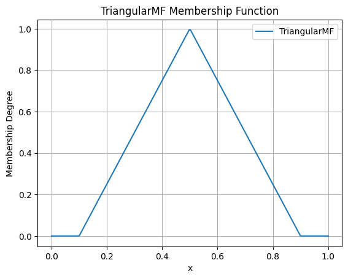

**Use Case:**
Commonly used in simple control systems and when a clear optimal value (`b`) exists, with 
membership decreasing linearly as the value moves away from the optimum.

TrapezoidalMF
~~~~~~~~~~~~~

The trapezoidal membership function is a four-point function that forms a
trapezoid. It is similar to the triangular function but has a plateau where
membership is 1, making it suitable for representing a range of optimal values.

**Formula:**

.. math::

   f(x; a, b, c, d) = \begin{cases}
   0, & x \le a \\
   \frac{x - a}{b - a}, & a < x \le b \\
   1, & b < x \le c \\
   \frac{d - x}{d - c}, & c < x \le d \\
   0, & x > d
   \end{cases}

**Parameters:**

- ``a``: The left foot, where membership begins to increase from 0.
- ``b``: The left shoulder, where the plateau of 1 begins.
- ``c``: The right shoulder, where the plateau of 1 ends.
- ``d``: The right foot, where membership returns to 0.

**Constraints:** ``a <= b <= c <= d``

**Example:**

.. code-block:: python

   from axisfuzzy.membership.function import TrapezoidalMF
   import matplotlib.pyplot as plt

   mf = TrapezoidalMF(a=0.1, b=0.4, c=0.6, d=0.9)
   mf.plot(x_range=(0, 1), num_points=200)

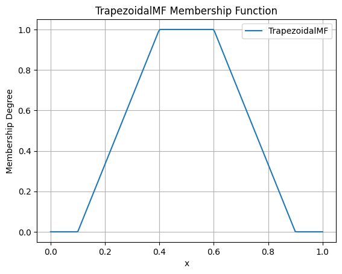

**Use Case:**
Useful when a range of values are all considered to have full membership. For example, 
a "comfortable" temperature might be a range (e.g., 20-25°C) rather than a single point.

Smooth & Bell-Shaped
--------------------

These functions are defined by smooth, continuous curves. They are suitable for
modeling phenomena where changes in membership are gradual and non-linear.

GaussianMF
~~~~~~~~~~

The Gaussian membership function is a classic bell-shaped curve based on the
Gaussian distribution. It is symmetric and provides a smooth transition around a
central point.

**Formula:**

.. math::

   f(x; \sigma, c) = e^{-\frac{1}{2}\left(\frac{x - c}{\sigma}\right)^2}

**Parameters:**

- ``sigma``: The standard deviation, which controls the width of the curve. Smaller 
  values result in a narrower, sharper peak.
- ``c``: The center of the peak, where membership is 1.

**Constraints:** ``sigma > 0``

**Example:**

.. code-block:: python

   from axisfuzzy.membership.function import GaussianMF
   import matplotlib.pyplot as plt

   mf = GaussianMF(sigma=0.1, c=0.5)
   mf.plot(x_range=(0, 1), num_points=200)

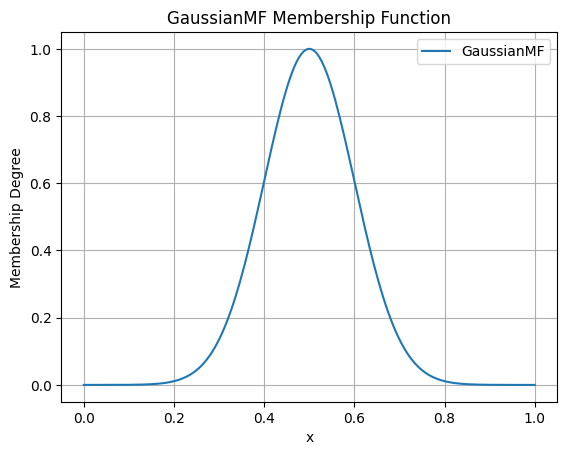

**Use Case:**
Ideal for representing concepts where membership is highest at a specific point and decreases 
symmetrically and smoothly. For example, an "ideal" value with a tolerance.

GeneralizedBellMF
~~~~~~~~~~~~~~~~~

The Generalized Bell membership function is a more flexible bell-shaped curve
with three parameters that control its width, slope, and center. This allows for
a wider variety of shapes than the standard Gaussian function.

**Formula:**

.. math::

   f(x; a, b, c) = \frac{1}{1 + |\frac{x - c}{a}|^{2b}}

**Parameters:**

- ``a``: Controls the width of the curve. Larger values result in a wider base.
- ``b``: Controls the slope of the curve's shoulders. Values of `b` > 1 steepen the slope, while values < 1 make it more gradual.
- ``c``: The center of the peak.

**Constraints:** ``a > 0``, ``b > 0``

**Example:**

.. code-block:: python

   from axisfuzzy.membership.function import GeneralizedBellMF
   import matplotlib.pyplot as plt

   mf = GeneralizedBellMF(a=0.2, b=3, c=0.5)
   mf.plot(x_range=(0, 1), num_points=200)

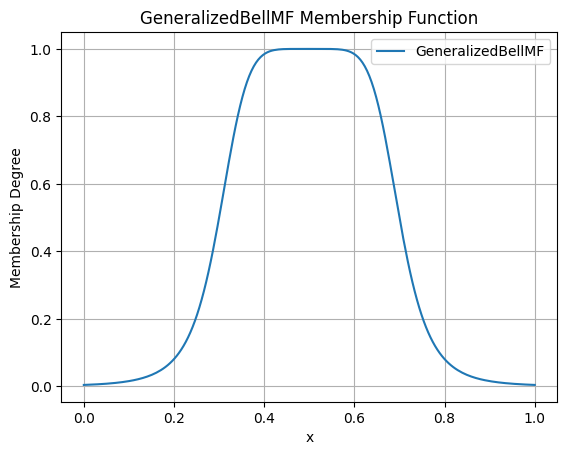

**Use Case:**
Provides great flexibility in defining bell-shaped curves. It is often used in adaptive fuzzy 
systems (like ANFIS) where the parameters can be tuned to fit data.

Sigmoidal & Transition
----------------------

These functions model monotonic transitions from 0 to 1 (or 1 to 0). They are
fundamental for representing concepts like "high" or "low" where membership
continuously increases or decreases.

SigmoidMF
~~~~~~~~~

The Sigmoid membership function is a smooth, S-shaped curve that is widely used
in fuzzy logic and neural networks. It provides a gradual transition between two
levels.

**Formula:**

.. math::

   f(x; k, c) = \frac{1}{1 + e^{-k(x - c)}}

**Parameters:**

- ``k``: Controls the steepness of the slope. Positive values create an ascending curve, 
  while negative values create a descending one.
- ``c``: The center of the transition, where membership is 0.5.

**Constraints:** ``k != 0``

**Example:**

.. code-block:: python

   from axisfuzzy.membership.function import SigmoidMF
   import matplotlib.pyplot as plt

   mf = SigmoidMF(k=15, c=0.5)
   mf.plot(x_range=(0, 1), num_points=200)

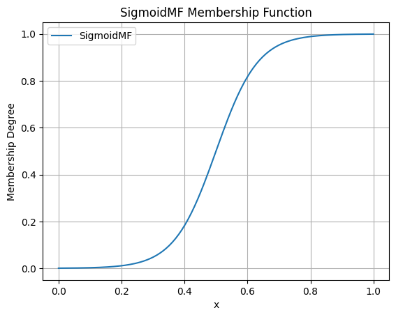

**Use Case:**
Excellent for modeling transitions in systems where a gradual change is expected. For example, 
defining the concept of "high temperature" where the transition from "not high" to "high" is smooth.

SMF
~~~

The S-shaped membership function (SMF) is a piecewise quadratic function that
provides a smooth, S-shaped transition from 0 to 1 between two points.

**Formula:**

.. math::

   f(x; a, b) = \begin{cases}
   0, & x \le a \\
   2\left(\frac{x - a}{b - a}\right)^2, & a < x \le \frac{a+b}{2} \\
   1 - 2\left(\frac{x - b}{b - a}\right)^2, & \frac{a+b}{2} < x \le b \\
   1, & x > b
   \end{cases}

**Parameters:**

- ``a``: The point where the function starts to rise from 0.
- ``b``: The point where the function reaches 1.

**Constraints:** ``a < b``

**Example:**

.. code-block:: python

   from axisfuzzy.membership.function import SMF
   import matplotlib.pyplot as plt

   mf = SMF(a=0.2, b=0.8)
   mf.plot(x_range=(0, 1), num_points=200)

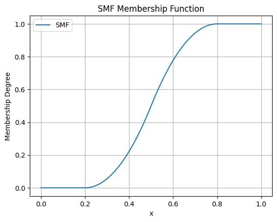

**Use Case:**
Useful for defining a gradual increase in membership over a specific range. It provides a smoother alternative to a linear ramp.

ZMF
~~~

The Z-shaped membership function (ZMF) is the mirror image of the SMF. It is a
piecewise quadratic function that provides a smooth, Z-shaped transition from 1
to 0.

**Formula:**

.. math::

   f(x; a, b) = \begin{cases}
   1, & x \le a \\
   1 - 2\left(\frac{x - a}{b - a}\right)^2, & a < x \le \frac{a+b}{2} \\
   2\left(\frac{x - b}{b - a}\right)^2, & \frac{a+b}{2} < x \le b \\
   0, & x > b
   \end{cases}

**Parameters:**

- ``a``: The point where the function starts to fall from 1.
- ``b``: The point where the function reaches 0.

**Constraints:** ``a < b``

**Example:**

.. code-block:: python

   from axisfuzzy.membership.function import ZMF
   import matplotlib.pyplot as plt

   mf = ZMF(a=0.2, b=0.8)
   mf.plot(x_range=(0, 1), num_points=200)

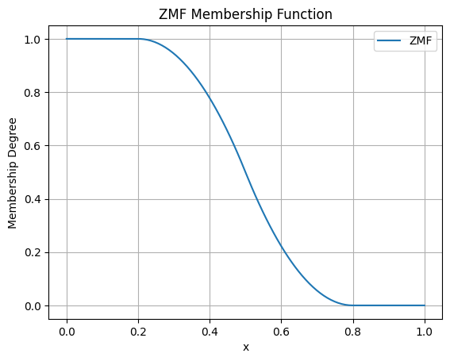

**Use Case:**
Ideal for defining a gradual decrease in membership. For example, representing the concept 
of "low speed" where membership decreases as speed increases.

Composite Shapes
----------------

These functions are constructed by combining simpler functions, allowing for more
complex and specialized membership shapes.

PiMF
~~~~

The Pi-shaped membership function (PiMF) is formed by the product of an SMF and
a ZMF. It creates a smooth, bell-shaped curve with a plateau of 1, making it a
smooth version of the trapezoidal function.

**Formula:**

.. math::

   f(x; a, b, c, d) = SMF(x; a, b) \times ZMF(x; c, d)

**Parameters:**

- ``a``, ``b``: Define the S-shaped (rising) part of the curve.
- ``c``, ``d``: Define the Z-shaped (falling) part of the curve.

**Constraints:** ``a <= b <= c <= d``

**Example:**

.. code-block:: python

   from axisfuzzy.membership.function import PiMF
   import matplotlib.pyplot as plt

   mf = PiMF(a=0.1, b=0.4, c=0.6, d=0.9)
   mf.plot(x_range=(0, 1), num_points=200)

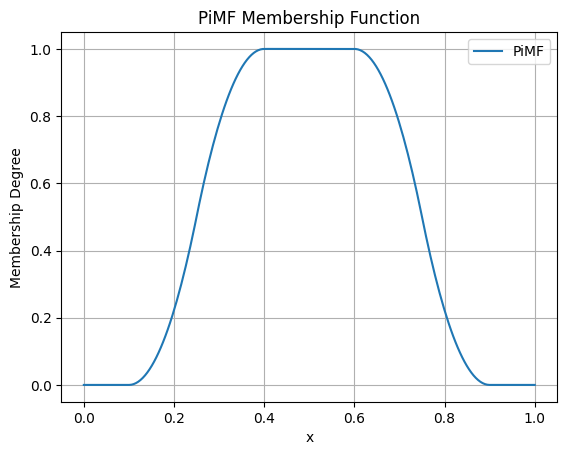

**Use Case:**
Perfect for representing a concept with an optimal range that has smooth transitions. 
It is a more refined alternative to the `TrapezoidalMF`.

DoubleGaussianMF
~~~~~~~~~~~~~~~~~

The Double Gaussian membership function is the product of two different Gaussian
functions. This allows for the creation of asymmetric bell-shaped curves, where
the rate of approach to the peak and departure from it can be different.

**Formula:**

.. math::

   f(x; \sigma_1, c_1, \sigma_2, c_2) = e^{-\frac{1}{2}\left(\frac{x - c_1}{\sigma_1}\right)^2} \times e^{-\frac{1}{2}\left(\frac{x - c_2}{\sigma_2}\right)^2}

**Parameters:**

- ``sigma1``, ``c1``: Standard deviation and center for the first Gaussian.
- ``sigma2``, ``c2``: Standard deviation and center for the second Gaussian.

**Constraints:** ``sigma1 > 0``, ``sigma2 > 0``. For a single peak, ``c1`` should equal ``c2``.

**Example:**

.. code-block:: python

   from axisfuzzy.membership.function import DoubleGaussianMF
   import matplotlib.pyplot as plt

   mf = DoubleGaussianMF(sigma1=0.1, c1=0.3, sigma2=0.1, c2=0.7)
   mf.plot(x_range=(0, 1), num_points=200)

.. .. image:: ../_static/double_gaussian_mf.png
..    :alt: Surface plot of the Double Gaussian Membership Function
..    :align: center

**Use Case:**
Useful for modeling concepts where the membership changes at different rates on either side of 
the optimal value. For example, a process parameter that is more sensitive to deviations in one direction than the other.

Creating Factory Functions
==========================

While you can instantiate membership function classes directly, the recommended and most convenient 
approach is to use the factory function ``create_mf`` from the ``axisfuzzy.membership.factory`` module. 
This factory provides a centralized, flexible, and user-friendly way to create any built-in membership 
function using string names or aliases.

Introduction to ``create_mf``
-----------------------------

The ``create_mf`` function simplifies the creation process by:

- **Decoupling from Concrete Classes**: You don't need to import specific function classes.
- **Supporting Aliases**: Use short, intuitive names (e.g., 'trimf' instead of 'TriangularMF').
- **Intelligent Parameter Handling**: Automatically separates parameters intended for the membership function from other system parameters.

**Basic Usage**

Here is how you can create different membership functions using their string names or aliases:

.. code-block:: python

   from axisfuzzy.membership.factory import create_mf

   # Create a triangular MF using its alias
   tri_mf, _ = create_mf('trimf', a=0, b=0.5, c=1)

   # Create a Gaussian MF using its full class name (case-insensitive)
   gauss_mf, _ = create_mf('GaussianMF', sigma=0.2, c=0.5)

   # The factory returns the instance and any unused parameters
   print(type(tri_mf).__name__)
   # Output: TriangularMF

Available Functions and Aliases
-------------------------------

The factory recognizes a variety of names for each function. The following table lists the available built-in functions and their common aliases for quick reference.

.. list-table:: Membership Function Aliases
   :widths: 25 50
   :header-rows: 1

   * - Class Name
     - Common Aliases
   * - ``TriangularMF``
     - ``trimf``, ``triangularmf``
   * - ``TrapezoidalMF``
     - ``trapmf``, ``trapezoidalmf``
   * - ``GaussianMF``
     - ``gaussmf``, ``gaussianmf``
   * - ``GeneralizedBellMF``
     - ``gbellmf``, ``generalizedbellmf``
   * - ``SigmoidMF``
     - ``sigmoid``, ``sigmoidmf``
   * - ``SMF``
     - ``smf``
   * - ``ZMF``
     - ``zmf``
   * - ``PiMF``
     - ``pimf``
   * - ``DoubleGaussianMF``
     - ``gauss2mf``, ``doublegaussianmf``

Intelligent Parameter Separation
--------------------------------

A key feature of the ``create_mf`` factory is its ability to intelligently separate parameters. 
When you pass a dictionary of arguments, the factory inspects the constructor of the target 
membership function and only uses the parameters it needs. The remaining parameters are returned in a separate dictionary.

This is particularly useful when building larger systems where parameters for different components are mixed together.

**Example**

Imagine you have a set of parameters for a complete fuzzification process, including 
membership function parameters and other system settings.

.. code-block:: python

   from axisfuzzy.membership.factory import create_mf

   # Mixed parameters for a larger system
   all_params = {
       'a': 0, 'b': 0.5, 'c': 1,  # Parameters for TriangularMF
       'mtype': 'qrofn',          # A parameter for the fuzzy number type
       'q': 3,                    # Another system parameter
       'method': 'direct'         # A parameter for the fuzzification method
   }

   # The factory automatically separates the parameters
   mf, system_params = create_mf('trimf', **all_params)

   print(f"Created MF: {type(mf).__name__}")
   # Output: Created MF: TriangularMF
   
   print(f"MF Parameters: {mf.get_parameters()}")
   # Output: MF Parameters: {'a': 0, 'b': 0.5, 'c': 1}
   
   print(f"Remaining System Parameters: {system_params}")
   # Output: Remaining System Parameters: {'mtype': 'qrofn', 'q': 3, 'method': 'direct'}

This feature allows for clean, modular code and makes it easy to configure 
complex systems from a single source of parameters.

Advanced Parameterization
-------------------------

The ``create_mf`` factory supports two primary ways to provide parameters for a membership function, 
offering flexibility for different use cases.

**1. Keyword Arguments (Recommended)**

The most direct method is to pass parameters as keyword arguments. The factory will match these 
arguments to the constructor of the target membership function.

.. code-block:: python

   from axisfuzzy.membership.factory import create_mf

   # Parameters are passed directly as keywords
   tri_mf, _ = create_mf('trimf', a=0, b=0.5, c=1)
   print(tri_mf.get_parameters())
   # Output: {'a': 0, 'b': 0.5, 'c': 1}

**2. Using a ``params`` Dictionary**

Alternatively, you can group all parameters into a single dictionary and pass it using the ``params`` argument. 
This is useful when parameters are loaded from a configuration file or another data source.

.. code-block:: python

   from axisfuzzy.membership.factory import create_mf

   # Parameters are grouped in a dictionary
   mf_params = {'a': 0, 'b': 0.5, 'c': 1}
   tri_mf, _ = create_mf('trimf', params=mf_params)
   print(tri_mf.get_parameters())
   # Output: {'a': 0, 'b': 0.5, 'c': 1}

.. note::
   The membership function constructors (e.g., ``TriangularMF``) are designed to handle both 
   keyword arguments and a ``params`` dictionary. If you pass both a ``params`` dictionary and 
   individual keyword arguments (like ``a``, ``b``, ``c``) to ``create_mf``, both will be 
   forwarded to the constructor, but the constructor will use the values from the ``params`` 
   dictionary.

Direct Class Retrieval with ``get_mf_class``
--------------------------------------------

For more advanced use cases, the factory provides the ``get_mf_class`` function. Instead of creating an 
instance, this function returns the actual membership function class (type) corresponding to a given name or alias.

This function is useful in scenarios where you need a reference to the class itself, such as:

- **Performance Optimization**: When creating a large number of instances of the same type, 
  getting the class once and then calling its constructor directly can be slightly more efficient 
  than repeatedly calling ``create_mf``.
- **Type Checking**: Verifying if an object is an instance of a specific membership function type.
- **Metaprogramming**: Building higher-level abstractions or tools that operate on membership function classes.

**Basic Usage**

The function takes a name or alias and returns the corresponding class. The name resolution is 
case-insensitive and follows the same rules as ``create_mf``.

.. code-block:: python

   from axisfuzzy.membership.factory import get_mf_class

   # Get the TriangularMF class using different names
   TriMFClass1 = get_mf_class('trimf')
   TriMFClass2 = get_mf_class('TriangularMF')
   TriMFClass3 = get_mf_class('triangularmf')

   assert TriMFClass1 is TriMFClass2 is TriMFClass3

   # Now you can create instances directly from the class
   mf1 = TriMFClass1(a=0, b=0.2, c=0.4)
   mf2 = TriMFClass1(a=0.6, b=0.8, c=1.0)

   print(type(mf1).__name__)
   # Output: TriangularMF

**Error Handling**

If you provide a name that does not exist, ``get_mf_class`` will raise a ``ValueError`` with a 
helpful message listing all available function names and aliases.

.. code-block:: python

   try:
       UnknownClass = get_mf_class('non_existent_mf')
   except ValueError as e:
       print(e)

**Output:**

.. code-block:: text

   Unknown membership function 'non_existent_mf'. Available functions are: doublegaussianmf, 
   gbellmf, gauss2mf, gaussmf, gaussianmf, generalizedbellmf, pimf, sigmoid, sigmoidmf, smf, 
   trapmf, trapezoidalmf, trimf, triangularmf, zmf

This clear feedback mechanism makes debugging and discovery straightforward.

Visualization and Analysis
==========================

A key feature of the `axisfuzzy` membership functions is their built-in support for visualization, 
which is crucial for understanding their shape, parameters, and behavior. 
The :meth:`~axisfuzzy.membership.base.MembershipFunction.plot` method, inherited by all membership 
functions, provides a simple way to generate plots using `matplotlib`.

.. note::
   To use the plotting features, you must have `matplotlib` installed in your environment. You can install it via pip:
   
   .. code-block:: bash

      pip install matplotlib

Plotting a Single Function
--------------------------

You can easily plot any membership function to inspect its shape. The ``plot`` method accepts 
a ``x_range`` tuple to define the plotting interval and ``num_points`` to control the resolution of the curve.

Here is an example of plotting a ``GaussianMF``:

.. code-block:: python

   from axisfuzzy.membership import create_mf
   import matplotlib.pyplot as plt

   # Create a Gaussian membership function
   gauss_mf, _ = create_mf('gaussmf', sigma=0.15, c=0.5)

   # Plot the function over the default range [0, 1]
   gauss_mf.plot()

   # The plot will be displayed automatically.
   # To customize further, you can use matplotlib's functions.
   plt.title("Gaussian Membership Function (sigma=0.15, c=0.5)")
   plt.xlabel("Input Value")
   plt.ylabel("Membership Degree")
   plt.grid(True)
   plt.show()

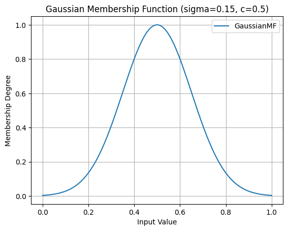

   Gaussian Membership Function (sigma=0.15, c=0.5)

You can also specify the range and resolution:

.. code-block:: python

   from axisfuzzy.membership import create_mf
   import matplotlib.pyplot as plt
   import numpy as np

   # Create a Pi-shaped membership function
   pi_mf, _ = create_mf('pimf', a=1, b=4, c=6, d=9)

   # Plot it over a custom range with higher resolution
   pi_mf.plot(x_range=(0, 10), num_points=500)
   plt.title("Pi-Shaped Membership Function")
   plt.show()

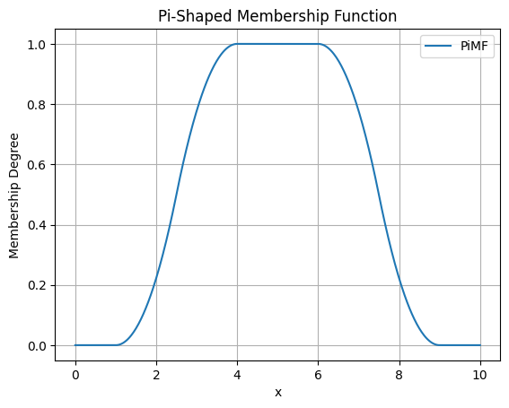

   Pi-Shaped Membership Function

Overlaying Multiple Functions for Comparison
--------------------------------------------

Visualizing multiple membership functions on the same plot is essential for designing fuzzy 
systems, as it helps in understanding the relationships and overlaps between different 
fuzzy sets (e.g., "low", "medium", "high").

The following example demonstrates how to plot three triangular functions representing 
different linguistic terms on a single graph.

.. code-block:: python

    from axisfuzzy.membership import create_mf
    import matplotlib.pyplot as plt
    import numpy as np

    # Define parameters for three fuzzy sets: "Low", "Medium", and "High"
    params_low = {'a': 0.1, 'b': 0.3, 'c': 0.5}
    params_medium = {'a': 0.2, 'b': 0.6, 'c': 0.7}
    params_high = {'a': 0.4, 'b': 0.8, 'c': 0.9}

    # Create the membership functions
    low_mf, _ = create_mf('trimf', **params_low)
    medium_mf, _ = create_mf('trimf', **params_medium)
    high_mf, _ = create_mf('trimf', **params_high)

    # --- Plotting ---
    # 1. Create a figure and axes
    fig, ax = plt.subplots()

    # 2. Generate x values
    x = np.linspace(0, 1, 500)

    # 3. Plot each function
    ax.plot(x, low_mf(x), label='Low')
    ax.plot(x, medium_mf(x), label='Medium')
    ax.plot(x, high_mf(x), label='High')

    # 4. Add labels and title
    ax.set_title('Comparison of Fuzzy Sets')
    ax.set_xlabel('Universe of Discourse (e.g., Temperature)')
    ax.set_ylabel('Membership Degree')
    ax.legend()
    ax.grid(True)

    # 5. Show the plot
    plt.show()

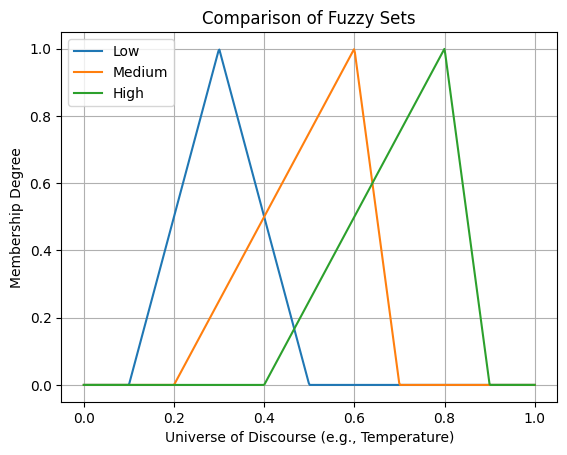

   Comparison of Fuzzy Sets (Low, Medium, High)

This visualization clearly shows how the fuzzy sets partition the universe of discourse and 
where they overlap, which is fundamental for designing fuzzy inference systems.

Conclusion
==========

This chapter has provided a comprehensive overview of the membership function system in `AxisFuzzy`. 
The design is centered around three core pillars that together offer a powerful, flexible, 
and user-friendly experience:

1. **Extensible Base Class** (``MembershipFunction``):

   - At the heart of the module is the ``MembershipFunction`` base class, which establishes a 
     consistent interface for all functions. Every function, whether built-in or custom, 
     inherits methods like ``__call__`` for evaluation and ``plot`` for visualization.

   - This object-oriented design empowers you to create your own custom membership functions 
     by simply inheriting from the base class. Your custom functions will automatically 
     integrate into the `AxisFuzzy` ecosystem, benefiting from the same tools and 
     functionalities as the built-in ones.

2. **Rich Library of Built-in Functions**:

   - `AxisFuzzy` comes with a diverse and well-categorized library of pre-built membership functions, 
     including basic shapes (triangular, trapezoidal), smooth curves (Gaussian, bell-shaped), 
     transitional forms (sigmoidal, S/Z-shaped), and composite structures (Pi-shaped, double Gaussian).

   - This extensive collection provides ready-to-use solutions for a wide range of fuzzy logic problems, 
     saving you development time and ensuring mathematically sound implementations.

3. **User-Friendly Factory** (``create_mf`` and ``get_mf_class``):

   - The factory system acts as a high-level abstraction that simplifies the process of creating 
     and retrieving membership functions.

   - With ``create_mf``, you can instantiate functions using simple string names or aliases, 
     and it intelligently handles parameter assignment, whether passed as keyword arguments or a dictionary.

   - For scenarios requiring direct access to the class definition, ``get_mf_class`` provides 
     a straightforward and safe retrieval mechanism.

Together, these three components create a robust framework for defining, managing, and utilizing 
membership functions, catering to both common use cases and specialized requirements with equal ease.
